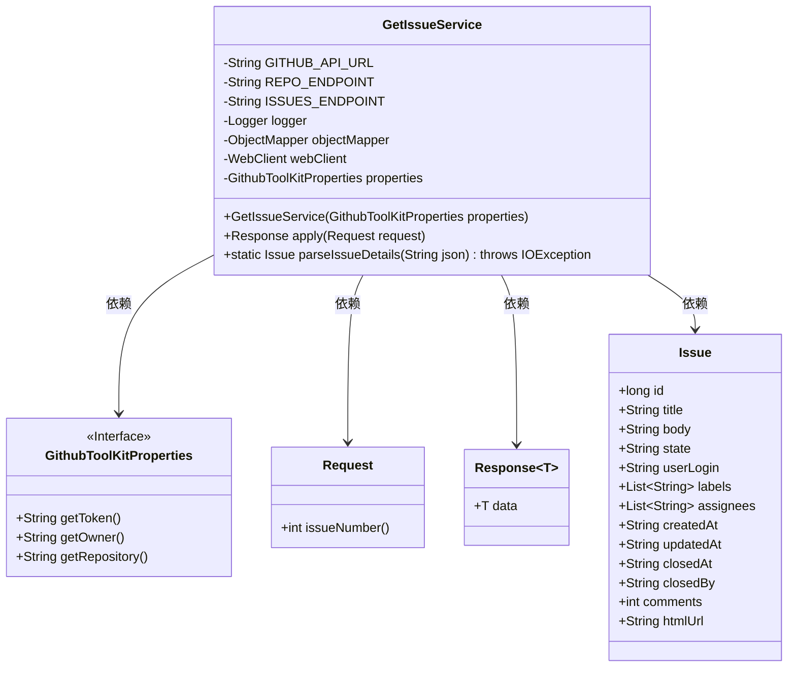

# 基础信息

|      |      |
|------|------|
| 名称 | GetIssueService |
| 编码语言 | .java |
| 代码路径 | spring-ai-alibaba/community/tool-calls/spring-ai-alibaba-starter-tool-calling-githubtoolkit/src/main/java/com/alibaba/cloud/ai/toolcalling/githubtoolkit/GetIssueService.java |
| 包名 | com.alibaba.cloud.ai.toolcalling.githubtoolkit |
| 依赖项 | ['com.fasterxml.jackson.annotation.JsonClassDescription', 'com.fasterxml.jackson.databind.JsonNode', 'com.fasterxml.jackson.databind.ObjectMapper', 'org.slf4j.Logger', 'org.slf4j.LoggerFactory', 'org.springframework.http.HttpHeaders', 'org.springframework.web.reactive.function.client.WebClient', 'reactor.core.publisher.Mono', 'java.io.IOException', 'java.util.ArrayList', 'java.util.List', 'java.util.function.Function'] |
| 概述说明 | 服务类通过GitHub API获取并解析问题数据。 |

# 说明

该服务类用于获取GitHub问题，通过API请求从GitHub获取相关数据，并对响应数据进行解析。其主要功能包括发送API请求、接收响应以及解析数据，以便进一步处理和使用。该服务类旨在简化与GitHub API的交互，提供一种高效的方式来获取和处理GitHub问题信息。

# 类列表 Class Summary

| 名称   | 类型  | 说明 |
|-------|------|-------------|
| GetIssueService | class | 获取GitHub问题的服务类，通过API请求并解析响应数据。 |

## 类 GetIssueService

|      |      |
|------|------|
| 访问范围 | @JsonClassDescription("Get issue operation");public |
| 类型 | class |
| 名称 | GetIssueService |
| 说明 | 获取GitHub问题的服务类，通过API请求并解析响应数据。 |

### UML类图

**描述**：  
`GetIssueService` 类用于从GitHub API获取指定仓库的Issue详情。它依赖于 `GithubToolKitProperties` 来获取必要的配置信息，如Token、仓库所有者等。`Request` 类用于传递Issue编号，`Response` 类则封装了返回的Issue数据。`Issue` 类是一个记录类，用于存储Issue的详细信息，包括标题、状态、标签、评论等。`GetIssueService` 通过 `WebClient` 发送HTTP请求，并解析返回的JSON数据，最终返回一个包含Issue详情的 `Response` 对象。

### 内部方法调用关系图

```mermaid
graph TD
    A["类GetIssueService"]
    B["属性: String GITHUB_API_URL"]
    C["属性: String REPO_ENDPOINT"]
    D["属性: String ISSUES_ENDPOINT"]
    E["属性: Logger logger"]
    F["属性: ObjectMapper objectMapper"]
    G["属性: WebClient webClient"]
    H["属性: GithubToolKitProperties properties"]
    I["构造方法: GetIssueService(GithubToolKitProperties properties)"]
    J["方法: Response apply(Request request)"]
    K["方法: static Issue parseIssueDetails(String json)"]
    L["记录类: Issue"]

    A --> B
    A --> C
    A --> D
    A --> E
    A --> F
    A --> G
    A --> H
    A --> I
    A --> J
    A --> K
    A --> L

    J --> M["构建URL: GITHUB_API_URL + REPO_ENDPOINT + ISSUES_ENDPOINT + '/{issueNumber}'"]
    J --> N["发送请求: webClient.get().uri(url, properties.getOwner(), properties.getRepository(), request.issueNumber())"]
    J --> O["获取响应: responseMono.block()"]
    J --> P["记录日志: logger.info('GetIssueOperation response: {}', responseData)"]
    J --> Q["解析响应: parseIssueDetails(responseData)"]
    J --> R["返回响应: new Response<>(parseIssueDetails(responseData))"]

    K --> S["解析JSON: objectMapper.readTree(json)"]
    K --> T["获取Issue字段: id, title, state, userLogin, labels, assignees, createdAt, updatedAt, closedAt, closedBy, comments, htmlUrl"]
    K --> U["返回Issue对象: new Issue(id, title, body, state, userLogin, labels, assignees, createdAt, updatedAt, closedAt, closedBy, comments, htmlUrl)"]
```

这段代码定义了一个`GetIssueService`类，用于从GitHub API获取特定issue的详细信息。该类通过`WebClient`发送HTTP请求，并解析返回的JSON响应，最终返回一个包含issue详细信息的`Response`对象。`parseIssueDetails`方法负责解析JSON数据并构建`Issue`记录类。整个过程包括URL构建、请求发送、响应解析和日志记录。

### 字段列表 Field List

| 名称  | 类型  | 说明 |
|-------|-------|------|
| GITHUB_API_URL = "https://api.github.com" | String | 定义GitHub API基础URL常量。 |
| webClient | WebClient | 私有不可变的WebClient实例。 |
| ISSUES_ENDPOINT = "/issues" | String | 定义私有静态常量ISSUES_ENDPOINT为"/issues"。 |
| objectMapper = new ObjectMapper() | ObjectMapper | 声明并初始化一个私有的静态ObjectMapper对象。 |
| properties | GithubToolKitProperties | 私有且不可变的Github工具包属性。 |
| logger = LoggerFactory.getLogger(GetIssueService.class) | Logger | GetIssueService类中定义了一个私有的静态日志记录器。 |
| REPO_ENDPOINT = "/repos/{owner}/{repo}" | String | 私有静态常量REPO_ENDPOINT定义仓库端点路径。 |

### 方法列表 Method List

| 名称  | 类型  | 说明 |
|-------|-------|------|
| parseIssueDetails | Issue | 解析JSON数据生成Issue对象，包含ID、标题、状态、用户、标签、负责人、创建时间、更新时间、关闭时间、关闭者、评论数和URL。 |
| apply | Response | 通过GitHub API获取指定issue信息并解析返回结果。 |

