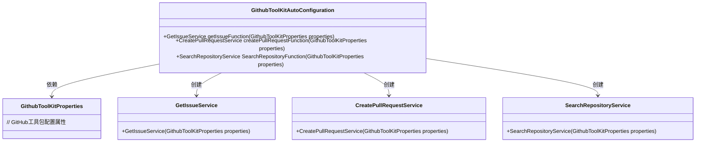
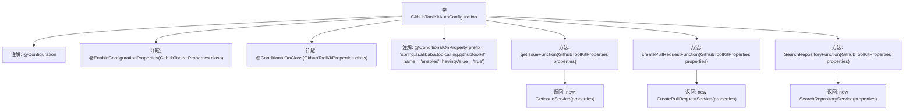

# 基础信息

|      |      |
|------|------|
| 名称 | GithubToolKitAutoConfiguration |
| 编码语言 | .java |
| 代码路径 | spring-ai-alibaba/community/tool-calls/spring-ai-alibaba-starter-tool-calling-githubtoolkit/src/main/java/com/alibaba/cloud/ai/toolcalling/githubtoolkit/GithubToolKitAutoConfiguration.java |
| 包名 | com.alibaba.cloud.ai.toolcalling.githubtoolkit |
| 依赖项 | ['org.springframework.boot.autoconfigure.condition.ConditionalOnClass', 'org.springframework.boot.autoconfigure.condition.ConditionalOnMissingBean', 'org.springframework.boot.autoconfigure.condition.ConditionalOnProperty', 'org.springframework.boot.context.properties.EnableConfigurationProperties', 'org.springframework.context.annotation.Bean', 'org.springframework.context.annotation.Configuration', 'org.springframework.context.annotation.Description'] |
| 概述说明 | 配置类实现GitHub操作，支持获取问题、创建拉取请求和搜索仓库。 |

# 说明

该配置类实现了与GitHub操作相关的功能，主要包括获取问题、创建拉取请求以及搜索仓库。通过这些功能，用户可以方便地管理GitHub上的项目，执行常见的开发任务，如查看问题、发起代码合并请求以及查找特定仓库。这些操作帮助开发者更高效地协作和维护代码库。

# 类列表 Class Summary

| 名称   | 类型  | 说明 |
|-------|------|-------------|
| GithubToolKitAutoConfiguration | class | 配置类实现GitHub操作，包括获取问题、创建拉取请求和搜索仓库。 |

## 类 GithubToolKitAutoConfiguration

|      |      |
|------|------|
| 访问范围 | @Configuration;@EnableConfigurationProperties(GithubToolKitProperties.class);@ConditionalOnClass(GithubToolKitProperties.class);@ConditionalOnProperty(prefix = "spring.ai.alibaba.toolcalling.githubtoolkit", name = "enabled", havingValue = "true");public |
| 类型 | class |
| 名称 | GithubToolKitAutoConfiguration |
| 说明 | 配置类实现GitHub操作，包括获取问题、创建拉取请求和搜索仓库。 |

### UML类图

类图描述：`GithubToolKitAutoConfiguration` 是一个自动配置类，依赖于 `GithubToolKitProperties` 类来获取配置属性。它通过 `@Bean` 注解创建了三个服务类：`GetIssueService`、`CreatePullRequestService` 和 `SearchRepositoryService`，分别用于获取 GitHub 问题、创建拉取请求和搜索仓库列表。这些服务类都依赖于 `GithubToolKitProperties` 来初始化。

### 内部方法调用关系图

这段代码是一个Spring Boot的自动配置类`GithubToolKitAutoConfiguration`，用于根据条件自动配置与GitHub操作相关的服务。类中包含三个Bean方法，分别用于获取GitHub问题、创建Pull请求和搜索仓库列表。每个方法都依赖于`GithubToolKitProperties`类，并在特定条件下（如类存在、属性启用等）才会被加载。这些方法返回相应的服务实例，用于执行具体的GitHub操作。

### 字段列表 Field List

| 名称  | 类型  | 说明 |
|-------|-------|------|

### 方法列表 Method List

| 名称  | 类型  | 说明 |
|-------|-------|------|
| getIssueFunction | GetIssueService | 实现获取GitHub问题的功能，使用GithubToolKitProperties属性。 |
| createPullRequestFunction | CreatePullRequestService | 实现创建GitHub拉取请求功能的服务类。 |
| SearchRepositoryFunction | SearchRepositoryService | 定义缺失时自动创建搜索仓库服务的Bean。 |

