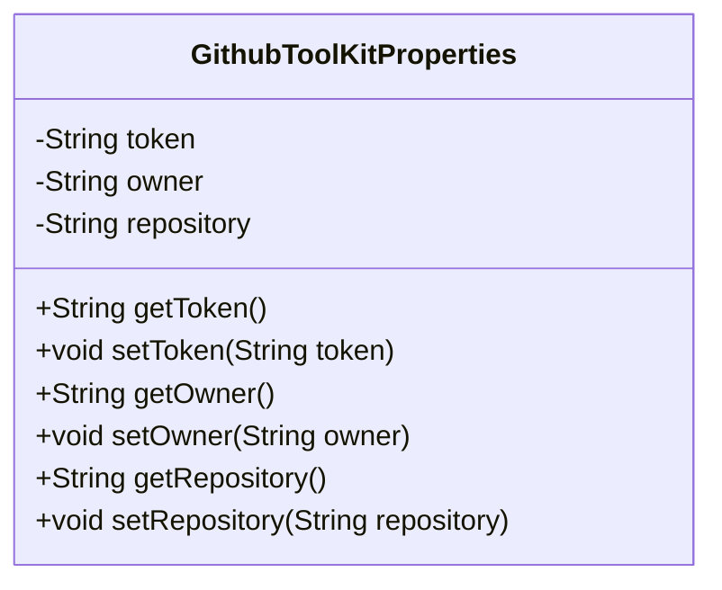
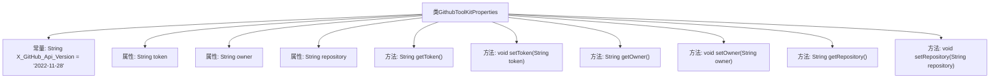

# 基础信息

|      |      |
|------|------|
| 名称 | GithubToolKitProperties |
| 编码语言 | .java |
| 代码路径 | spring-ai-alibaba/community/tool-calls/spring-ai-alibaba-starter-tool-calling-githubtoolkit/src/main/java/com/alibaba/cloud/ai/toolcalling/githubtoolkit/GithubToolKitProperties.java |
| 包名 | com.alibaba.cloud.ai.toolcalling.githubtoolkit |
| 依赖项 | ['org.springframework.boot.context.properties.ConfigurationProperties'] |
| 概述说明 | GithubToolKitProperties类配置GitHub API的token、owner和repository。 |

# 说明

GithubToolKitProperties类用于配置与GitHub API相关的关键参数，包括token、owner和repository。token用于身份验证，确保API请求的合法性和安全性；owner指定GitHub仓库的所有者，通常为个人或组织；repository则指向具体的仓库名称。通过此类，开发者可以方便地管理和设置与GitHub API交互所需的基本信息，确保代码能够正确访问和操作指定的GitHub资源。

# 类列表 Class Summary

| 名称   | 类型  | 说明 |
|-------|------|-------------|
| GithubToolKitProperties | class | GithubToolKitProperties类配置GitHub API的token、owner和repository。 |

## 类 GithubToolKitProperties

|      |      |
|------|------|
| 访问范围 | @ConfigurationProperties(prefix = "spring.ai.alibaba.toolcalling.github");public |
| 类型 | class |
| 名称 | GithubToolKitProperties |
| 说明 | GithubToolKitProperties类配置GitHub API的token、owner和repository。 |

### UML类图

这段代码定义了一个名为 `GithubToolKitProperties` 的类，用于管理与 GitHub 工具调用相关的配置属性。类中包含三个私有属性：`token`、`owner` 和 `repository`，分别表示 GitHub 的访问令牌、仓库所有者名称和仓库名称。类中提供了这些属性的公有 getter 和 setter 方法，以便外部代码可以访问和修改这些属性。该类通过 `@ConfigurationProperties` 注解与配置文件中的特定前缀 `spring.ai.alibaba.toolcalling.github` 进行绑定，使得配置属性能够自动注入到类的实例中。

### 内部方法调用关系图

这段代码定义了一个名为 `GithubToolKitProperties` 的类，用于配置与 GitHub 工具调用相关的属性。类中包含三个私有属性：`token`、`owner` 和 `repository`，分别表示 GitHub 的访问令牌、仓库所有者和仓库名称。类还提供了这些属性的 getter 和 setter 方法，用于获取和设置属性的值。此外，类中定义了一个常量 `X_GitHub_Api_Version`，表示 GitHub API 的版本号。这个类通常用于 Spring Boot 项目中，通过 `@ConfigurationProperties` 注解将配置文件中的属性绑定到类的实例上。

### 字段列表 Field List

| 名称  | 类型  | 说明 |
|-------|-------|------|
| owner | String | 定义了一个私有字符串变量owner。 |
| token | String | 声明了一个私有字符串变量token。 |
| X_GitHub_Api_Version = "2022-11-28" | String | GitHub API版本号设置为2022-11-28。 |
| repository | String | 私有字符串变量repository。 |

### 方法列表 Method List

| 名称  | 类型  | 说明 |
|-------|-------|------|
| setToken | void | 设置token值的方法。 |
| getToken | String | 获取token的Java方法。 |
| setOwner | void | 设置对象所有者属性的方法。 |
| getRepository | String | 获取仓库信息的字符串方法。 |
| setRepository | void | 设置存储库路径的方法。 |
| getOwner | String | 该方法返回所有者信息。 |

