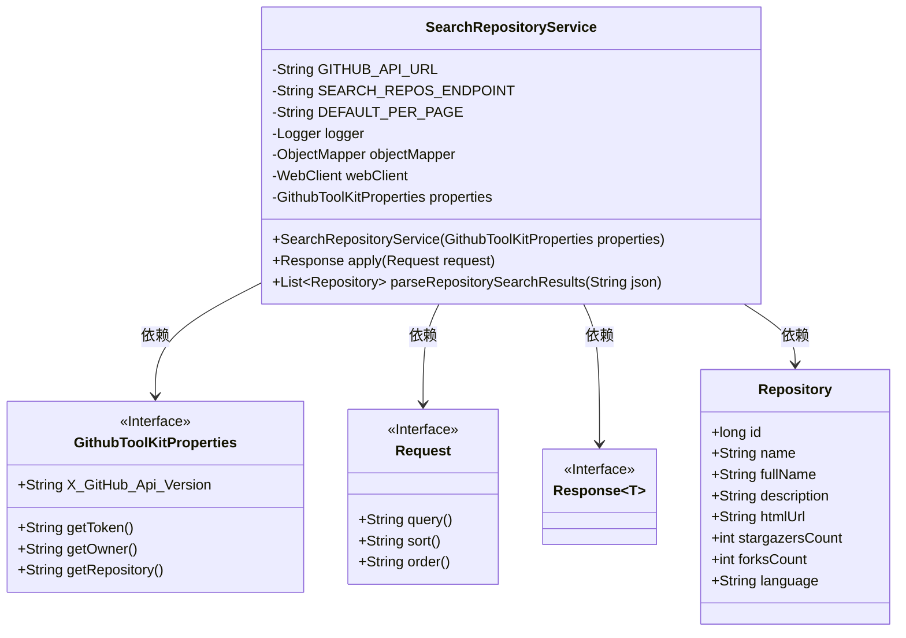
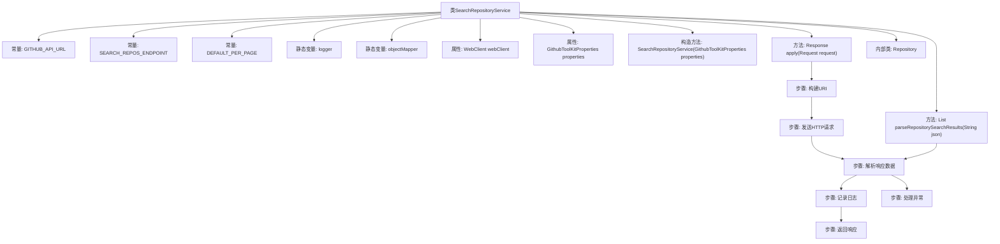

# 基础信息

|      |      |
|------|------|
| 名称 | SearchRepositoryService |
| 编码语言 | .java |
| 代码路径 | spring-ai-alibaba/community/tool-calls/spring-ai-alibaba-starter-tool-calling-githubtoolkit/src/main/java/com/alibaba/cloud/ai/toolcalling/githubtoolkit/SearchRepositoryService.java |
| 包名 | com.alibaba.cloud.ai.toolcalling.githubtoolkit |
| 依赖项 | ['com.fasterxml.jackson.annotation.JsonClassDescription', 'com.fasterxml.jackson.databind.JsonNode', 'com.fasterxml.jackson.databind.ObjectMapper', 'org.slf4j.Logger', 'org.slf4j.LoggerFactory', 'org.springframework.http.HttpHeaders', 'org.springframework.web.reactive.function.client.WebClient', 'org.springframework.web.util.UriComponentsBuilder', 'reactor.core.publisher.Mono', 'java.io.IOException', 'java.net.URI', 'java.util.ArrayList', 'java.util.List', 'java.util.function.Function'] |
| 概述说明 | 通过GitHub API查询并解析仓库信息。 |

# 说明

该描述涉及通过GitHub的API服务来搜索和查询仓库信息，并对获取的数据进行解析。主要步骤包括使用API接口进行仓库搜索，获取相关数据，然后对返回的JSON或其他格式的数据进行解析，以提取所需的关键信息。整个过程旨在自动化地获取和处理GitHub仓库的相关数据，便于进一步分析或使用。

# 类列表 Class Summary

| 名称   | 类型  | 说明 |
|-------|------|-------------|
| SearchRepositoryService | class | 搜索GitHub仓库服务类，通过API查询并解析仓库信息。 |

## 类 SearchRepositoryService

|      |      |
|------|------|
| 访问范围 | @JsonClassDescription("Search repositories operation");public |
| 类型 | class |
| 名称 | SearchRepositoryService |
| 说明 | 搜索GitHub仓库服务类，通过API查询并解析仓库信息。 |

### UML类图

这段代码定义了一个 `SearchRepositoryService` 类，用于通过 GitHub API 搜索仓库。该类依赖于 `GithubToolKitProperties`、`Request` 和 `Response` 接口，并包含一个内部记录类 `Repository` 来表示仓库信息。`SearchRepositoryService` 类通过 `WebClient` 发送 HTTP 请求，并解析返回的 JSON 数据，最终返回一个包含仓库信息的 `Response` 对象。代码还处理了异常情况，并使用了日志记录来跟踪操作的成功或失败。

### 内部方法调用关系图

这段代码描述了一个用于搜索GitHub仓库的服务类`SearchRepositoryService`。该类通过HTTP请求向GitHub API发送查询，并解析返回的JSON数据。流程图展示了从构建URI、发送请求、解析响应、记录日志到返回响应的完整流程，同时还包括了异常处理步骤。代码中使用了`WebClient`进行HTTP通信，并通过`ObjectMapper`解析JSON数据，最终将解析后的仓库信息封装为`Repository`对象返回。

### 字段列表 Field List

| 名称  | 类型  | 说明 |
|-------|-------|------|
| DEFAULT_PER_PAGE = "10" | String | 默认每页显示数量为10。 |
| logger = LoggerFactory.getLogger(SearchRepositoryService.class) | Logger | SearchRepositoryService类中定义了私有静态日志记录器logger。 |
| SEARCH_REPOS_ENDPOINT = "/search/repositories" | String | 定义搜索仓库的API端点路径。 |
| webClient | WebClient | 私有且不可变的WebClient实例。 |
| GITHUB_API_URL = "https://api.github.com" | String | GitHub API的基础URL为https://api.github.com。 |
| objectMapper = new ObjectMapper() | ObjectMapper | 创建静态不可变的对象映射器实例。 |
| properties | GithubToolKitProperties | 私有且不可变的GithubToolKitProperties属性。 |

### 方法列表 Method List

| 名称  | 类型  | 说明 |
|-------|-------|------|
| apply | Response | 重写方法，构建URI并调用API，处理响应数据。 |
| parseRepositorySearchResults | List<Repository> | 解析JSON数据，生成Repository对象列表，包含ID、名称、描述等字段。 |

