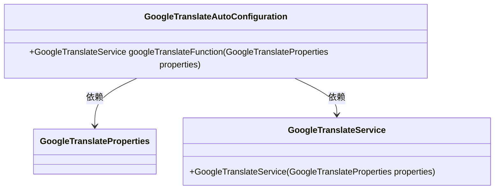
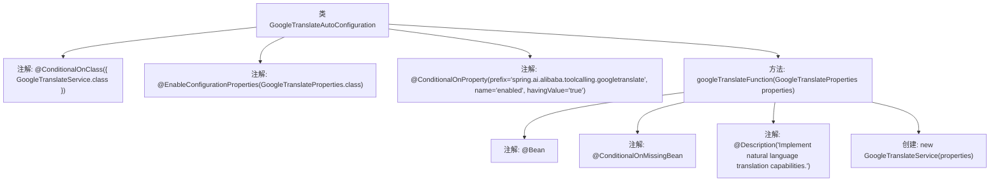

# 基础信息

|      |      |
|------|------|
| 名称 | GoogleTranslateAutoConfiguration |
| 编码语言 | .java |
| 代码路径 | spring-ai-alibaba/community/tool-calls/spring-ai-alibaba-starter-tool-calling-googletranslate/src/main/java/com/alibaba/cloud/ai/toolcalling/googletranslate/GoogleTranslateAutoConfiguration.java |
| 包名 | com.alibaba.cloud.ai.toolcalling.googletranslate |
| 依赖项 | ['org.springframework.boot.autoconfigure.condition.ConditionalOnClass', 'org.springframework.boot.autoconfigure.condition.ConditionalOnMissingBean', 'org.springframework.boot.autoconfigure.condition.ConditionalOnProperty', 'org.springframework.boot.context.properties.EnableConfigurationProperties', 'org.springframework.context.annotation.Bean', 'org.springframework.context.annotation.Description'] |
| 概述说明 | 自动配置Google翻译，启用后支持自然语言翻译功能。 |

# 说明

自动配置Google翻译服务，启用后提供自然语言翻译功能。该服务能够自动识别和处理多种语言的文本，实现快速、准确的翻译。用户只需启用该功能，即可在应用中享受无缝的翻译体验，支持跨语言沟通和信息获取。此配置简化了翻译服务的集成过程，提升了用户体验。

# 类列表 Class Summary

| 名称   | 类型  | 说明 |
|-------|------|-------------|
| GoogleTranslateAutoConfiguration | class | 自动配置Google翻译服务，启用后提供自然语言翻译功能。 |

## 类 GoogleTranslateAutoConfiguration

|      |      |
|------|------|
| 访问范围 | @ConditionalOnClass({ GoogleTranslateService.class });@EnableConfigurationProperties(GoogleTranslateProperties.class);@ConditionalOnProperty(prefix = "spring.ai.alibaba.toolcalling.googletranslate", name = "enabled", havingValue = "true");public |
| 类型 | class |
| 名称 | GoogleTranslateAutoConfiguration |
| 说明 | 自动配置Google翻译服务，启用后提供自然语言翻译功能。 |

### UML类图

类图描述：`GoogleTranslateAutoConfiguration` 是一个自动配置类，依赖于 `GoogleTranslateProperties` 和 `GoogleTranslateService`。它通过 `googleTranslateFunction` 方法创建并返回 `GoogleTranslateService` 实例，该方法接受 `GoogleTranslateProperties` 作为参数。`GoogleTranslateService` 类负责实现自然语言翻译功能。

### 内部方法调用关系图

这段代码是一个Spring Boot自动配置类，用于在特定条件下创建`GoogleTranslateService`的Bean。类上使用了多个条件注解，确保只有在满足条件时才会生效。`googleTranslateFunction`方法用于创建并返回`GoogleTranslateService`实例，并且只有在没有其他`GoogleTranslateService` Bean存在时才会创建。

### 字段列表 Field List

| 名称  | 类型  | 说明 |
|-------|-------|------|

### 方法列表 Method List

| 名称  | 类型  | 说明 |
|-------|-------|------|
| googleTranslateFunction | GoogleTranslateService | 实现自然语言翻译功能的Google翻译服务。 |

