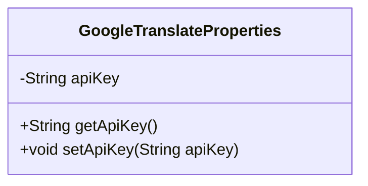
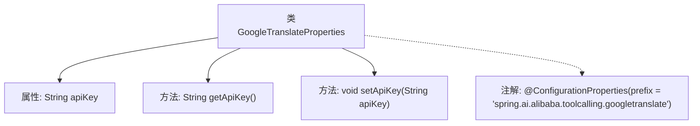

# 基础信息

|      |      |
|------|------|
| 名称 | GoogleTranslateProperties |
| 编码语言 | .java |
| 代码路径 | spring-ai-alibaba/community/tool-calls/spring-ai-alibaba-starter-tool-calling-googletranslate/src/main/java/com/alibaba/cloud/ai/toolcalling/googletranslate/GoogleTranslateProperties.java |
| 包名 | com.alibaba.cloud.ai.toolcalling.googletranslate |
| 依赖项 | ['org.springframework.boot.context.properties.ConfigurationProperties'] |
| 概述说明 | GoogleTranslateProperties类配置阿里云工具调用谷歌翻译API密钥。 |

# 说明

GoogleTranslateProperties类用于在阿里云工具调用中配置谷歌翻译API的密钥信息。该类的主要功能是管理和存储与谷歌翻译服务相关的API密钥，确保在调用谷歌翻译API时能够正确进行身份验证和授权。通过此类，用户可以方便地设置和获取所需的API密钥，从而实现对谷歌翻译服务的有效调用和集成。

# 类列表 Class Summary

| 名称   | 类型  | 说明 |
|-------|------|-------------|
| GoogleTranslateProperties | class | GoogleTranslateProperties类用于配置阿里云工具调用中的谷歌翻译API密钥。 |

## 类 GoogleTranslateProperties

|      |      |
|------|------|
| 访问范围 | @ConfigurationProperties(prefix = "spring.ai.alibaba.toolcalling.googletranslate");public |
| 类型 | class |
| 名称 | GoogleTranslateProperties |
| 说明 | GoogleTranslateProperties类用于配置阿里云工具调用中的谷歌翻译API密钥。 |

### UML类图

这段代码定义了一个名为 `GoogleTranslateProperties` 的类，用于配置 Google 翻译 API 的相关属性。类中包含一个私有成员变量 `apiKey`，用于存储 API 密钥，并提供了对应的 `getApiKey` 和 `setApiKey` 方法来访问和修改这个属性。这个类通常用于 Spring Boot 应用程序中，通过 `@ConfigurationProperties` 注解将配置文件中的属性绑定到该类的实例上，从而方便地管理配置信息。

### 内部方法调用关系图

这段代码定义了一个名为`GoogleTranslateProperties`的类，该类包含一个私有属性`apiKey`，并提供了相应的`getter`和`setter`方法。类上使用了`@ConfigurationProperties`注解，指定了配置属性的前缀为`spring.ai.alibaba.toolcalling.googletranslate`。该注解通常用于将外部配置文件中的属性绑定到类的字段上，便于在Spring应用中使用。

### 字段列表 Field List

| 名称  | 类型  | 说明 |
|-------|-------|------|
| apiKey | String | 定义了一个私有字符串变量apiKey。 |

### 方法列表 Method List

| 名称  | 类型  | 说明 |
|-------|-------|------|
| getApiKey | String | 获取API密钥的方法。 |
| setApiKey | void | 设置API密钥的方法，将传入的apiKey赋值给当前对象的apiKey属性。 |

