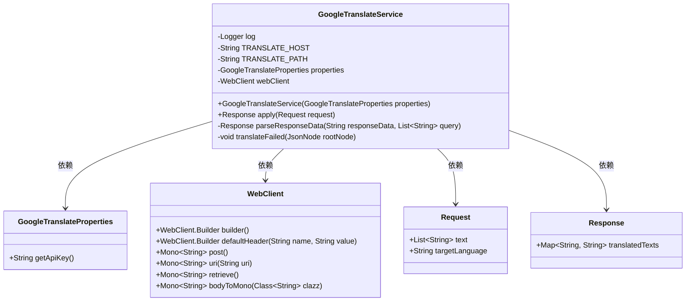
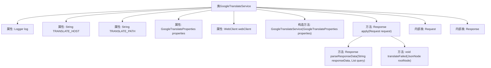

# 基础信息

|      |      |
|------|------|
| 名称 | GoogleTranslateService |
| 编码语言 | .java |
| 代码路径 | spring-ai-alibaba/community/tool-calls/spring-ai-alibaba-starter-tool-calling-googletranslate/src/main/java/com/alibaba/cloud/ai/toolcalling/googletranslate/GoogleTranslateService.java |
| 包名 | com.alibaba.cloud.ai.toolcalling.googletranslate |
| 依赖项 | ['com.fasterxml.jackson.annotation.JsonClassDescription', 'com.fasterxml.jackson.annotation.JsonProperty', 'com.fasterxml.jackson.annotation.JsonPropertyDescription', 'com.fasterxml.jackson.databind.JsonNode', 'com.fasterxml.jackson.databind.ObjectMapper', 'org.slf4j.Logger', 'org.slf4j.LoggerFactory', 'org.springframework.util.StringUtils', 'org.springframework.web.reactive.function.client.WebClient', 'org.springframework.web.util.UriComponentsBuilder', 'reactor.core.publisher.Mono', 'java.util.HashMap', 'java.util.List', 'java.util.Map', 'java.util.function.Function'] |
| 概述说明 | GoogleTranslateService通过WebClient调用API实现翻译功能并返回结果。 |

# 说明

GoogleTranslateService实现了翻译功能，通过WebClient调用Google翻译API，处理请求并返回翻译结果。该服务负责与Google翻译API进行通信，确保翻译请求的发送和结果的接收。通过WebClient，服务能够高效地处理网络请求，并将翻译结果返回给调用方。整个流程确保了翻译功能的准确性和可靠性，为用户提供了便捷的翻译服务。

# 类列表 Class Summary

| 名称   | 类型  | 说明 |
|-------|------|-------------|
| GoogleTranslateService | class | GoogleTranslateService实现翻译功能，通过WebClient调用Google翻译API，处理请求并返回翻译结果。 |

## 类 GoogleTranslateService

|      |      |
|------|------|
| 访问范围 | public |
| 类型 | class |
| 名称 | GoogleTranslateService |
| 说明 | GoogleTranslateService实现翻译功能，通过WebClient调用Google翻译API，处理请求并返回翻译结果。 |

### UML类图

**描述：**
`GoogleTranslateService` 是一个实现 `Function` 接口的类，用于处理谷歌翻译服务的请求和响应。它依赖于 `GoogleTranslateProperties` 来获取API密钥，使用 `WebClient` 发送HTTP请求，并处理 `Request` 和 `Response` 对象。`Request` 包含需要翻译的文本和目标语言，`Response` 包含翻译后的文本。`GoogleTranslateService` 通过 `apply` 方法执行翻译逻辑，并在内部使用 `parseResponseData` 和 `translateFailed` 方法来处理响应数据和错误情况。

### 内部方法调用关系图

这段代码定义了一个`GoogleTranslateService`类，用于通过Google翻译API进行文本翻译。类中包含了对翻译请求的处理、响应的解析以及错误处理逻辑。流程图展示了类的结构，包括属性、构造方法、主要方法以及内部类之间的关系。`apply`方法负责处理翻译请求，`parseResponseData`方法用于解析API返回的JSON数据，`translateFailed`方法处理翻译失败的情况。内部类`Request`和`Response`分别表示翻译请求和响应。

### 字段列表 Field List

| 名称  | 类型  | 说明 |
|-------|-------|------|
| webClient | WebClient | 私有且不可变的WebClient实例。 |
| properties | GoogleTranslateProperties | 私有且不可变的Google翻译属性对象。 |
| log = LoggerFactory.getLogger(GoogleTranslateService.class) | Logger | GoogleTranslateService类中定义了一个私有的静态日志记录器。 |
| TRANSLATE_HOST = "https://translation.googleapis.com" | String | 定义了翻译服务的API主机地址常量。 |
| TRANSLATE_PATH = "/language/translate/v2" | String | 定义常量TRANSLATE_PATH为"/language/translate/v2"。 |

### 方法列表 Method List

| 名称  | 类型  | 说明 |
|-------|-------|------|
| translateFailed | void | 翻译失败时记录错误信息和代码。 |
| apply | Response | 该方法处理翻译请求，验证参数后构建URL并发送请求，处理响应并记录日志。 |
| parseResponseData | Response | 解析响应数据并提取翻译结果，处理异常情况。 |

