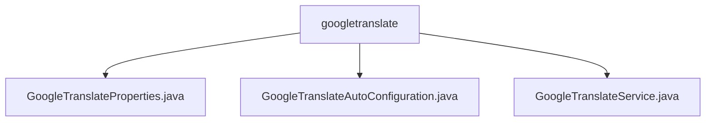

# 基础信息

|      |      |
|------|------|
| 名称 | googletranslate |
| 编码语言 | .java |
| 代码路径 | spring-ai-alibaba/community/tool-calls/spring-ai-alibaba-starter-tool-calling-googletranslate/src/main/java/com/alibaba/cloud/ai/toolcalling/googletranslate |
| 包名 | spring-ai-alibaba.community.tool-calls.spring-ai-alibaba-starter-tool-calling-googletranslate.src.main.java.com.alibaba.cloud.ai.toolcalling.googletranslate |
| 概述说明 | GoogleTranslateProperties类管理谷歌翻译API密钥，GoogleTranslateAutoConfiguration自动配置翻译服务，GoogleTranslateService通过WebClient调用API实现翻译功能。 |

# 说明

## 概述
该代码模块是一个基于Spring框架的阿里云工具调用模块，主要用于集成和调用Google翻译API，提供自然语言翻译功能。模块通过自动配置和属性管理，简化了Google翻译服务的集成过程，并确保翻译功能的准确性和可靠性。用户可以通过简单的配置，快速在应用中启用翻译服务，支持跨语言沟通和信息获取。

## 主要业务场景
1. **API密钥管理**：通过`GoogleTranslateProperties`类，管理和存储与Google翻译服务相关的API密钥，确保在调用Google翻译API时能够正确进行身份验证和授权。
2. **自动配置**：通过`GoogleTranslateAutoConfiguration`类，自动配置Google翻译服务，启用后提供自然语言翻译功能。该服务能够自动识别和处理多种语言的文本，实现快速、准确的翻译。
3. **翻译功能实现**：通过`GoogleTranslateService`类，实现翻译功能。该服务通过`WebClient`调用Google翻译API，处理请求并返回翻译结果，确保翻译功能的准确性和可靠性。

### 包内部结构视图

该流程图展示了`googletranslate`目录下的三个文件：`GoogleTranslateProperties.java`、`GoogleTranslateAutoConfiguration.java`和`GoogleTranslateService.java`。这些文件均位于同一层级，直接隶属于`googletranslate`目录，反映了该模块的核心配置和服务实现。

# 文件列表 File List

| 名称   | 类型  | 说明 |
|-------|------|-------------|
| [GoogleTranslateService.java](GoogleTranslateService.md) | file | GoogleTranslateService通过WebClient调用API实现翻译功能并返回结果。 |
| [GoogleTranslateProperties.java](GoogleTranslateProperties.md) | file | GoogleTranslateProperties类配置阿里云工具调用谷歌翻译API密钥。 |
| [GoogleTranslateAutoConfiguration.java](GoogleTranslateAutoConfiguration.md) | file | 自动配置Google翻译，启用后支持自然语言翻译功能。 |

