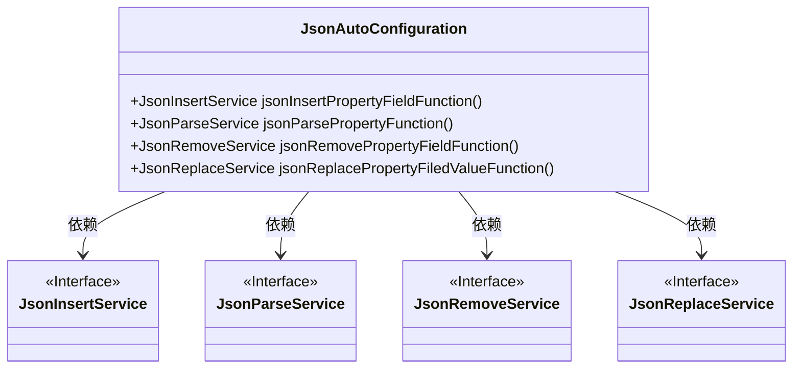
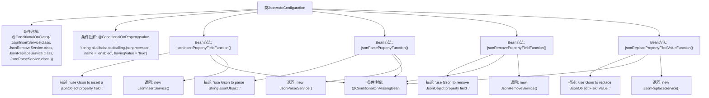

# 基础信息

|      |      |
|------|------|
| 名称 | JsonAutoConfiguration |
| 编码语言 | .java |
| 代码路径 | spring-ai-alibaba/community/tool-calls/spring-ai-alibaba-starter-tool-calling-jsonprocessor/src/main/java/com/alibaba/cloud/ai/toolcalling/jsonprocessor/JsonAutoConfiguration.java |
| 包名 | com.alibaba.cloud.ai.toolcalling.jsonprocessor |
| 依赖项 | ['org.springframework.boot.autoconfigure.condition.ConditionalOnClass', 'org.springframework.boot.autoconfigure.condition.ConditionalOnMissingBean', 'org.springframework.boot.autoconfigure.condition.ConditionalOnProperty', 'org.springframework.context.annotation.Bean', 'org.springframework.context.annotation.Description'] |
| 概述说明 | JsonAutoConfiguration类配置Gson的插入、解析、移除和替换JSON属性字段服务。 |

# 说明

JsonAutoConfiguration类负责配置四个核心的Gson服务，包括插入、解析、移除和替换JSON属性字段的功能。这些服务共同实现了对JSON数据的灵活操作，确保在处理JSON时能够高效地进行属性字段的管理和转换。

# 类列表 Class Summary

| 名称   | 类型  | 说明 |
|-------|------|-------------|
| JsonAutoConfiguration | class | JsonAutoConfiguration类配置了四个Gson服务：插入、解析、移除和替换JSON属性字段。 |

## 类 JsonAutoConfiguration

|      |      |
|------|------|
| 访问范围 | @ConditionalOnClass({ JsonInsertService.class, JsonRemoveService.class, JsonReplaceService.class,;		JsonParseService.class });@ConditionalOnProperty(value = "spring.ai.alibaba.toolcalling.jsonprocessor", name = "enabled", havingValue = "true");public |
| 类型 | class |
| 名称 | JsonAutoConfiguration |
| 说明 | JsonAutoConfiguration类配置了四个Gson服务：插入、解析、移除和替换JSON属性字段。 |

### UML类图

这段代码定义了一个名为 `JsonAutoConfiguration` 的配置类，用于在特定条件下自动配置与 JSON 处理相关的服务。该类通过 `@Bean` 注解创建了四个服务实例：`JsonInsertService`、`JsonParseService`、`JsonRemoveService` 和 `JsonReplaceService`。这些服务分别用于插入、解析、移除和替换 JSON 对象的属性字段。`JsonAutoConfiguration` 类依赖于这些服务接口，并在满足特定条件时自动配置这些服务。

### 内部方法调用关系图

这段代码定义了一个名为`JsonAutoConfiguration`的配置类，该类在满足特定条件时自动配置四个不同的Bean：`JsonInsertService`、`JsonParseService`、`JsonRemoveService`和`JsonReplaceService`。每个Bean方法都带有`@ConditionalOnMissingBean`注解，确保只有在没有相同类型的Bean存在时才会创建新的实例。这些Bean分别用于插入、解析、移除和替换JSON对象的属性字段，并且每个方法都附带了详细的描述信息。

### 字段列表 Field List

| 名称  | 类型  | 说明 |
|-------|-------|------|

### 方法列表 Method List

| 名称  | 类型  | 说明 |
|-------|-------|------|
| jsonInsertPropertyFieldFunction | JsonInsertService | 使用Gson插入JSON对象属性字段的Bean方法。 |
| jsonParsePropertyFunction | JsonParseService | 使用Gson解析JSON字符串，若未定义Bean则创建JsonParseService实例。 |
| jsonReplacePropertyFiledValueFunction | JsonReplaceService | 使用Gson替换JsonObject字段值的服务。 |
| jsonRemovePropertyFieldFunction | JsonRemoveService | 使用Gson移除JsonObject属性字段的JsonRemoveService。 |

