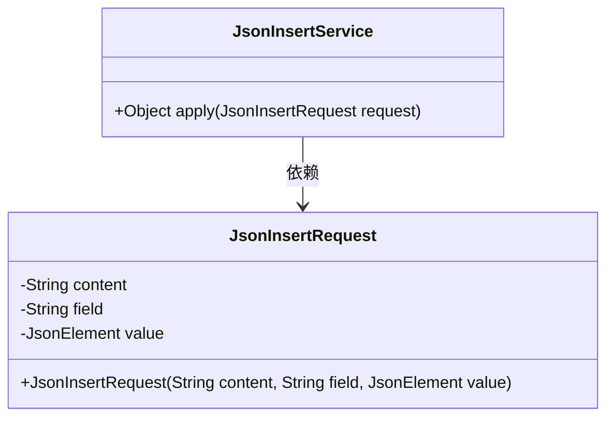
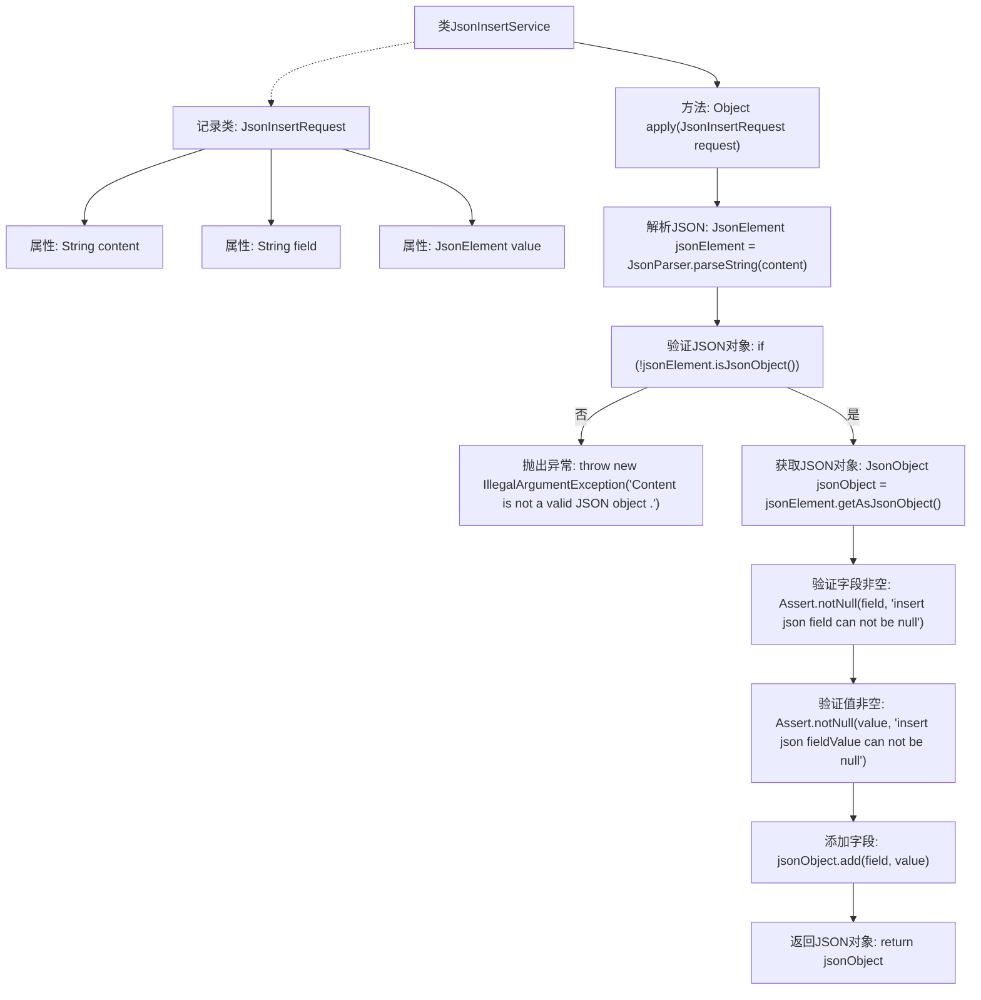

# 基础信息

|      |      |
|------|------|
| 名称 | JsonInsertService |
| 编码语言 | .java |
| 代码路径 | spring-ai-alibaba/community/tool-calls/spring-ai-alibaba-starter-tool-calling-jsonprocessor/src/main/java/com/alibaba/cloud/ai/toolcalling/jsonprocessor/JsonInsertService.java |
| 包名 | com.alibaba.cloud.ai.toolcalling.jsonprocessor |
| 依赖项 | ['com.fasterxml.jackson.annotation.JsonProperty', 'com.google.gson.JsonElement', 'com.google.gson.JsonObject', 'com.google.gson.JsonParser', 'org.springframework.util.Assert', 'java.util.function.Function'] |
| 概述说明 | JsonInsertService实现JSON字段插入，验证输入并返回更新后的JSON对象。 |

# 说明

JsonInsertService是一个用于实现插入JSON字段功能的服务。该服务首先对输入数据进行验证，确保其符合预期的格式和内容要求。验证通过后，服务将指定的字段插入到现有的JSON对象中，并返回更新后的JSON对象。整个过程确保了数据的完整性和准确性，同时提供了清晰的结果输出。

# 类列表 Class Summary

| 名称   | 类型  | 说明 |
|-------|------|-------------|
| JsonInsertService | class | JsonInsertService实现插入JSON字段功能，验证输入并返回更新后的JSON对象。 |

## 类 JsonInsertService

|      |      |
|------|------|
| 访问范围 | public |
| 类型 | class |
| 名称 | JsonInsertService |
| 说明 | JsonInsertService实现插入JSON字段功能，验证输入并返回更新后的JSON对象。 |

### UML类图

这段代码定义了一个 `JsonInsertService` 类，该类实现了 `Function` 接口，用于处理 `JsonInsertRequest` 请求。`JsonInsertRequest` 是一个记录类，包含三个字段：`content`、`field` 和 `value`。`JsonInsertService` 的 `apply` 方法接收一个 `JsonInsertRequest` 对象，解析 `content` 为 JSON 对象，并在该对象中添加指定的 `field` 和 `value`。如果 `content` 不是有效的 JSON 对象，或者 `field` 或 `value` 为 `null`，则会抛出异常。

### 内部方法调用关系图

这段代码描述了一个`JsonInsertService`类，该类实现了`Function`接口，用于处理`JsonInsertRequest`请求。`apply`方法首先解析传入的JSON字符串，验证其是否为有效的JSON对象，然后确保插入的字段和值非空，最后将字段和值添加到JSON对象中并返回。流程图展示了从解析JSON到返回处理后的JSON对象的完整流程。

### 字段列表 Field List

| 名称  | 类型  | 说明 |
|-------|-------|------|

### 方法列表 Method List

| 名称  | 类型  | 说明 |
|-------|-------|------|
| apply | Object | 该方法解析JSON内容，验证字段和值非空，并将值插入指定字段后返回JSON对象。 |

