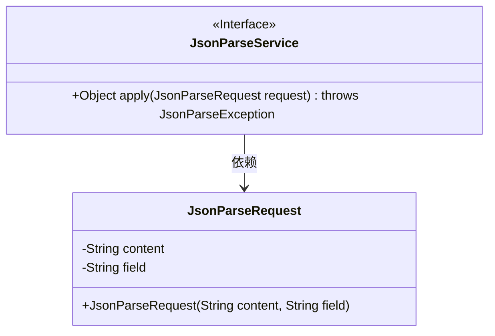
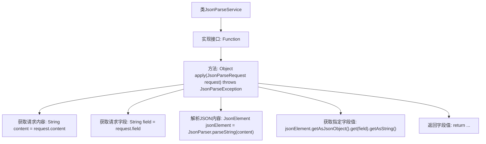
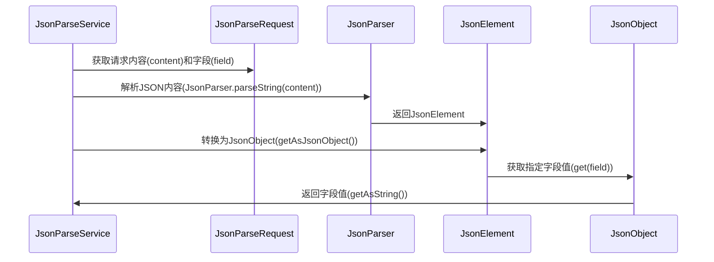

# 基础信息

|      |      |
|------|------|
| 名称 | JsonParseService |
| 编码语言 | .java |
| 代码路径 | spring-ai-alibaba/community/tool-calls/spring-ai-alibaba-starter-tool-calling-jsonprocessor/src/main/java/com/alibaba/cloud/ai/toolcalling/jsonprocessor/JsonParseService.java |
| 包名 | com.alibaba.cloud.ai.toolcalling.jsonprocessor |
| 依赖项 | ['com.fasterxml.jackson.annotation.JsonProperty', 'com.google.gson.JsonElement', 'com.google.gson.JsonParseException', 'com.google.gson.JsonParser', 'java.util.function.Function'] |
| 概述说明 | JsonParseService解析JSON并返回指定字段值。 |

# 说明

JsonParseService是一个用于解析JSON内容的服务，其主要功能是从给定的JSON数据中提取并返回用户指定的字段值。该服务通过解析JSON结构，定位并获取所需的字段信息，确保用户能够准确获取所需数据。这一过程不涉及代码实现，仅专注于功能描述。

# 类列表 Class Summary

| 名称   | 类型  | 说明 |
|-------|------|-------------|
| JsonParseService | class | JsonParseService解析JSON内容并返回指定字段值。 |

## 类 JsonParseService

|      |      |
|------|------|
| 访问范围 | public |
| 类型 | class |
| 名称 | JsonParseService |
| 说明 | JsonParseService解析JSON内容并返回指定字段值。 |

### UML类图

**描述：**
`JsonParseService` 类实现了 `Function` 接口，用于处理 JSON 解析请求。它包含一个 `apply` 方法，接收 `JsonParseRequest` 对象作为参数，并返回解析后的字符串。`JsonParseRequest` 是一个记录类，包含两个字段：`content` 和 `field`，分别表示 JSON 内容和需要提取的字段。`JsonParseService` 依赖于 `JsonParseRequest` 来获取解析所需的数据。

### 内部方法调用关系图

这段代码定义了一个`JsonParseService`类，该类实现了`Function`接口，用于解析JSON请求并返回指定字段的值。代码首先从请求中获取内容和字段，然后使用`JsonParser`解析JSON内容，最后从解析后的`JsonObject`中获取指定字段的值并返回。流程图展示了类的结构和方法调用关系，时序图则详细描述了方法调用的顺序和交互过程。

### 字段列表 Field List

| 名称  | 类型  | 说明 |
|-------|-------|------|

### 方法列表 Method List

| 名称  | 类型  | 说明 |
|-------|-------|------|
| apply | Object | 该方法解析JSON请求并返回指定字段的字符串值。 |

