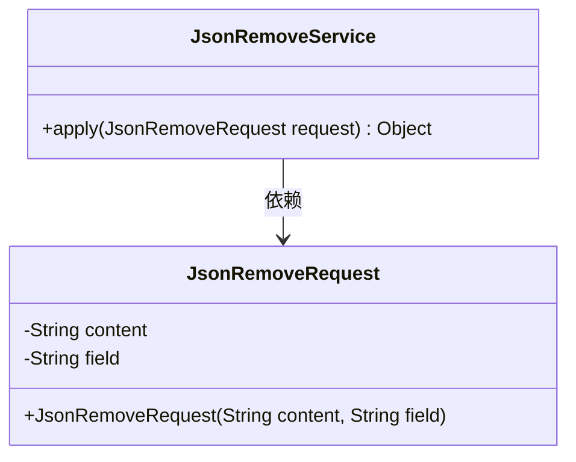
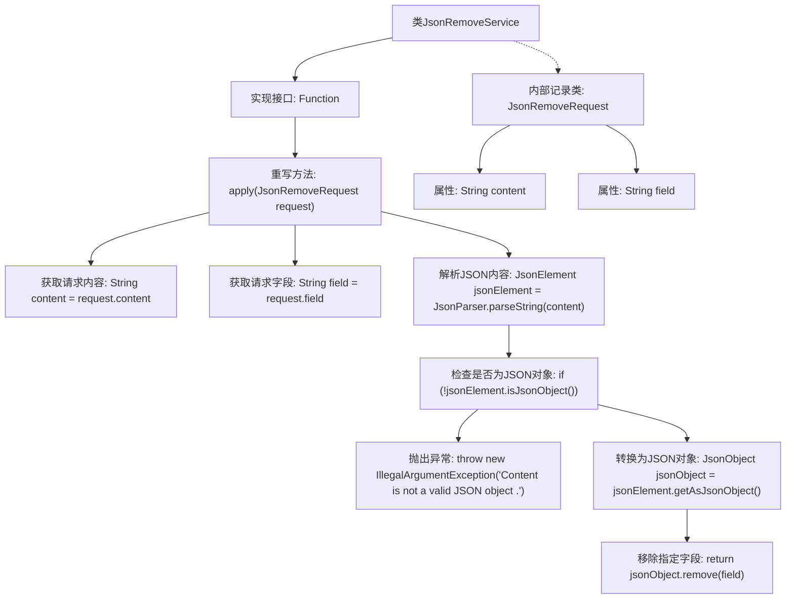

# 基础信息

|      |      |
|------|------|
| 名称 | JsonRemoveService |
| 编码语言 | .java |
| 代码路径 | spring-ai-alibaba/community/tool-calls/spring-ai-alibaba-starter-tool-calling-jsonprocessor/src/main/java/com/alibaba/cloud/ai/toolcalling/jsonprocessor/JsonRemoveService.java |
| 包名 | com.alibaba.cloud.ai.toolcalling.jsonprocessor |
| 依赖项 | ['com.fasterxml.jackson.annotation.JsonProperty', 'com.google.gson.JsonElement', 'com.google.gson.JsonObject', 'com.google.gson.JsonParseException', 'com.google.gson.JsonParser', 'java.util.function.Function'] |
| 概述说明 | JsonRemoveService类用于移除JSON对象中的指定字段。 |

# 说明

JsonRemoveService类是一个用于处理JSON对象的工具类，其主要功能是从给定的JSON对象中移除指定的字段。通过调用该类的相关方法，用户可以便捷地删除不需要的字段，从而实现对JSON数据的精简和优化。该类适用于需要对JSON结构进行动态调整的场景，确保数据处理的高效性和灵活性。

# 类列表 Class Summary

| 名称   | 类型  | 说明 |
|-------|------|-------------|
| JsonRemoveService | class | JsonRemoveService类实现移除JSON对象中指定字段的功能。 |

## 类 JsonRemoveService

|      |      |
|------|------|
| 访问范围 | public |
| 类型 | class |
| 名称 | JsonRemoveService |
| 说明 | JsonRemoveService类实现移除JSON对象中指定字段的功能。 |

### UML类图

这段代码定义了一个 `JsonRemoveService` 类，该类实现了 `Function` 接口，用于处理 JSON 数据的移除操作。`JsonRemoveService` 类包含一个 `apply` 方法，该方法接收一个 `JsonRemoveRequest` 对象作为参数，并返回移除指定字段后的 JSON 对象。`JsonRemoveRequest` 是一个记录类，包含两个字段：`content` 和 `field`，分别表示 JSON 字符串和要移除的字段。`JsonRemoveService` 类依赖于 `JsonRemoveRequest` 类来获取操作所需的数据。

### 内部方法调用关系图

这段代码定义了一个`JsonRemoveService`类，实现了`Function`接口，用于处理`JsonRemoveRequest`请求。`apply`方法首先从请求中获取内容和字段，然后解析JSON内容并检查是否为有效的JSON对象。如果不是，抛出异常；如果是，则将其转换为`JsonObject`并移除指定字段。内部记录类`JsonRemoveRequest`用于封装请求内容。

### 字段列表 Field List

| 名称  | 类型  | 说明 |
|-------|-------|------|

### 方法列表 Method List

| 名称  | 类型  | 说明 |
|-------|-------|------|
| apply | Object | 方法解析JSON内容并移除指定字段，返回移除结果。 |

