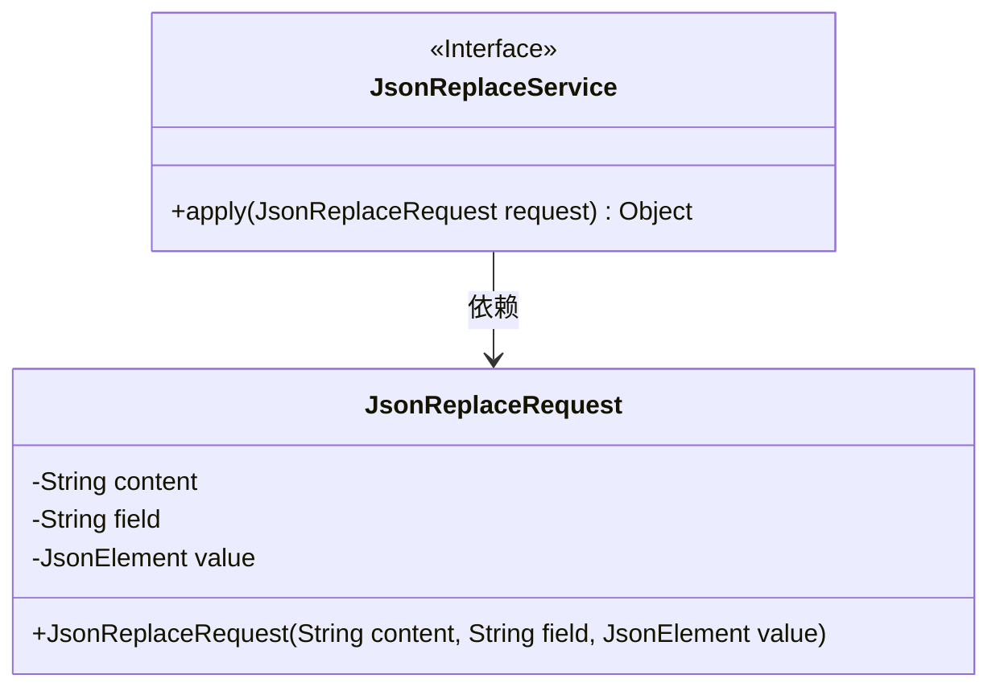
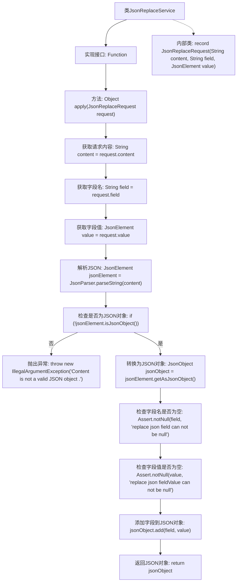

# 基础信息

|      |      |
|------|------|
| 名称 | JsonReplaceService |
| 编码语言 | .java |
| 代码路径 | spring-ai-alibaba/community/tool-calls/spring-ai-alibaba-starter-tool-calling-jsonprocessor/src/main/java/com/alibaba/cloud/ai/toolcalling/jsonprocessor/JsonReplaceService.java |
| 包名 | com.alibaba.cloud.ai.toolcalling.jsonprocessor |
| 依赖项 | ['com.fasterxml.jackson.annotation.JsonProperty', 'com.google.gson.JsonElement', 'com.google.gson.JsonObject', 'com.google.gson.JsonParser', 'org.springframework.util.Assert', 'java.util.function.Function'] |
| 概述说明 | JsonReplaceService类用于替换JSON字段并返回修改后的对象。 |

# 说明

JsonReplaceService类的主要功能是实现JSON字段的替换。该类接收包含特定字段的JSON请求，并根据请求中的指示对相应字段进行修改。处理完成后，返回修改后的JSON对象。该服务确保了JSON数据的灵活性和可操作性，适用于需要动态调整JSON结构的应用场景。

# 类列表 Class Summary

| 名称   | 类型  | 说明 |
|-------|------|-------------|
| JsonReplaceService | class | JsonReplaceService类实现替换JSON字段功能，接收请求并返回修改后的JSON对象。 |

## 类 JsonReplaceService

|      |      |
|------|------|
| 访问范围 | public |
| 类型 | class |
| 名称 | JsonReplaceService |
| 说明 | JsonReplaceService类实现替换JSON字段功能，接收请求并返回修改后的JSON对象。 |

### UML类图

**描述**：`JsonReplaceService` 类实现了 `Function` 接口，用于处理 JSON 替换请求。它接收一个 `JsonReplaceRequest` 对象，该对象包含 JSON 内容、字段名和要替换的值。`JsonReplaceService` 解析 JSON 内容，验证其有效性，并执行字段替换操作，最终返回更新后的 JSON 对象。`JsonReplaceRequest` 是一个记录类，用于封装请求参数。

### 内部方法调用关系图

这段代码描述了一个`JsonReplaceService`类，该类实现了`Function`接口，用于处理JSON替换请求。流程从解析请求内容开始，检查是否为有效的JSON对象，然后添加指定的字段和值到JSON对象中，并返回更新后的JSON对象。代码中还包含一个内部类`JsonReplaceRequest`，用于封装请求数据。

### 字段列表 Field List

| 名称  | 类型  | 说明 |
|-------|-------|------|

### 方法列表 Method List

| 名称  | 类型  | 说明 |
|-------|-------|------|
| apply | Object | 方法解析JSON内容，替换指定字段并返回修改后的JSON对象。 |

