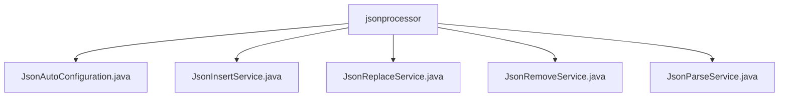

# 基础信息

|      |      |
|------|------|
| 名称 | jsonprocessor |
| 编码语言 | .java |
| 代码路径 | spring-ai-alibaba/community/tool-calls/spring-ai-alibaba-starter-tool-calling-jsonprocessor/src/main/java/com/alibaba/cloud/ai/toolcalling/jsonprocessor |
| 包名 | spring-ai-alibaba.community.tool-calls.spring-ai-alibaba-starter-tool-calling-jsonprocessor.src.main.java.com.alibaba.cloud.ai.toolcalling.jsonprocessor |
| 概述说明 | JsonAutoConfiguration类配置Gson服务，实现JSON字段的插入、解析、移除和替换操作。 |

# 说明

## 概述

该代码模块是一个用于处理JSON数据的工具集，主要提供对JSON属性字段的插入、解析、移除和替换功能。模块的核心配置由`JsonAutoConfiguration`类负责，它整合了四个核心服务：`JsonInsertService`、`JsonReplaceService`、`JsonRemoveService`和`JsonParseService`。这些服务共同实现了对JSON数据的灵活操作，确保在处理JSON时能够高效地进行属性字段的管理和转换。

## 主要业务场景

1. **JSON字段插入**：通过`JsonInsertService`，用户可以在现有的JSON对象中插入指定的字段。该服务首先对输入数据进行验证，确保其符合预期的格式和内容要求，然后插入字段并返回更新后的JSON对象。适用于需要在JSON中动态添加新字段的场景。

2. **JSON字段替换**：`JsonReplaceService`类提供了JSON字段的替换功能。它接收包含特定字段的JSON请求，并根据请求中的指示对相应字段进行修改，最终返回修改后的JSON对象。适用于需要动态调整JSON结构中已有字段的场景。

3. **JSON字段移除**：`JsonRemoveService`类允许用户从给定的JSON对象中移除指定的字段。通过调用该类的相关方法，用户可以便捷地删除不需要的字段，从而实现对JSON数据的精简和优化。适用于需要动态删除JSON字段的场景。

4. **JSON字段解析**：`JsonParseService`服务专注于从给定的JSON数据中提取并返回用户指定的字段值。通过解析JSON结构，定位并获取所需的字段信息，确保用户能够准确获取所需数据。适用于需要从JSON中提取特定信息的场景。

这些服务共同构成了一个功能强大的JSON处理工具集，适用于需要动态操作JSON数据的各种应用场景，确保数据处理的高效性和灵活性。

### 包内部结构视图

该流程图展示了 `jsonprocessor` 目录下的文件层级关系。`jsonprocessor` 作为根节点，包含了五个子节点，分别是 `JsonAutoConfiguration.java`、`JsonInsertService.java`、`JsonReplaceService.java`、`JsonRemoveService.java` 和 `JsonParseService.java`。这些文件均位于同一目录下，反映了它们在项目中的组织结构。

# 文件列表 File List

| 名称   | 类型  | 说明 |
|-------|------|-------------|
| [JsonParseService.java](JsonParseService.md) | file | JsonParseService解析JSON并返回指定字段值。 |
| [JsonRemoveService.java](JsonRemoveService.md) | file | JsonRemoveService类用于移除JSON对象中的指定字段。 |
| [JsonInsertService.java](JsonInsertService.md) | file | JsonInsertService实现JSON字段插入，验证输入并返回更新后的JSON对象。 |
| [JsonReplaceService.java](JsonReplaceService.md) | file | JsonReplaceService类用于替换JSON字段并返回修改后的对象。 |
| [JsonAutoConfiguration.java](JsonAutoConfiguration.md) | file | JsonAutoConfiguration类配置Gson的插入、解析、移除和替换JSON属性字段服务。 |

