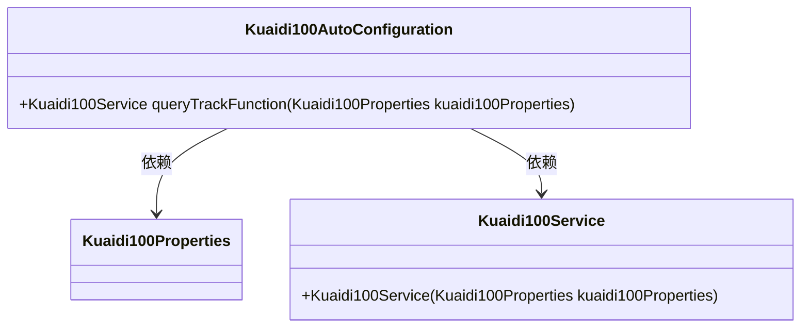
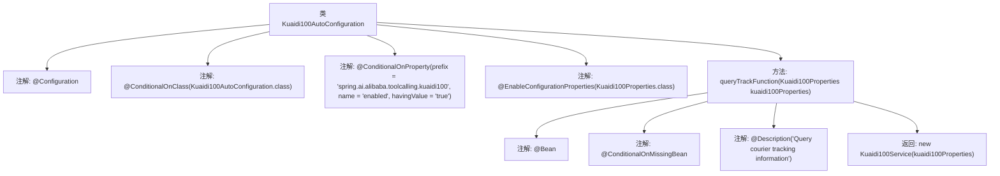

# 基础信息

|      |      |
|------|------|
| 名称 | Kuaidi100AutoConfiguration |
| 编码语言 | .java |
| 代码路径 | spring-ai-alibaba/community/tool-calls/spring-ai-alibaba-starter-tool-calling-kuaidi100/src/main/java/com/alibaba/cloud/ai/toolcalling/kuaidi100/Kuaidi100AutoConfiguration.java |
| 包名 | com.alibaba.cloud.ai.toolcalling.kuaidi100 |
| 依赖项 | ['org.springframework.boot.autoconfigure.condition.ConditionalOnClass', 'org.springframework.boot.autoconfigure.condition.ConditionalOnMissingBean', 'org.springframework.boot.autoconfigure.condition.ConditionalOnProperty', 'org.springframework.boot.context.properties.EnableConfigurationProperties', 'org.springframework.context.annotation.Bean', 'org.springframework.context.annotation.Configuration', 'org.springframework.context.annotation.Description'] |
| 概述说明 | 配置类启用快递100服务需类存在且属性启用。 |

# 说明

配置类启用快递100服务的条件是该类存在且其属性已启用。具体来说，只有在配置类存在并且其相关属性被设置为启用状态时，快递100服务才会被激活并投入使用。这一条件确保了服务在适当的配置环境下运行，避免了因配置缺失或属性未启用而导致的潜在问题。

# 类列表 Class Summary

| 名称   | 类型  | 说明 |
|-------|------|-------------|
| Kuaidi100AutoConfiguration | class | 配置类启用快递100服务，条件为类存在且属性启用。 |

## 类 Kuaidi100AutoConfiguration

|      |      |
|------|------|
| 访问范围 | @Configuration;@ConditionalOnClass(Kuaidi100AutoConfiguration.class);@ConditionalOnProperty(prefix = "spring.ai.alibaba.toolcalling.kuaidi100", name = "enabled", havingValue = "true");@EnableConfigurationProperties(Kuaidi100Properties.class);public |
| 类型 | class |
| 名称 | Kuaidi100AutoConfiguration |
| 说明 | 配置类启用快递100服务，条件为类存在且属性启用。 |

### UML类图

这段代码展示了Spring Boot中的自动配置类`Kuaidi100AutoConfiguration`，它根据条件创建并返回`Kuaidi100Service`的实例。`Kuaidi100Service`依赖于`Kuaidi100Properties`类，用于配置快递查询服务。`Kuaidi100AutoConfiguration`类通过`@ConditionalOnClass`和`@ConditionalOnProperty`注解确保在特定条件下自动配置生效。

### 内部方法调用关系图

该流程图展示了`Kuaidi100AutoConfiguration`类的结构和内部方法调用关系。类通过多个条件注解进行配置，仅在满足特定条件时生效。`queryTrackFunction`方法用于查询快递跟踪信息，返回一个`Kuaidi100Service`实例。该方法在缺失`Kuaidi100Service` Bean时才会被调用，并且通过`@Description`注解提供了方法的功能描述。

### 字段列表 Field List

| 名称  | 类型  | 说明 |
|-------|-------|------|

### 方法列表 Method List

| 名称  | 类型  | 说明 |
|-------|-------|------|
| queryTrackFunction | Kuaidi100Service | 查询快递跟踪信息的Kuaidi100Service实例化方法。 |

