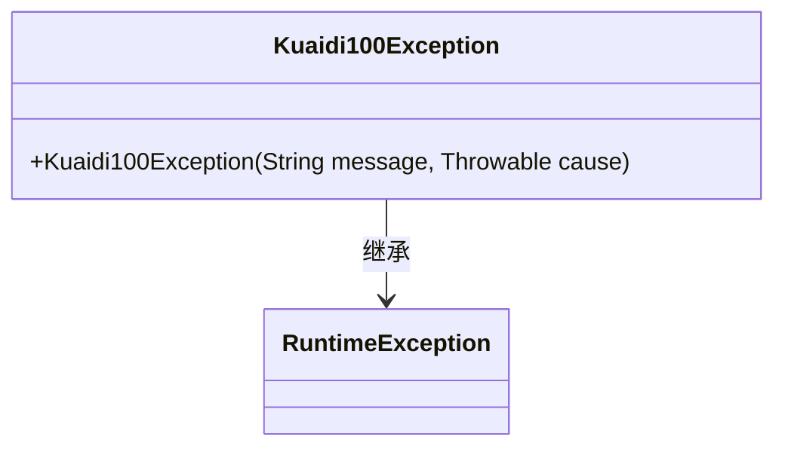
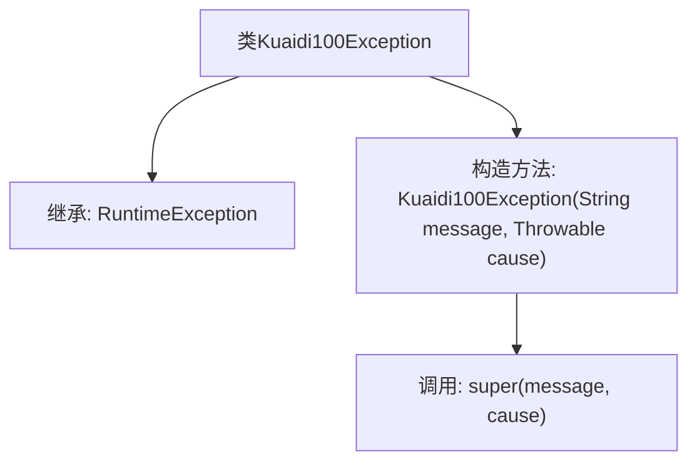

# 基础信息

|      |      |
|------|------|
| 名称 | Kuaidi100Exception |
| 编码语言 | .java |
| 代码路径 | spring-ai-alibaba/community/tool-calls/spring-ai-alibaba-starter-tool-calling-kuaidi100/src/main/java/com/alibaba/cloud/ai/toolcalling/kuaidi100/Kuaidi100Exception.java |
| 包名 | com.alibaba.cloud.ai.toolcalling.kuaidi100 |
| 依赖项 | [] |
| 概述说明 | Kuaidi100Exception继承RuntimeException，支持消息和原因的构造方法。 |

# 说明

Kuaidi100Exception继承自RuntimeException，提供了带有消息和原因的构造方法，用于在异常发生时传递详细的错误信息和根本原因。

# 类列表 Class Summary

| 名称   | 类型  | 说明 |
|-------|------|-------------|
| Kuaidi100Exception | class | Kuaidi100Exception继承RuntimeException，包含带消息和原因的构造方法。 |

## 类 Kuaidi100Exception

|      |      |
|------|------|
| 访问范围 | public |
| 类型 | class |
| 名称 | Kuaidi100Exception |
| 说明 | Kuaidi100Exception继承RuntimeException，包含带消息和原因的构造方法。 |

### UML类图

这段代码定义了一个名为 `Kuaidi100Exception` 的类，它继承自 `RuntimeException`。该类提供了一个构造函数，接受一个字符串类型的 `message` 和一个 `Throwable` 类型的 `cause` 作为参数，并将它们传递给父类的构造函数。这个类主要用于处理与快递100相关的异常情况，继承了 `RuntimeException` 的特性，表示它是一个运行时异常，通常用于处理非检查型异常。

### 内部方法调用关系图

这段代码定义了一个名为`Kuaidi100Exception`的类，该类继承自`RuntimeException`。它包含一个构造方法，该构造方法接受两个参数：`message`和`cause`，并调用父类的构造方法`super(message, cause)`来初始化异常对象。这个类通常用于处理快递100相关的运行时异常，能够传递异常信息和原因。

### 字段列表 Field List

| 名称  | 类型  | 说明 |
|-------|-------|------|

### 方法列表 Method List

| 名称  | 类型  | 说明 |
|-------|-------|------|

