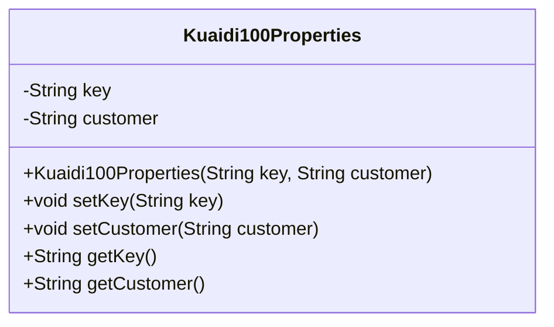
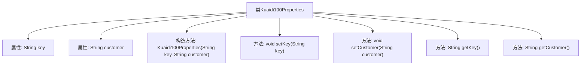

# 基础信息

|      |      |
|------|------|
| 名称 | Kuaidi100Properties |
| 编码语言 | .java |
| 代码路径 | spring-ai-alibaba/community/tool-calls/spring-ai-alibaba-starter-tool-calling-kuaidi100/src/main/java/com/alibaba/cloud/ai/toolcalling/kuaidi100/Kuaidi100Properties.java |
| 包名 | com.alibaba.cloud.ai.toolcalling.kuaidi100 |
| 依赖项 | ['org.springframework.boot.context.properties.ConfigurationProperties'] |
| 概述说明 | Kuaidi100配置类含key和customer属性及相关方法。 |

# 说明

Kuaidi100配置类是一个用于管理和存储Kuaidi100相关配置信息的类。该类包含两个主要属性：key和customer，分别用于存储API密钥和客户标识。此外，该类还提供了相应的方法，用于获取和设置这些属性值，确保配置信息的安全性和可访问性。通过此类，用户可以方便地管理和使用Kuaidi100服务所需的配置参数。

# 类列表 Class Summary

| 名称   | 类型  | 说明 |
|-------|------|-------------|
| Kuaidi100Properties | class | Kuaidi100配置类，包含key和customer属性及相应方法。 |

## 类 Kuaidi100Properties

|      |      |
|------|------|
| 访问范围 | @ConfigurationProperties(prefix = "spring.ai.alibaba.toolcalling.kuaidi100");public |
| 类型 | class |
| 名称 | Kuaidi100Properties |
| 说明 | Kuaidi100配置类，包含key和customer属性及相应方法。 |

### UML类图

**描述：**  
`Kuaidi100Properties` 类用于管理快递100 API 的配置属性，包含 `key` 和 `customer` 两个私有字段。类提供了构造函数用于初始化这两个字段，并提供了相应的 `getter` 和 `setter` 方法，以便在外部访问和修改这些属性。该类主要用于在 Spring 配置中绑定相关属性。

### 内部方法调用关系图

这段代码定义了一个名为 `Kuaidi100Properties` 的类，用于管理快递100的配置属性。类中包含两个私有属性 `key` 和 `customer`，分别用于存储授权key和customer信息。类提供了一个构造方法用于初始化这两个属性，并提供了相应的setter和getter方法来设置和获取这些属性的值。代码通过 `@ConfigurationProperties` 注解与配置文件中的属性进行绑定，确保配置的灵活性和可维护性。

### 字段列表 Field List

| 名称  | 类型  | 说明 |
|-------|-------|------|
| key | String | 定义了一个私有的字符串类型变量key。 |
| customer | String | 定义私有字符串变量customer。 |

### 方法列表 Method List

| 名称  | 类型  | 说明 |
|-------|-------|------|
| getCustomer | String | 方法返回客户信息。 |
| setCustomer | void | 设置客户信息的Java方法。 |
| getKey | String | 该方法返回字符串类型的key值。 |
| setKey | void | 设置类成员变量key的值。 |

