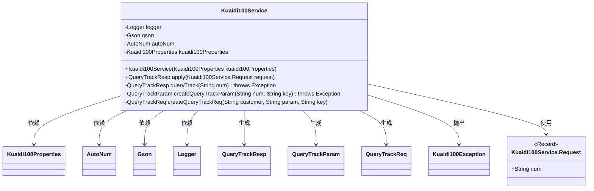
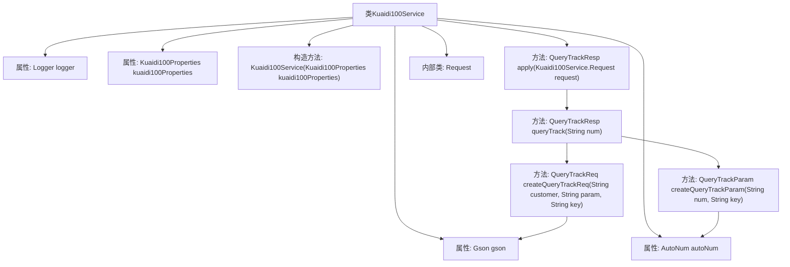

# 基础信息

|      |      |
|------|------|
| 名称 | Kuaidi100Service |
| 编码语言 | .java |
| 代码路径 | spring-ai-alibaba/community/tool-calls/spring-ai-alibaba-starter-tool-calling-kuaidi100/src/main/java/com/alibaba/cloud/ai/toolcalling/kuaidi100/Kuaidi100Service.java |
| 包名 | com.alibaba.cloud.ai.toolcalling.kuaidi100 |
| 依赖项 | ['com.fasterxml.jackson.annotation.JsonClassDescription', 'com.fasterxml.jackson.annotation.JsonInclude', 'com.fasterxml.jackson.annotation.JsonProperty', 'com.fasterxml.jackson.annotation.JsonPropertyDescription', 'com.google.gson.Gson', 'com.kuaidi100.sdk.api.AutoNum', 'com.kuaidi100.sdk.api.QueryTrack', 'com.kuaidi100.sdk.request.AutoNumReq', 'com.kuaidi100.sdk.request.QueryTrackParam', 'com.kuaidi100.sdk.request.QueryTrackReq', 'com.kuaidi100.sdk.response.QueryTrackResp', 'com.kuaidi100.sdk.utils.SignUtils', 'org.slf4j.Logger', 'org.slf4j.LoggerFactory', 'java.util.function.Function'] |
| 概述说明 | Kuaidi100Service类实现快递查询，用Gson处理JSON，AutoNum获取公司，返回物流信息。 |

# 说明

Kuaidi100Service类实现了快递查询功能，利用Gson库处理JSON数据，通过AutoNum获取快递公司信息，查询物流信息并返回查询结果。该功能集成了快递公司识别与物流信息查询，确保用户能够准确获取快递状态。

# 类列表 Class Summary

| 名称   | 类型  | 说明 |
|-------|------|-------------|
| Kuaidi100Service | class | Kuaidi100Service类实现快递查询功能，使用Gson处理JSON，通过AutoNum获取快递公司，查询物流信息并返回结果。 |

## 类 Kuaidi100Service

|      |      |
|------|------|
| 访问范围 | public |
| 类型 | class |
| 名称 | Kuaidi100Service |
| 说明 | Kuaidi100Service类实现快递查询功能，使用Gson处理JSON，通过AutoNum获取快递公司，查询物流信息并返回结果。 |

### UML类图

### 描述
`Kuaidi100Service` 类实现了 `Function` 接口，用于处理快递查询请求。它依赖于 `Kuaidi100Properties`、`AutoNum`、`Gson` 和 `Logger` 等类来完成查询任务。`Kuaidi100Service` 通过 `apply` 方法接收 `Request` 对象，并调用内部方法 `queryTrack` 进行快递查询。查询过程中，`Kuaidi100Service` 会生成 `QueryTrackParam` 和 `QueryTrackReq` 对象，并最终返回 `QueryTrackResp` 结果。如果查询过程中发生异常，会抛出 `Kuaidi100Exception`。

### 内部方法调用关系图

这段代码定义了一个`Kuaidi100Service`类，用于处理快递查询请求。类中包含多个方法，用于构造查询参数、发送查询请求并处理响应。`apply`方法是主要入口，调用`queryTrack`方法进行查询，并在异常情况下记录错误日志。`queryTrack`方法进一步调用`createQueryTrackParam`和`createQueryTrackReq`来构建请求参数和请求对象，最终通过`QueryTrack`类执行查询并返回结果。

### 字段列表 Field List

| 名称  | 类型  | 说明 |
|-------|-------|------|
| logger = LoggerFactory.getLogger(Kuaidi100Service.class) | Logger | Kuaidi100Service类中定义了私有的静态日志记录器。 |
| autoNum = new AutoNum() | AutoNum | 声明并初始化了一个私有的AutoNum对象autoNum。 |
| kuaidi100Properties | Kuaidi100Properties | 定义Kuaidi100Properties类的final实例kuaidi100Properties。 |
| gson = new Gson() | Gson | 代码声明了一个私有的不可变的Gson对象实例。 |

### 方法列表 Method List

| 名称  | 类型  | 说明 |
|-------|-------|------|
| createQueryTrackParam | QueryTrackParam | 创建查询跟踪参数，设置公司和编号。 |
| queryTrack | QueryTrackResp | 查询物流轨迹方法，包含参数处理和请求构建。 |
| apply | QueryTrackResp | 方法查询物流轨迹，成功返回结果，失败抛出异常并记录日志。 |
| createQueryTrackReq | QueryTrackReq | 创建查询请求对象，设置参数、客户和签名。 |

