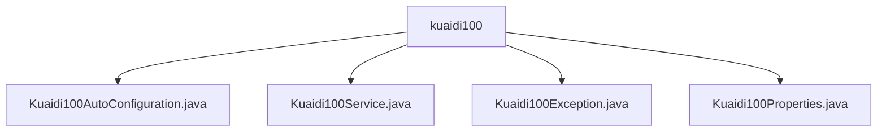

# 基础信息

|      |      |
|------|------|
| 名称 | kuaidi100 |
| 编码语言 | .java |
| 代码路径 | spring-ai-alibaba/community/tool-calls/spring-ai-alibaba-starter-tool-calling-kuaidi100/src/main/java/com/alibaba/cloud/ai/toolcalling/kuaidi100 |
| 包名 | spring-ai-alibaba.community.tool-calls.spring-ai-alibaba-starter-tool-calling-kuaidi100.src.main.java.com.alibaba.cloud.ai.toolcalling.kuaidi100 |
| 概述说明 | 快递100服务启用需配置类存在且属性启用，提供快递查询与异常处理功能。 |

# 说明

## 概述
该代码模块是一个用于集成快递100服务的Spring Boot Starter模块，主要提供了快递查询功能。模块通过自动配置机制确保在满足特定条件时启用快递100服务，并提供了完整的服务实现、配置管理和异常处理功能。模块的核心功能包括快递公司识别、物流信息查询以及配置信息的管理，确保用户能够方便地使用快递100服务。

## 主要业务场景
1. **配置管理**：通过`Kuaidi100Properties`类管理快递100服务的配置信息，包括API密钥和客户标识。确保配置信息的安全性和可访问性，为服务提供必要的参数。
2. **服务激活**：`Kuaidi100AutoConfiguration`类负责在配置类存在且相关属性启用时，自动激活快递100服务。这一机制确保了服务在适当的配置环境下运行，避免了因配置缺失或属性未启用而导致的潜在问题。
3. **快递查询**：`Kuaidi100Service`类实现了快递查询功能，利用Gson库处理JSON数据，通过`AutoNum`获取快递公司信息，并查询物流信息。该功能集成了快递公司识别与物流信息查询，确保用户能够准确获取快递状态。
4. **异常处理**：`Kuaidi100Exception`类继承自`RuntimeException`，提供了带有消息和原因的构造方法，用于在异常发生时传递详细的错误信息和根本原因。确保在服务执行过程中能够有效捕获和处理异常。

### 包内部结构视图

该流程图展示了`kuaidi100`目录下的四个Java文件之间的层级关系。`kuaidi100`作为根节点，包含了`Kuaidi100AutoConfiguration.java`、`Kuaidi100Service.java`、`Kuaidi100Exception.java`和`Kuaidi100Properties.java`四个子节点。这些文件分别代表了自动配置类、服务类、异常类和属性类，共同构成了一个完整的工具调用模块。

# 文件列表 File List

| 名称   | 类型  | 说明 |
|-------|------|-------------|
| [Kuaidi100Properties.java](Kuaidi100Properties.md) | file | Kuaidi100配置类含key和customer属性及相关方法。 |
| [Kuaidi100Exception.java](Kuaidi100Exception.md) | file | Kuaidi100Exception继承RuntimeException，支持消息和原因的构造方法。 |
| [Kuaidi100Service.java](Kuaidi100Service.md) | file | Kuaidi100Service类实现快递查询，用Gson处理JSON，AutoNum获取公司，返回物流信息。 |
| [Kuaidi100AutoConfiguration.java](Kuaidi100AutoConfiguration.md) | file | 配置类启用快递100服务需类存在且属性启用。 |

