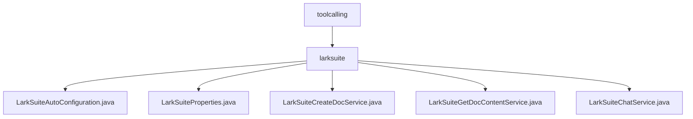

# 基础信息

|      |      |
|------|------|
| 名称 | toolcalling |
| 编码语言 | .java |
| 代码路径 | spring-ai-alibaba/community/tool-calls/spring-ai-alibaba-starter-tool-calling-larksuite/src/main/java/com/alibaba/cloud/ai/toolcalling |
| 包名 | spring-ai-alibaba.community.tool-calls.spring-ai-alibaba-starter-tool-calling-larksuite.src.main.java.com.alibaba.cloud.ai.toolcalling |
| 概述说明 | LarkSuite自动配置类启用配置属性，简化文档和聊天服务创建流程。 |

# 说明

## 概述
该代码模块是一个用于与LarkSuite（飞书）平台集成的Spring Boot Starter工具包，主要提供了自动配置、身份验证、文档创建与管理、文档内容获取以及消息发送等功能。通过该模块，开发者可以快速集成LarkSuite的文档和聊天服务，简化了配置和调用流程，提升了开发效率和系统的集成便利性。

## 主要业务场景
1. **自动配置与属性加载**：`LarkSuiteAutoConfiguration`类负责在应用启动时自动加载和初始化相关配置属性，确保文档和聊天服务能够正确启用并运行。
2. **身份验证**：`LarkSuiteProperties`类用于配置应用程序的`AppId`和`AppSecret`，确保应用程序能够在LarkSuite平台中进行安全的身份验证和授权操作。
3. **文档创建**：`LarkSuiteCreateDocService`类提供创建飞书文档的功能，通过验证配置和处理请求流程，确保文档能够顺利生成。
4. **文档内容获取**：`LarkSuiteGetDocContentService`类通过用户凭证和文档ID，高效提取文档中的纯文本内容，适用于需要快速访问和处理文档内容的场景。
5. **消息发送**：`LarkSuiteChatService`类负责处理用户请求并生成响应，实现消息的发送功能，确保消息传递的准确性和效率。

该模块适用于需要与LarkSuite平台进行深度集成的应用场景，例如企业内部文档管理、团队协作、自动化消息通知等。

### 包内部结构视图

该流程图展示了`spring-ai-alibaba-starter-tool-calling-larksuite`模块中`toolcalling`目录下的层级结构。`toolcalling`目录包含一个子目录`larksuite`，而`larksuite`目录下则包含了多个Java文件，分别用于处理与LarkSuite相关的自动配置、属性、文档创建、文档内容获取和聊天服务等功能。

# 文件列表 File List

| 名称   | 类型  | 说明 |
|-------|------|-------------|
| [larksuite](larksuite/_module.md) | package | LarkSuite自动配置类启用配置属性，简化文档和聊天服务创建流程。 |

