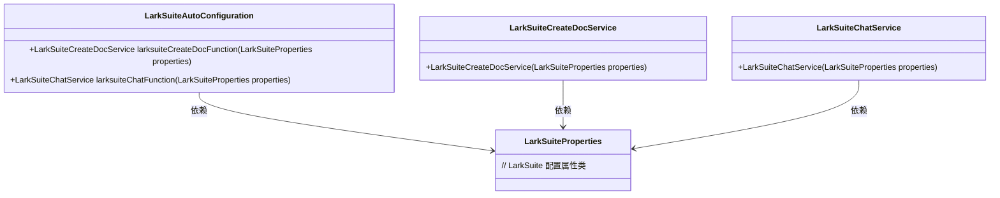

# 基础信息

|      |      |
|------|------|
| 名称 | LarkSuiteAutoConfiguration |
| 编码语言 | .java |
| 代码路径 | spring-ai-alibaba/community/tool-calls/spring-ai-alibaba-starter-tool-calling-larksuite/src/main/java/com/alibaba/cloud/ai/toolcalling/larksuite/LarkSuiteAutoConfiguration.java |
| 包名 | com.alibaba.cloud.ai.toolcalling.larksuite |
| 依赖项 | ['org.springframework.boot.autoconfigure.condition.ConditionalOnClass', 'org.springframework.boot.autoconfigure.condition.ConditionalOnMissingBean', 'org.springframework.boot.autoconfigure.condition.ConditionalOnProperty', 'org.springframework.boot.context.properties.EnableConfigurationProperties', 'org.springframework.context.annotation.Bean', 'org.springframework.context.annotation.Description'] |
| 概述说明 | LarkSuite自动配置类启用属性，生成文档和聊天服务。 |

# 说明

LarkSuite自动配置类主要用于启用配置属性，并创建文档和聊天服务。该配置类通过自动化的方式，确保相关属性在应用启动时被正确加载和初始化，从而简化了服务配置的流程。通过该配置类，用户可以快速创建和管理文档服务以及聊天服务，提升系统的集成效率和开发便利性。

# 类列表 Class Summary

| 名称   | 类型  | 说明 |
|-------|------|-------------|
| LarkSuiteAutoConfiguration | class | LarkSuite自动配置类，启用配置属性并创建文档和聊天服务。 |

## 类 LarkSuiteAutoConfiguration

|      |      |
|------|------|
| 访问范围 | @EnableConfigurationProperties({ LarkSuiteProperties.class });@ConditionalOnClass({ LarkSuiteProperties.class });@ConditionalOnProperty(prefix = "spring.ai.alibaba.toolcalling.larksuite", name = "enabled", havingValue = "true");public |
| 类型 | class |
| 名称 | LarkSuiteAutoConfiguration |
| 说明 | LarkSuite自动配置类，启用配置属性并创建文档和聊天服务。 |

### UML类图

这段代码定义了一个名为 `LarkSuiteAutoConfiguration` 的自动配置类，用于在 Spring 应用中自动配置与 LarkSuite 相关的服务。该类通过 `@Bean` 注解定义了两个服务：`LarkSuiteCreateDocService` 和 `LarkSuiteChatService`，分别用于创建文档和发送消息。这两个服务都依赖于 `LarkSuiteProperties` 类，该类包含了 LarkSuite 的配置属性。`LarkSuiteAutoConfiguration` 类仅在 `LarkSuiteProperties` 类存在且特定配置属性启用时才会生效。

### 内部方法调用关系图

这段代码是一个Spring Boot自动配置类，用于根据条件创建和配置LarkSuite的相关服务。类`LarkSuiteAutoConfiguration`通过多个注解控制其行为，如`@EnableConfigurationProperties`、`@ConditionalOnClass`和`@ConditionalOnProperty`。类中定义了两个Bean方法：`larksuiteCreateDocFunction`和`larksuiteChatFunction`，分别用于创建文档服务和聊天服务。每个方法都使用了`@Bean`、`@ConditionalOnMissingBean`和`@Description`注解，确保在缺失Bean时自动创建，并提供了方法的功能描述。

### 字段列表 Field List

| 名称  | 类型  | 说明 |
|-------|-------|------|

### 方法列表 Method List

| 名称  | 类型  | 说明 |
|-------|-------|------|
| larksuiteCreateDocFunction | LarkSuiteCreateDocService | 调用文档API创建LarkSuite文档的服务。 |
| larksuiteChatFunction | LarkSuiteChatService | 定义条件缺失时创建发送群聊和私聊消息的LarkSuiteChatService实例。 |

