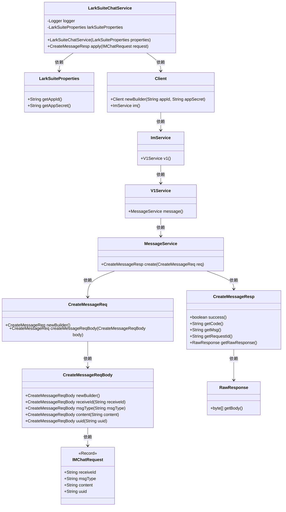
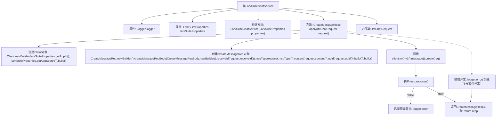

# 基础信息

|      |      |
|------|------|
| 名称 | LarkSuiteChatService |
| 编码语言 | .java |
| 代码路径 | spring-ai-alibaba/community/tool-calls/spring-ai-alibaba-starter-tool-calling-larksuite/src/main/java/com/alibaba/cloud/ai/toolcalling/larksuite/LarkSuiteChatService.java |
| 包名 | com.alibaba.cloud.ai.toolcalling.larksuite |
| 依赖项 | ['com.fasterxml.jackson.annotation.JsonProperty', 'com.google.gson.JsonParser', 'com.lark.oapi.Client', 'com.lark.oapi.core.utils.Jsons', 'com.lark.oapi.service.im.v1.model.CreateMessageReq', 'com.lark.oapi.service.im.v1.model.CreateMessageReqBody', 'com.lark.oapi.service.im.v1.model.CreateMessageResp', 'org.slf4j.Logger', 'org.slf4j.LoggerFactory', 'java.nio.charset.StandardCharsets', 'java.util.function.Function'] |
| 概述说明 | LarkSuiteChatService类实现消息发送，处理请求并返回响应。 |

# 说明

LarkSuiteChatService类负责实现消息发送功能，主要处理用户请求并生成相应的响应。该类通过接收输入信息，执行必要的处理逻辑，最终将处理结果以响应形式返回给用户。整个过程确保了消息发送的准确性和效率，同时维护了系统的稳定性和可靠性。

# 类列表 Class Summary

| 名称   | 类型  | 说明 |
|-------|------|-------------|
| LarkSuiteChatService | class | LarkSuiteChatService类实现消息发送功能，处理请求并返回响应。 |

## 类 LarkSuiteChatService

|      |      |
|------|------|
| 访问范围 | public |
| 类型 | class |
| 名称 | LarkSuiteChatService |
| 说明 | LarkSuiteChatService类实现消息发送功能，处理请求并返回响应。 |

### UML类图

这段代码定义了一个`LarkSuiteChatService`类，该类实现了`Function`接口，用于处理飞书聊天消息的创建请求。类中包含了依赖注入的`LarkSuiteProperties`对象，用于获取飞书应用的ID和密钥。`apply`方法通过构建`Client`对象和`CreateMessageReq`对象，发送请求并处理响应。`IMChatRequest`是一个记录类，用于封装聊天请求的相关参数。代码通过一系列的依赖关系，最终实现了消息的创建和响应处理。

### 内部方法调用关系图

这段代码描述了一个名为 `LarkSuiteChatService` 的类，它实现了 `Function` 接口，用于处理飞书聊天服务的请求。类中包含了一个构造方法和一个 `apply` 方法，`apply` 方法负责创建飞书消息并发送请求。代码中还包括了一个内部类 `IMChatRequest`，用于封装请求参数。流程图展示了从创建 `Client` 对象到发送请求、处理响应和异常的全过程。

### 字段列表 Field List

| 名称  | 类型  | 说明 |
|-------|-------|------|
| logger = LoggerFactory.getLogger(LarkSuiteChatService.class) | Logger | LarkSuiteChatService类中定义了一个私有的静态日志记录器。 |
| larkSuiteProperties | LarkSuiteProperties | LarkSuiteProperties对象用于存储LarkSuite相关属性。 |

### 方法列表 Method List

| 名称  | 类型  | 说明 |
|-------|-------|------|
| apply | CreateMessageResp | 创建飞书消息请求，处理响应并记录异常。 |

