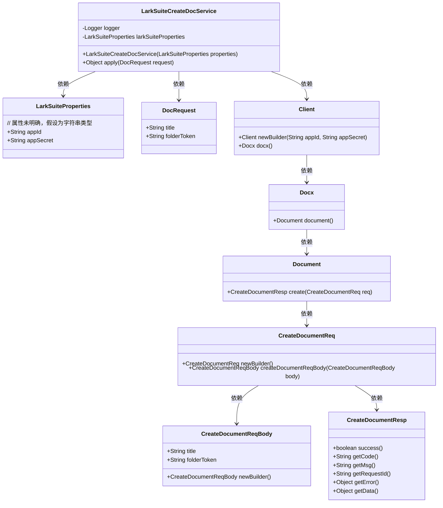
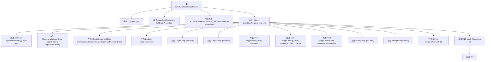

# 基础信息

|      |      |
|------|------|
| 名称 | LarkSuiteCreateDocService |
| 编码语言 | .java |
| 代码路径 | spring-ai-alibaba/community/tool-calls/spring-ai-alibaba-starter-tool-calling-larksuite/src/main/java/com/alibaba/cloud/ai/toolcalling/larksuite/LarkSuiteCreateDocService.java |
| 包名 | com.alibaba.cloud.ai.toolcalling.larksuite |
| 依赖项 | ['com.fasterxml.jackson.annotation.JsonProperty', 'com.fasterxml.jackson.annotation.JsonPropertyDescription', 'com.lark.oapi.Client', 'com.lark.oapi.service.docx.v1.model.CreateDocumentReq', 'com.lark.oapi.service.docx.v1.model.CreateDocumentReqBody', 'com.lark.oapi.service.docx.v1.model.CreateDocumentResp', 'org.slf4j.Logger', 'org.slf4j.LoggerFactory', 'org.springframework.util.ObjectUtils', 'java.util.function.Function'] |
| 概述说明 | LarkSuiteCreateDocService类用于创建飞书文档，验证配置，处理请求。 |

# 说明

LarkSuiteCreateDocService类的主要功能是创建飞书文档。该类的职责包括验证相关配置以确保请求的有效性，并处理创建文档的请求流程。通过这一服务，用户可以便捷地在飞书平台上生成文档，同时确保配置的正确性和请求的顺利执行。

# 类列表 Class Summary

| 名称   | 类型  | 说明 |
|-------|------|-------------|
| LarkSuiteCreateDocService | class | LarkSuiteCreateDocService类用于创建飞书文档，验证配置并处理请求。 |

## 类 LarkSuiteCreateDocService

|      |      |
|------|------|
| 访问范围 | public |
| 类型 | class |
| 名称 | LarkSuiteCreateDocService |
| 说明 | LarkSuiteCreateDocService类用于创建飞书文档，验证配置并处理请求。 |

### UML类图

**类图描述：**  
`LarkSuiteCreateDocService` 类实现了 `Function` 接口，用于创建飞书文档。它依赖于 `LarkSuiteProperties` 类获取应用ID和密钥，并通过 `Client` 类与飞书API进行交互。`Client` 类进一步依赖于 `Docx`、`Document`、`CreateDocumentReq`、`CreateDocumentReqBody` 和 `CreateDocumentResp` 类来构建请求和处理响应。`DocRequest` 类用于封装创建文档所需的参数。整个流程展示了从配置验证到文档创建的完整过程。

### 内部方法调用关系图

这段代码定义了一个名为`LarkSuiteCreateDocService`的类，该类实现了`Function`接口，用于创建飞书文档。代码首先检查`LarkSuiteProperties`中的`appId`和`appSecret`是否为空，若为空则抛出异常。接着，使用这些属性构建一个`Client`对象，并尝试创建文档。如果创建成功，返回文档数据；如果失败，记录错误信息并返回错误对象。整个流程包括属性检查、客户端构建、文档创建、错误处理和日志记录等步骤。

### 字段列表 Field List

| 名称  | 类型  | 说明 |
|-------|-------|------|
| larkSuiteProperties | LarkSuiteProperties | 定义LarkSuiteProperties类型的变量larkSuiteProperties。 |
| logger = LoggerFactory.getLogger(LarkSuiteCreateDocService.class) | Logger | LarkSuiteCreateDocService类中定义了一个静态日志记录器。 |

### 方法列表 Method List

| 名称  | 类型  | 说明 |
|-------|-------|------|
| apply | Object | 检查LarkSuite配置，创建文档并处理响应，记录错误。 |

