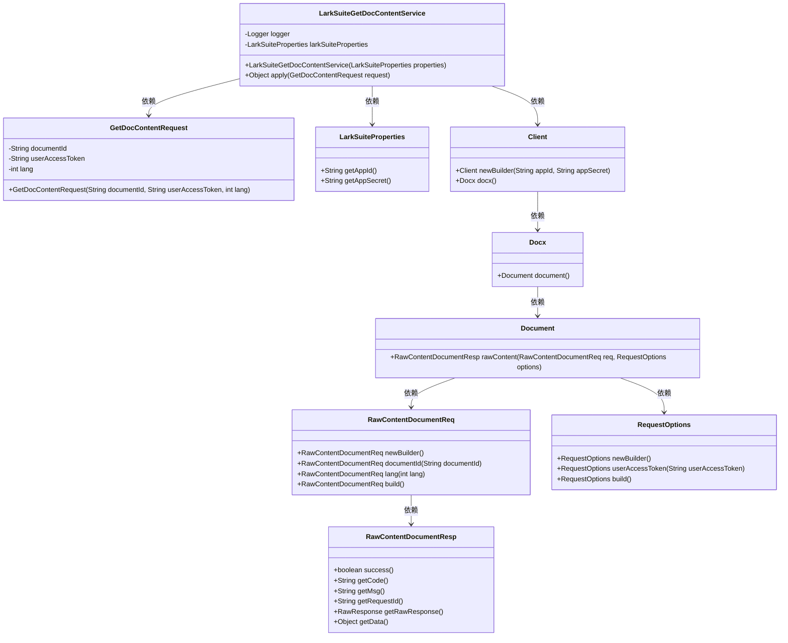
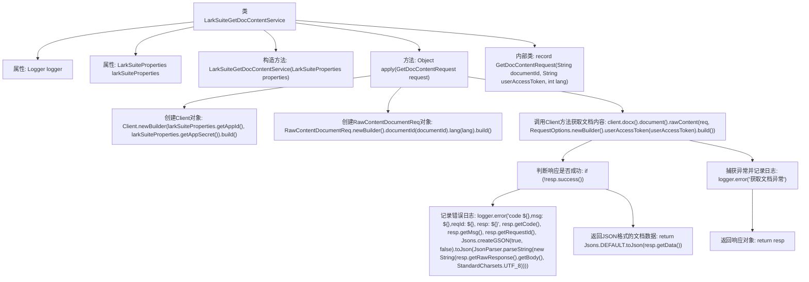

# 基础信息

|      |      |
|------|------|
| 名称 | LarkSuiteGetDocContentService |
| 编码语言 | .java |
| 代码路径 | spring-ai-alibaba/community/tool-calls/spring-ai-alibaba-starter-tool-calling-larksuite/src/main/java/com/alibaba/cloud/ai/toolcalling/larksuite/LarkSuiteGetDocContentService.java |
| 包名 | com.alibaba.cloud.ai.toolcalling.larksuite |
| 依赖项 | ['com.fasterxml.jackson.annotation.JsonProperty', 'com.google.gson.JsonParser', 'com.lark.oapi.Client', 'com.lark.oapi.core.request.RequestOptions', 'com.lark.oapi.core.utils.Jsons', 'com.lark.oapi.service.docx.v1.model.RawContentDocumentReq', 'com.lark.oapi.service.docx.v1.model.RawContentDocumentResp', 'org.slf4j.Logger', 'org.slf4j.LoggerFactory', 'java.nio.charset.StandardCharsets', 'java.util.function.Function'] |
| 概述说明 | 飞书文档服务通过用户凭证和文档ID提取纯文本内容。 |

# 说明

飞书文档内容获取服务通过用户凭证和文档ID，能够高效地提取文档中的纯文本内容。该服务简化了文档信息的获取流程，确保了数据的安全性和准确性，适用于需要快速访问和处理文档内容的场景。

# 类列表 Class Summary

| 名称   | 类型  | 说明 |
|-------|------|-------------|
| LarkSuiteGetDocContentService | class | 飞书文档内容获取服务，使用用户凭证和文档ID获取纯文本内容。 |

## 类 LarkSuiteGetDocContentService

|      |      |
|------|------|
| 访问范围 | public |
| 类型 | class |
| 名称 | LarkSuiteGetDocContentService |
| 说明 | 飞书文档内容获取服务，使用用户凭证和文档ID获取纯文本内容。 |

### UML类图

### 描述
`LarkSuiteGetDocContentService` 是一个服务类，用于获取飞书文档的内容。它依赖于 `LarkSuiteProperties` 来获取应用ID和密钥，并通过 `GetDocContentRequest` 接收文档ID、用户访问凭证和语言参数。服务类通过 `Client` 与飞书API交互，最终返回文档的纯文本内容。整个流程涉及多个类的协作，包括请求构建、响应处理和异常捕获。

### 内部方法调用关系图

这段代码定义了一个名为 `LarkSuiteGetDocContentService` 的类，该类实现了 `Function` 接口，用于根据请求获取飞书文档的内容。代码首先通过 `LarkSuiteProperties` 初始化客户端，然后根据请求参数构建请求对象，并通过客户端获取文档内容。如果响应不成功，则记录错误日志；如果成功，则返回JSON格式的文档数据。整个过程包括客户端的创建、请求的构建、响应的处理以及异常捕获和日志记录。

### 字段列表 Field List

| 名称  | 类型  | 说明 |
|-------|-------|------|
| larkSuiteProperties | LarkSuiteProperties | LarkSuite属性定义。 |
| logger = LoggerFactory.getLogger(LarkSuiteChatService.class) | Logger | 在LarkSuiteChatService类中定义了一个静态且不可变的日志记录器。 |

### 方法列表 Method List

| 名称  | 类型  | 说明 |
|-------|-------|------|
| apply | Object | 根据请求获取文档内容，处理响应并返回JSON数据，异常时记录错误。 |

