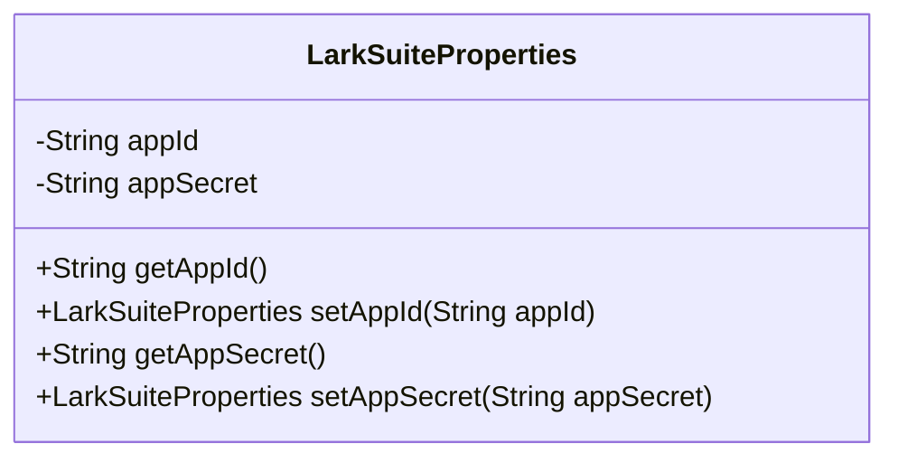
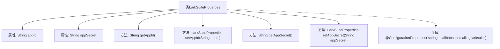

# 基础信息

|      |      |
|------|------|
| 名称 | LarkSuiteProperties |
| 编码语言 | .java |
| 代码路径 | spring-ai-alibaba/community/tool-calls/spring-ai-alibaba-starter-tool-calling-larksuite/src/main/java/com/alibaba/cloud/ai/toolcalling/larksuite/LarkSuiteProperties.java |
| 包名 | com.alibaba.cloud.ai.toolcalling.larksuite |
| 依赖项 | ['org.springframework.boot.context.properties.ConfigurationProperties'] |
| 概述说明 | LarkSuiteProperties类包含AppId和AppSecret属性。 |

# 说明

LarkSuiteProperties类用于配置应用程序的身份验证信息，主要包含AppId和AppSecret两个属性。AppId用于标识应用程序的唯一身份，而AppSecret则是用于确保通信安全的密钥。通过配置这两个属性，应用程序能够在LarkSuite平台中进行身份验证和授权操作，确保安全的数据交互和功能访问。

# 类列表 Class Summary

| 名称   | 类型  | 说明 |
|-------|------|-------------|
| LarkSuiteProperties | class | LarkSuiteProperties类配置了AppId和AppSecret属性。 |

## 类 LarkSuiteProperties

|      |      |
|------|------|
| 访问范围 | @ConfigurationProperties("spring.ai.alibaba.toolcalling.larksuite");public |
| 类型 | class |
| 名称 | LarkSuiteProperties |
| 说明 | LarkSuiteProperties类配置了AppId和AppSecret属性。 |

### UML类图

**描述：**  
`LarkSuiteProperties` 类是一个配置属性类，用于管理飞书工具调用的相关配置。它包含两个私有属性 `appId` 和 `appSecret`，分别表示应用的ID和密钥。类中提供了对应的 `getter` 和 `setter` 方法，用于获取和设置这些属性的值。`setter` 方法返回当前对象，支持链式调用。该类通过 `@ConfigurationProperties` 注解与配置文件中的 `spring.ai.alibaba.toolcalling.larksuite` 属性绑定。

### 内部方法调用关系图

该流程图展示了`LarkSuiteProperties`类的结构，包括其属性和方法。类中包含两个属性`appId`和`appSecret`，分别对应获取和设置这两个属性的方法。类上使用了`@ConfigurationProperties`注解，用于绑定配置属性。通过流程图可以清晰地看到类的内部结构及其方法之间的调用关系。

### 字段列表 Field List

| 名称  | 类型  | 说明 |
|-------|-------|------|
| appId | String | 定义了一个私有字符串变量appId。 |
| appSecret | String | 定义了一个私有字符串变量appSecret。 |

### 方法列表 Method List

| 名称  | 类型  | 说明 |
|-------|-------|------|
| getAppSecret | String | 获取应用密钥的方法。 |
| getAppId | String | 获取应用程序ID的方法。 |
| setAppSecret | LarkSuiteProperties | 设置LarkSuite应用密钥并返回当前对象。 |
| setAppId | LarkSuiteProperties | LarkSuiteProperties类中的setAppId方法用于设置appId并返回当前对象。 |

