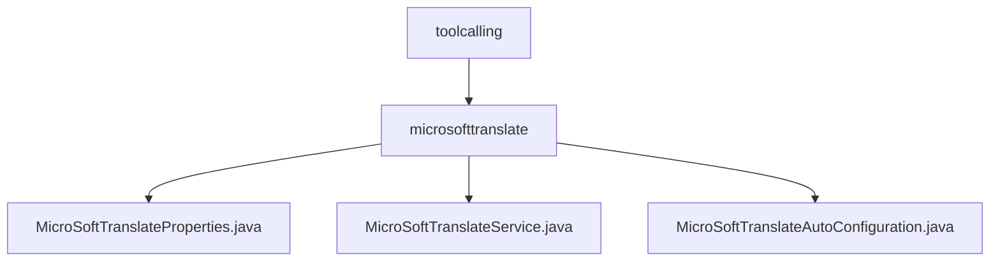

# 基础信息

|      |      |
|------|------|
| 名称 | toolcalling |
| 编码语言 | .java |
| 代码路径 | spring-ai-alibaba/community/tool-calls/spring-ai-alibaba-starter-tool-calling-microsofttranslate/src/main/java/com/alibaba/cloud/ai/toolcalling |
| 包名 | spring-ai-alibaba.community.tool-calls.spring-ai-alibaba-starter-tool-calling-microsofttranslate.src.main.java.com.alibaba.cloud.ai.toolcalling |
| 概述说明 | 配置类管理微软翻译API密钥，服务类处理翻译请求，自动装配简化集成。 |

# 说明

## 概述
该代码模块主要实现了与微软翻译API的集成，提供了文本翻译功能。模块通过配置类、服务类和自动装配类，实现了API密钥的管理、翻译请求的发送与响应处理，以及服务的自动装配，确保了翻译功能的快速、准确和稳定运行。整个模块设计注重代码的可维护性、安全性和开发效率。

## 主要业务场景
1. **API密钥管理**：通过配置类`MicroSoftTranslateProperties`，系统能够安全地存储和管理微软翻译API的密钥，确保翻译服务能够正常访问API。
2. **文本翻译**：`MicroSoftTranslateService`类负责接收用户输入的文本，调用微软翻译API进行翻译，并将翻译结果返回给用户。该过程涉及文本的发送、API的调用以及翻译结果的接收与处理。
3. **服务自动装配**：`MicroSoftTranslateAutoConfiguration`类实现了微软翻译服务的自动装配功能，简化了服务的集成过程。开发者无需手动配置相关组件，系统会自动完成依赖注入和初始化，提高了开发效率并减少了配置错误的可能性。

该模块适用于需要集成微软翻译服务的应用程序，特别是在需要快速、准确地实现文本翻译功能的场景中。

### 包内部结构视图

该流程图展示了`toolcalling`目录下的层级关系，其中`microsofttranslate`是`toolcalling`的子目录，而`MicroSoftTranslateProperties.java`、`MicroSoftTranslateService.java`和`MicroSoftTranslateAutoConfiguration.java`是`microsofttranslate`目录下的文件。通过该图可以清晰地看出文件与目录之间的从属关系。

# 文件列表 File List

| 名称   | 类型  | 说明 |
|-------|------|-------------|
| [microsofttranslate](microsofttranslate/_module.md) | package | 配置类管理微软翻译API密钥，服务类处理翻译请求，自动装配简化集成。 |

