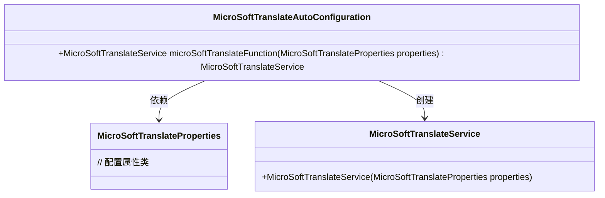
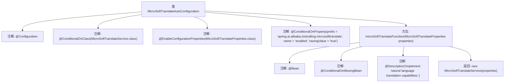

# 基础信息

|      |      |
|------|------|
| 名称 | MicroSoftTranslateAutoConfiguration |
| 编码语言 | .java |
| 代码路径 | spring-ai-alibaba/community/tool-calls/spring-ai-alibaba-starter-tool-calling-microsofttranslate/src/main/java/com/alibaba/cloud/ai/toolcalling/microsofttranslate/MicroSoftTranslateAutoConfiguration.java |
| 包名 | com.alibaba.cloud.ai.toolcalling.microsofttranslate |
| 依赖项 | ['org.springframework.boot.autoconfigure.condition.ConditionalOnClass', 'org.springframework.boot.autoconfigure.condition.ConditionalOnMissingBean', 'org.springframework.boot.autoconfigure.condition.ConditionalOnProperty', 'org.springframework.boot.context.properties.EnableConfigurationProperties', 'org.springframework.context.annotation.Bean', 'org.springframework.context.annotation.Configuration', 'org.springframework.context.annotation.Description'] |
| 概述说明 | 配置类实现微软翻译服务的自动装配。 |

# 说明

该配置类实现了微软翻译服务的自动装配功能，旨在简化微软翻译服务的集成过程。通过自动装配，开发者无需手动配置翻译服务的各个组件，系统会自动完成相关依赖的注入和初始化。这种设计提高了开发效率，减少了配置错误的可能性，并确保翻译服务能够快速、稳定地集成到应用程序中。

# 类列表 Class Summary

| 名称   | 类型  | 说明 |
|-------|------|-------------|
| MicroSoftTranslateAutoConfiguration | class | 配置类实现微软翻译服务自动装配。 |

## 类 MicroSoftTranslateAutoConfiguration

|      |      |
|------|------|
| 访问范围 | @Configuration;@ConditionalOnClass(MicroSoftTranslateService.class);@EnableConfigurationProperties(MicroSoftTranslateProperties.class);@ConditionalOnProperty(prefix = "spring.ai.alibaba.toolcalling.microsofttranslate", name = "enabled",;		havingValue = "true");public |
| 类型 | class |
| 名称 | MicroSoftTranslateAutoConfiguration |
| 说明 | 配置类实现微软翻译服务自动装配。 |

### UML类图

**描述：**  
`MicroSoftTranslateAutoConfiguration` 是一个自动配置类，用于在满足特定条件时创建 `MicroSoftTranslateService` 实例。它依赖于 `MicroSoftTranslateProperties` 类来获取配置属性，并通过 `microSoftTranslateFunction` 方法返回 `MicroSoftTranslateService` 实例。该类在 `spring.ai.alibaba.toolcalling.microsofttranslate.enabled` 属性为 `true` 时生效，并确保在 `MicroSoftTranslateService` 实例不存在时创建它。

### 内部方法调用关系图

这段代码是一个Spring Boot自动配置类，用于在满足特定条件时自动配置`MicroSoftTranslateService`。通过多个条件注解（如`@ConditionalOnClass`和`@ConditionalOnProperty`）来控制配置的生效条件，并在缺少`MicroSoftTranslateService`实例时，通过`@Bean`注解创建一个新的实例。该类的核心功能是实现自然语言翻译能力。

### 字段列表 Field List

| 名称  | 类型  | 说明 |
|-------|-------|------|

### 方法列表 Method List

| 名称  | 类型  | 说明 |
|-------|-------|------|
| microSoftTranslateFunction | MicroSoftTranslateService | 实现自然语言翻译功能的微软翻译服务Bean。 |

