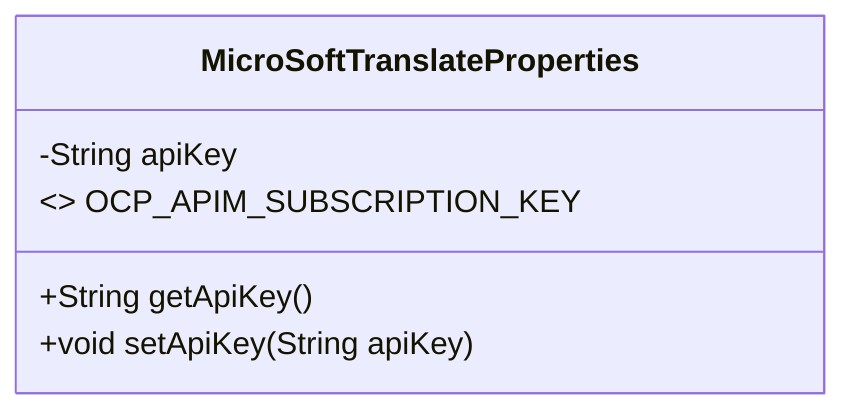
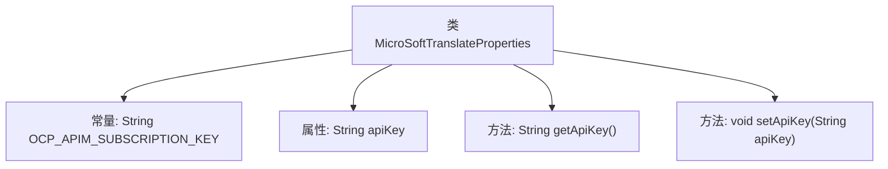

# 基础信息

|      |      |
|------|------|
| 名称 | MicroSoftTranslateProperties |
| 编码语言 | .java |
| 代码路径 | spring-ai-alibaba/community/tool-calls/spring-ai-alibaba-starter-tool-calling-microsofttranslate/src/main/java/com/alibaba/cloud/ai/toolcalling/microsofttranslate/MicroSoftTranslateProperties.java |
| 包名 | com.alibaba.cloud.ai.toolcalling.microsofttranslate |
| 依赖项 | ['org.springframework.boot.context.properties.ConfigurationProperties'] |
| 概述说明 | 配置类定义微软翻译API密钥属性。 |

# 说明

该配置类定义了用于存储微软翻译API密钥的属性。通过该属性，系统可以安全地管理和访问微软翻译服务所需的API密钥，确保翻译功能的正常运行。此设计有助于在应用程序中集中管理敏感信息，提高代码的可维护性和安全性。

# 类列表 Class Summary

| 名称   | 类型  | 说明 |
|-------|------|-------------|
| MicroSoftTranslateProperties | class | 配置类定义微软翻译API密钥属性。 |

## 类 MicroSoftTranslateProperties

|      |      |
|------|------|
| 访问范围 | @ConfigurationProperties(prefix = "spring.ai.alibaba.toolcalling.microsofttranslate");public |
| 类型 | class |
| 名称 | MicroSoftTranslateProperties |
| 说明 | 配置类定义微软翻译API密钥属性。 |

### UML类图

类图描述：  
`MicroSoftTranslateProperties` 类是一个配置属性类，用于管理微软翻译服务的API密钥。该类包含一个私有成员 `apiKey`，并通过公有的 `getApiKey` 和 `setApiKey` 方法进行访问和修改。类中还定义了一个常量 `OCP_APIM_SUBSCRIPTION_KEY`，用于标识API密钥的请求头字段。该类通常用于Spring Boot项目中，通过配置属性自动注入API密钥。

### 内部方法调用关系图

这段代码定义了一个名为 `MicroSoftTranslateProperties` 的配置类，用于管理微软翻译工具调用的相关属性。类中包含一个常量 `OCP_APIM_SUBSCRIPTION_KEY` 和一个属性 `apiKey`，并提供了 `getApiKey` 和 `setApiKey` 方法来访问和修改 `apiKey` 属性。该类的设计目的是通过配置属性来管理微软翻译工具的 API 密钥。

### 字段列表 Field List

| 名称  | 类型  | 说明 |
|-------|-------|------|
| OCP_APIM_SUBSCRIPTION_KEY = "Ocp-Apim-Subscription-Key" | String | 定义常量字符串，用于API订阅密钥。 |
| apiKey | String | 定义了一个私有字符串变量apiKey。 |

### 方法列表 Method List

| 名称  | 类型  | 说明 |
|-------|-------|------|
| setApiKey | void | 设置API密钥的方法。 |
| getApiKey | String | 获取API密钥的方法。 |

