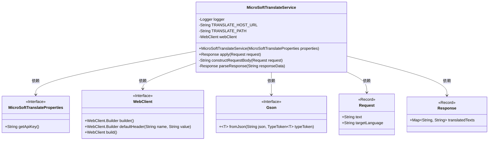
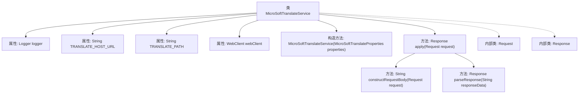
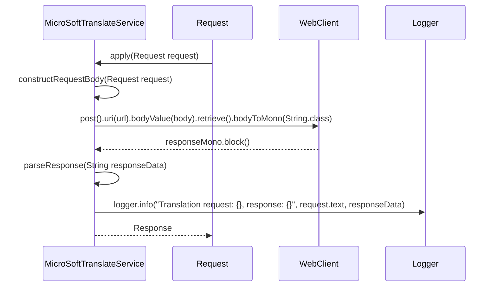

# 基础信息

|      |      |
|------|------|
| 名称 | MicroSoftTranslateService |
| 编码语言 | .java |
| 代码路径 | spring-ai-alibaba/community/tool-calls/spring-ai-alibaba-starter-tool-calling-microsofttranslate/src/main/java/com/alibaba/cloud/ai/toolcalling/microsofttranslate/MicroSoftTranslateService.java |
| 包名 | com.alibaba.cloud.ai.toolcalling.microsofttranslate |
| 依赖项 | ['com.fasterxml.jackson.annotation.JsonClassDescription', 'com.fasterxml.jackson.annotation.JsonProperty', 'com.fasterxml.jackson.annotation.JsonPropertyDescription', 'com.google.gson.Gson', 'com.google.gson.reflect.TypeToken', 'org.slf4j.Logger', 'org.slf4j.LoggerFactory', 'org.springframework.http.HttpHeaders', 'org.springframework.util.StringUtils', 'org.springframework.web.reactive.function.client.WebClient', 'org.springframework.web.util.UriComponentsBuilder', 'reactor.core.publisher.Mono', 'java.util.HashMap', 'java.util.List', 'java.util.Map', 'java.util.function.Function'] |
| 概述说明 | 微软翻译服务类通过API实现文本翻译的请求响应功能。 |

# 说明

微软翻译服务类旨在实现请求响应功能，通过调用API进行文本翻译。该服务类的主要功能是接收用户输入的文本，将其发送至微软翻译API，并获取翻译后的结果返回给用户。整个过程涉及文本的发送、API的调用以及翻译结果的接收与处理，确保用户能够快速、准确地获得翻译内容。

# 类列表 Class Summary

| 名称   | 类型  | 说明 |
|-------|------|-------------|
| MicroSoftTranslateService | class | 微软翻译服务类，实现请求响应功能，调用API进行文本翻译。 |

## 类 MicroSoftTranslateService

|      |      |
|------|------|
| 访问范围 | public |
| 类型 | class |
| 名称 | MicroSoftTranslateService |
| 说明 | 微软翻译服务类，实现请求响应功能，调用API进行文本翻译。 |

### UML类图

**描述：**  
`MicroSoftTranslateService` 是一个实现 `Function` 接口的类，用于调用微软翻译API进行文本翻译。它依赖于 `MicroSoftTranslateProperties` 获取API密钥，使用 `WebClient` 进行HTTP请求，并通过 `Gson` 解析响应数据。`Request` 和 `Response` 是记录类，分别表示翻译请求和响应。`MicroSoftTranslateService` 的主要方法 `apply` 负责处理翻译请求，构造请求体，发送请求并解析响应。

### 内部方法调用关系图

**描述**：  
`MicroSoftTranslateService` 类实现了 `Function` 接口，用于将文本翻译为目标语言。类中包含构造方法、`apply` 方法、`constructRequestBody` 方法和 `parseResponse` 方法。`apply` 方法负责处理翻译请求，调用 `constructRequestBody` 构建请求体，并通过 `WebClient` 发送请求，最后解析响应并返回结果。`parseResponse` 方法解析响应数据并记录翻译结果。内部类 `Request` 和 `Response` 分别用于封装请求和响应数据。

### 字段列表 Field List

| 名称  | 类型  | 说明 |
|-------|-------|------|
| TRANSLATE_HOST_URL = "https://api.cognitive.microsofttranslator.com" | String | 翻译API主机地址为微软认知服务翻译器。 |
| webClient | WebClient | 声明了一个私有的不可变WebClient实例。 |
| logger = LoggerFactory.getLogger(MicroSoftTranslateService.class) | Logger | 微软翻译服务类中定义了一个私有的静态日志记录器。 |
| TRANSLATE_PATH = "/microsofttranslate?api-version=3.0" | String | 定义私有静态常量TRANSLATE_PATH为"/microsofttranslate?api-version=3.0"。 |

### 方法列表 Method List

| 名称  | 类型  | 说明 |
|-------|-------|------|
| parseResponse | Response | 解析JSON响应，提取翻译文本并存入Map返回。 |
| constructRequestBody | String | 该方法构建请求体，将请求文本格式化为JSON数组。 |
| apply | Response | 重写方法处理翻译请求，验证输入后调用API并解析响应，记录日志。 |

