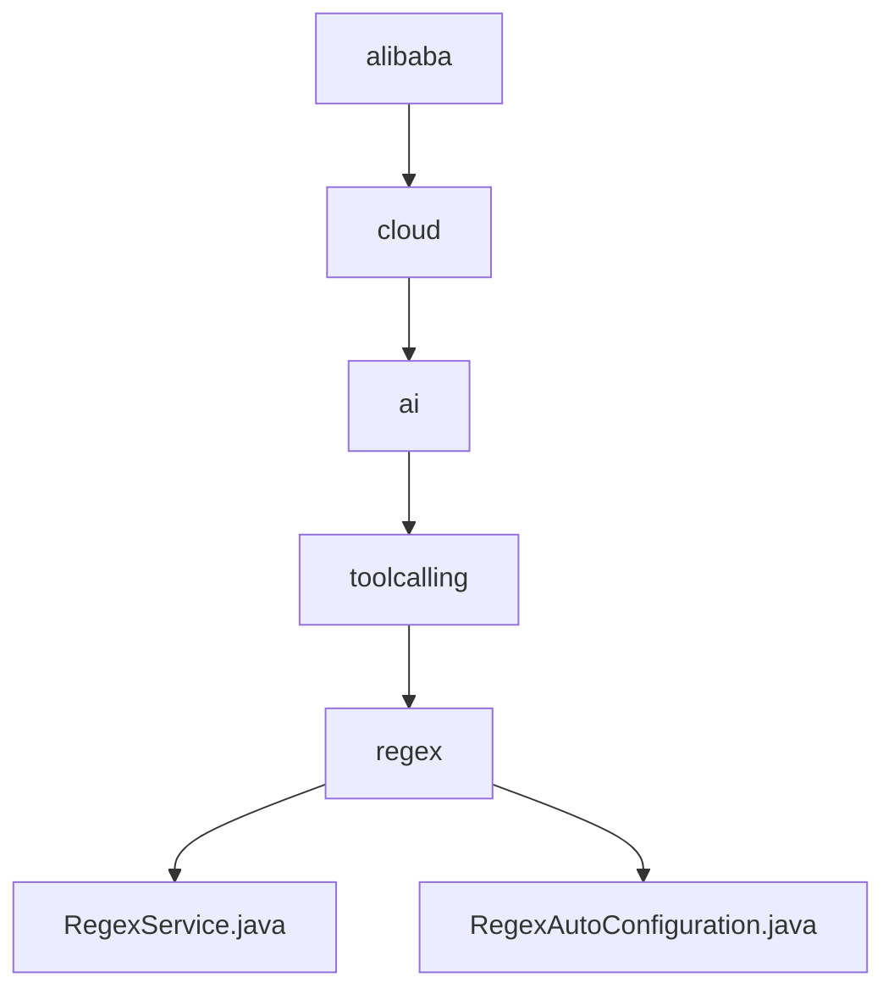

# 基础信息

|      |      |
|------|------|
| 名称 | alibaba |
| 编码语言 | .java |
| 代码路径 | spring-ai-alibaba/community/tool-calls/spring-ai-alibaba-starter-tool-calling-regex/src/main/java/com/alibaba |
| 包名 | spring-ai-alibaba.community.tool-calls.spring-ai-alibaba-starter-tool-calling-regex.src.main.java.com.alibaba |
| 概述说明 | RegexService类提供正则匹配功能，支持集合返回和结果处理。RegexAutoConfiguration类在满足条件时启用正则表达式服务。 |

# 说明

## 概述

该代码模块是一个用于实现正则表达式匹配和处理的工具模块，主要包含两个核心类：`RegexService` 和 `RegexAutoConfiguration`。`RegexService` 类提供了灵活的正则表达式操作能力，支持查找并处理匹配结果，适用于多种文本匹配和处理场景。`RegexAutoConfiguration` 类是一个自动配置类，用于在满足特定条件时启用正则表达式服务。

## 主要业务场景

1. **文本匹配与处理**：`RegexService` 类能够根据正则表达式对文本进行匹配，并将匹配结果以集合形式返回，或者直接对匹配结果进行处理。适用于需要从文本中提取特定模式或进行文本替换等场景。

2. **条件启用服务**：`RegexAutoConfiguration` 类通过自动配置机制，仅在满足两个条件时启用正则表达式服务：一是指定的类必须存在，二是某个属性必须为 `true`。这种机制适用于需要根据运行时环境动态启用或禁用正则表达式服务的场景，确保服务仅在需要时被激活。

该模块为开发者提供了高效、灵活的正则表达式处理工具，适用于多种需要文本匹配和处理的业务场景，同时通过自动配置机制优化了服务的启用流程。

### 包内部结构视图

该流程图展示了路径的层级关系，从最顶层的`alibaba`开始，逐级展开到`cloud`、`ai`、`toolcalling`，最后到`regex`文件夹，并在`regex`下包含了两个文件：`RegexService.java`和`RegexAutoConfiguration.java`。每个节点仅显示路径的最后一级元素，清晰地表示了文件与文件夹之间的嵌套关系。

# 文件列表 File List

| 名称   | 类型  | 说明 |
|-------|------|-------------|
| [cloud](cloud/_module.md) | package | RegexService类提供正则匹配功能，支持集合返回和结果处理。RegexAutoConfiguration类在满足条件时启用正则表达式服务。 |

