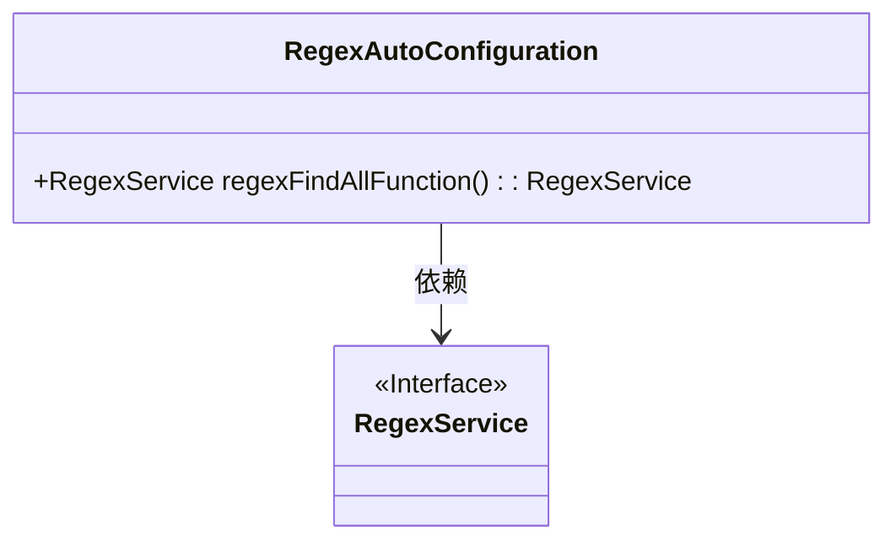
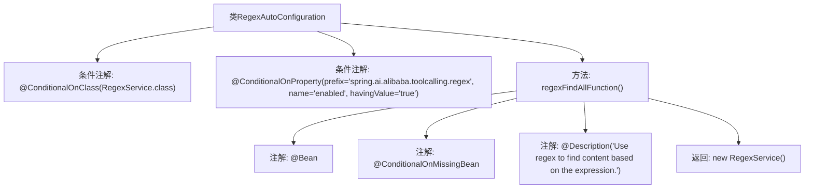

# 基础信息

|      |      |
|------|------|
| 名称 | RegexAutoConfiguration |
| 编码语言 | .java |
| 代码路径 | spring-ai-alibaba/community/tool-calls/spring-ai-alibaba-starter-tool-calling-regex/src/main/java/com/alibaba/cloud/ai/toolcalling/regex/RegexAutoConfiguration.java |
| 包名 | com.alibaba.cloud.ai.toolcalling.regex |
| 依赖项 | ['org.springframework.boot.autoconfigure.condition.ConditionalOnClass', 'org.springframework.boot.autoconfigure.condition.ConditionalOnMissingBean', 'org.springframework.boot.autoconfigure.condition.ConditionalOnProperty', 'org.springframework.context.annotation.Bean', 'org.springframework.context.annotation.Description'] |
| 概述说明 | 自动配置类启用正则表达式服务，需类存在且属性为真。 |

# 说明

该内容描述了一个自动配置类，其主要功能是启用正则表达式服务。该配置类的启用条件是两个：首先，指定的类必须存在；其次，某个属性必须为true。只有在满足这两个条件的情况下，正则表达式服务才会被启用。

# 类列表 Class Summary

| 名称   | 类型  | 说明 |
|-------|------|-------------|
| RegexAutoConfiguration | class | 自动配置类，启用正则表达式服务，条件为类存在且属性为true。 |

## 类 RegexAutoConfiguration

|      |      |
|------|------|
| 访问范围 | @ConditionalOnClass(RegexService.class);@ConditionalOnProperty(prefix = "spring.ai.alibaba.toolcalling.regex", name = "enabled", havingValue = "true");public |
| 类型 | class |
| 名称 | RegexAutoConfiguration |
| 说明 | 自动配置类，启用正则表达式服务，条件为类存在且属性为true。 |

### UML类图

这段代码定义了一个名为 `RegexAutoConfiguration` 的类，该类在满足特定条件时会自动配置一个 `RegexService` 的Bean。`RegexAutoConfiguration` 类通过 `regexFindAllFunction` 方法返回一个 `RegexService` 实例。`RegexService` 是一个接口，`RegexAutoConfiguration` 类依赖于该接口。代码使用了Spring的条件注解 `@ConditionalOnClass` 和 `@ConditionalOnProperty` 来控制配置的加载，确保只有在特定类存在且属性为真时才会进行配置。

### 内部方法调用关系图

这段代码定义了一个名为 `RegexAutoConfiguration` 的类，该类在满足特定条件时自动配置 `RegexService`。类上使用了两个条件注解：`@ConditionalOnClass` 和 `@ConditionalOnProperty`，分别用于检查 `RegexService` 类是否存在以及配置属性是否启用。类中包含一个 `regexFindAllFunction` 方法，该方法在缺少 `RegexService` Bean 时创建一个新的 `RegexService` 实例，并返回该实例。

### 字段列表 Field List

| 名称  | 类型  | 说明 |
|-------|-------|------|

### 方法列表 Method List

| 名称  | 类型  | 说明 |
|-------|-------|------|
| regexFindAllFunction | RegexService | 使用正则表达式根据表达式查找内容。 |

