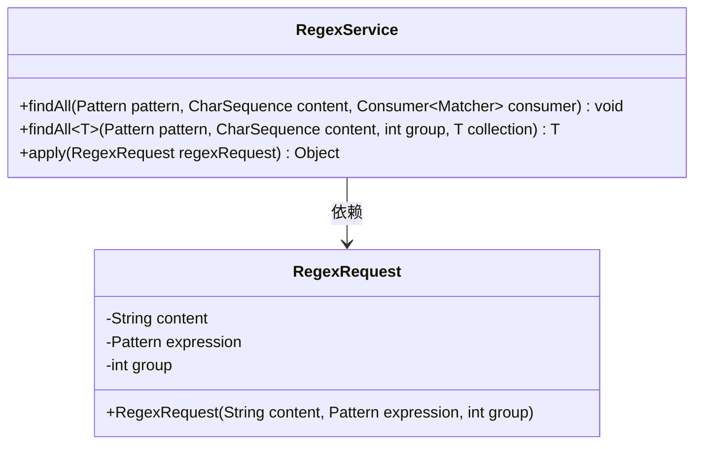
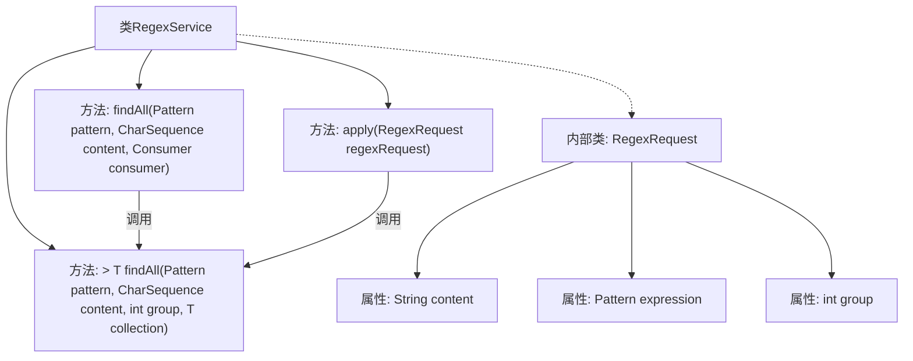

# 基础信息

|      |      |
|------|------|
| 名称 | RegexService |
| 编码语言 | .java |
| 代码路径 | spring-ai-alibaba/community/tool-calls/spring-ai-alibaba-starter-tool-calling-regex/src/main/java/com/alibaba/cloud/ai/toolcalling/regex/RegexService.java |
| 包名 | com.alibaba.cloud.ai.toolcalling.regex |
| 依赖项 | ['com.fasterxml.jackson.annotation.JsonProperty', 'org.springframework.util.Assert', 'java.util.ArrayList', 'java.util.Collection', 'java.util.function.Consumer', 'java.util.function.Function', 'java.util.regex.Matcher', 'java.util.regex.Pattern'] |
| 概述说明 | RegexService类提供正则匹配功能，支持查找、处理结果并返回集合或直接处理。 |

# 说明

RegexService类是一个用于实现正则匹配功能的工具类，能够查找并处理匹配结果。它支持将匹配结果以集合形式返回，也可以直接对匹配结果进行处理。该类为开发者提供了灵活的正则表达式操作能力，适用于需要文本匹配和处理的多种场景。

# 类列表 Class Summary

| 名称   | 类型  | 说明 |
|-------|------|-------------|
| RegexService | class | RegexService类实现正则匹配功能，支持查找并处理匹配结果，返回集合或直接处理。 |

## 类 RegexService

|      |      |
|------|------|
| 访问范围 | public |
| 类型 | class |
| 名称 | RegexService |
| 说明 | RegexService类实现正则匹配功能，支持查找并处理匹配结果，返回集合或直接处理。 |

### UML类图

**描述：**  
`RegexService` 类实现了 `Function<RegexRequest, Object>` 接口，提供了两个静态方法 `findAll` 来处理正则表达式匹配结果。第一个方法使用 `Consumer<Matcher>` 处理匹配结果，第二个方法将匹配结果收集到指定的集合中。`RegexRequest` 是一个记录类，用于封装正则表达式的请求参数。`RegexService` 依赖于 `RegexRequest` 来执行正则匹配操作。

### 内部方法调用关系图

这段代码定义了一个 `RegexService` 类，该类实现了 `Function<RegexService.RegexRequest, Object>` 接口。类中包含两个 `findAll` 方法，分别用于处理正则表达式的匹配结果，并将结果存储在集合中或通过 `Consumer` 进行处理。`apply` 方法接收 `RegexRequest` 对象作为参数，调用 `findAll` 方法并返回结果。`RegexRequest` 是一个内部记录类，包含 `content`、`expression` 和 `group` 三个属性，用于存储正则表达式的匹配请求数据。

### 字段列表 Field List

| 名称  | 类型  | 说明 |
|-------|-------|------|

### 方法列表 Method List

| 名称  | 类型  | 说明 |
|-------|-------|------|
| findAll | void | 方法查找匹配模式并处理每个匹配项。 |
| findAll | T | 静态方法根据正则表达式在字符串中查找匹配项并存入集合。 |
| apply | java.lang.Object | 重写apply方法，使用正则表达式在内容中查找匹配项并返回结果。 |

