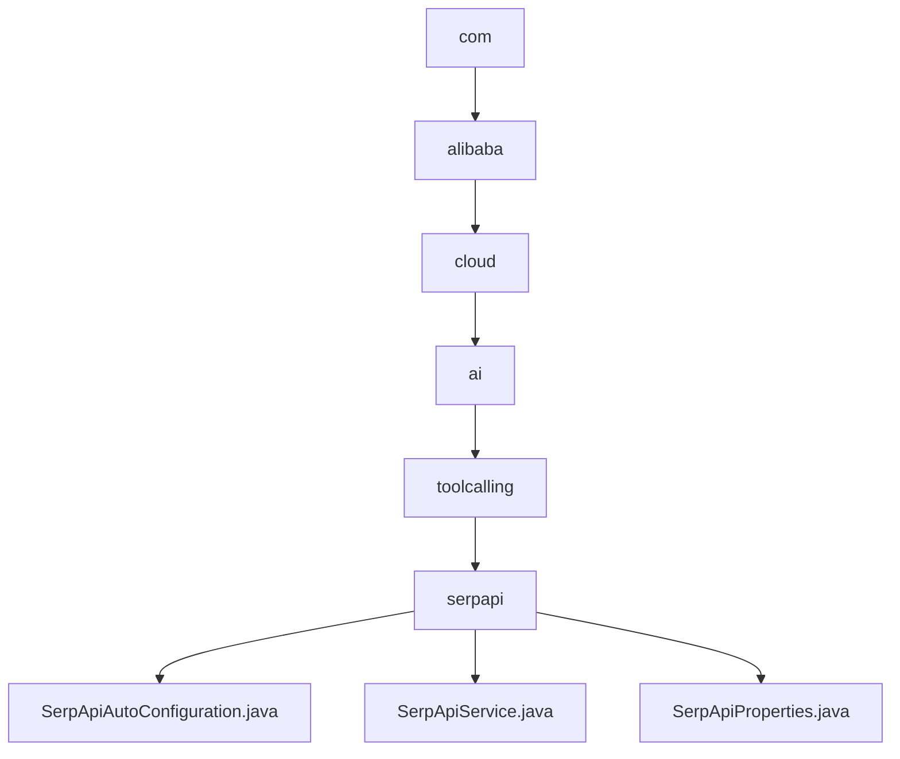

# 基础信息

|      |      |
|------|------|
| 名称 | com |
| 编码语言 | .java |
| 代码路径 | spring-ai-alibaba/community/tool-calls/spring-ai-alibaba-starter-tool-calling-serpapi/src/main/java/com |
| 包名 | spring-ai-alibaba.community.tool-calls.spring-ai-alibaba-starter-tool-calling-serpapi.src.main.java.com |
| 概述说明 | SerpApiAutoConfiguration自动配置SerpApiService Bean，SerpApiService实现搜索功能，SerpApiProperties配置API参数。 |

# 说明

## 概述
该代码模块主要围绕SERP API的集成和自动化配置展开，旨在简化SERP API的调用和搜索结果的处理。模块通过自动配置机制、服务实现和参数配置类，确保在符合条件的情况下，SERP API的调用和搜索结果的处理能够自动完成，提高了系统的自动化程度和配置的灵活性。

## 主要业务场景
1. **自动配置**：`SerpApiAutoConfiguration`类在满足特定条件时，会自动配置`SerpApiService` Bean。这一机制确保了在符合条件的情况下，`SerpApiService` Bean能够被自动创建和初始化，从而简化了配置过程并提高了系统的自动化程度。
2. **搜索功能实现**：`SerpApiService`类实现了一个搜索功能，该功能通过调用SERP API获取搜索结果，并对这些结果进行解析处理，最终返回响应数据。这一过程确保了搜索功能的完整性和数据的准确性，为用户提供了可靠的搜索结果。
3. **参数配置**：`SerpApiProperties`类用于配置SERP API的相关参数，主要包括API密钥和搜索引擎的设置。该类通过定义必要的属性，确保API请求能够正确执行，从而获取搜索引擎结果页面的数据。通过配置这些参数，用户可以灵活地调整API的调用方式，以满足不同的搜索需求。

### 包内部结构视图

该流程图展示了`spring-ai-alibaba`项目中`tool-calls`模块的层级结构。从`com`开始，逐级深入到`alibaba`、`cloud`、`ai`、`toolcalling`，最终到达`serpapi`文件夹，其中包含了`SerpApiAutoConfiguration.java`、`SerpApiService.java`和`SerpApiProperties.java`三个文件。流程图清晰地反映了路径的嵌套关系。

# 文件列表 File List

| 名称   | 类型  | 说明 |
|-------|------|-------------|
| [alibaba](alibaba/_module.md) | package | SerpApiAutoConfiguration自动配置SerpApiService Bean，SerpApiService实现搜索功能，SerpApiProperties配置API参数。 |

