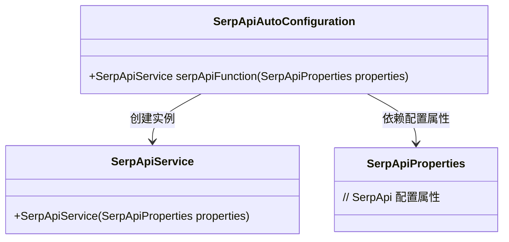
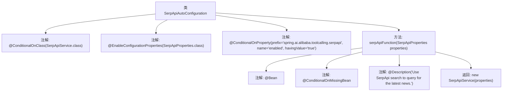

# 基础信息

|      |      |
|------|------|
| 名称 | SerpApiAutoConfiguration |
| 编码语言 | .java |
| 代码路径 | spring-ai-alibaba/community/tool-calls/spring-ai-alibaba-starter-tool-calling-serpapi/src/main/java/com/alibaba/cloud/ai/toolcalling/serpapi/SerpApiAutoConfiguration.java |
| 包名 | com.alibaba.cloud.ai.toolcalling.serpapi |
| 依赖项 | ['org.springframework.boot.autoconfigure.condition.ConditionalOnClass', 'org.springframework.boot.autoconfigure.condition.ConditionalOnMissingBean', 'org.springframework.boot.autoconfigure.condition.ConditionalOnProperty', 'org.springframework.boot.context.properties.EnableConfigurationProperties', 'org.springframework.context.annotation.Bean', 'org.springframework.context.annotation.Description'] |
| 概述说明 | 类SerpApiAutoConfiguration在满足条件时自动配置SerpApiService Bean。 |

# 说明

类SerpApiAutoConfiguration在满足特定条件时，会自动配置SerpApiService Bean。这一机制确保了在符合条件的情况下，SerpApiService Bean能够被自动创建和初始化，从而简化了配置过程并提高了系统的自动化程度。

# 类列表 Class Summary

| 名称   | 类型  | 说明 |
|-------|------|-------------|
| SerpApiAutoConfiguration | class | 类SerpApiAutoConfiguration在条件满足时自动配置SerpApiService Bean。 |

## 类 SerpApiAutoConfiguration

|      |      |
|------|------|
| 访问范围 | @ConditionalOnClass(SerpApiService.class);@EnableConfigurationProperties(SerpApiProperties.class);@ConditionalOnProperty(prefix = "spring.ai.alibaba.toolcalling.serpapi", name = "enabled", havingValue = "true");public |
| 类型 | class |
| 名称 | SerpApiAutoConfiguration |
| 说明 | 类SerpApiAutoConfiguration在条件满足时自动配置SerpApiService Bean。 |

### UML类图

**描述：**
`SerpApiAutoConfiguration` 是一个自动配置类，用于在满足特定条件时创建 `SerpApiService` 实例。它依赖于 `SerpApiProperties` 类来获取配置属性，并通过 `serpApiFunction` 方法返回 `SerpApiService` 实例。该类仅在 `SerpApiService` 类存在且配置属性 `spring.ai.alibaba.toolcalling.serpapi.enabled` 为 `true` 时生效。

### 内部方法调用关系图

该流程图展示了`SerpApiAutoConfiguration`类的结构及其内部方法`serpApiFunction`的注解和返回值。类通过多个条件注解控制其加载行为，方法`serpApiFunction`在缺少`SerpApiService`实例时创建一个新的`SerpApiService`对象，并返回该对象。整个过程确保了在特定条件下自动配置`SerpApiService`的实例。

### 字段列表 Field List

| 名称  | 类型  | 说明 |
|-------|-------|------|

### 方法列表 Method List

| 名称  | 类型  | 说明 |
|-------|-------|------|
| serpApiFunction | SerpApiService | 使用SerpApi查询最新新闻的Bean配置。 |

