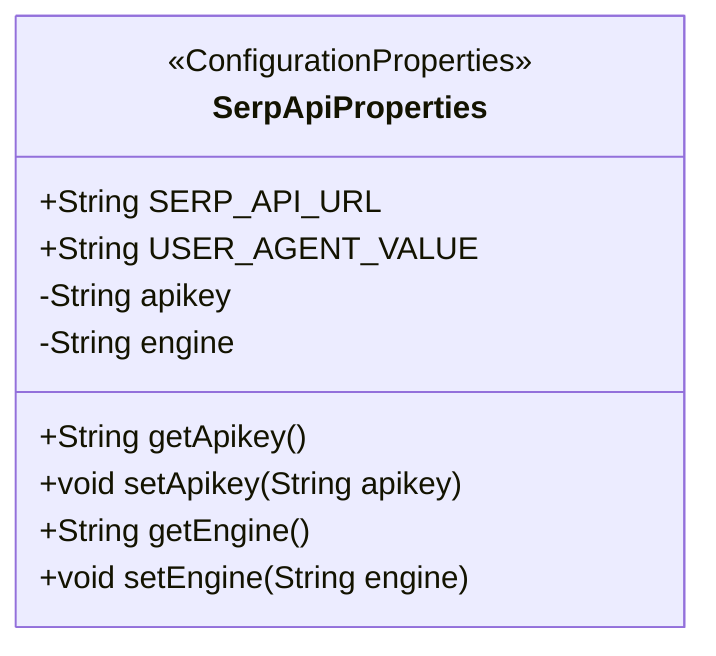
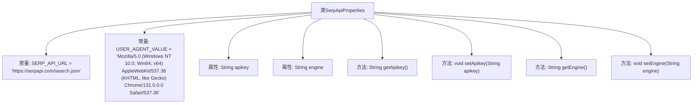

# 基础信息

|      |      |
|------|------|
| 名称 | SerpApiProperties |
| 编码语言 | .java |
| 代码路径 | spring-ai-alibaba/community/tool-calls/spring-ai-alibaba-starter-tool-calling-serpapi/src/main/java/com/alibaba/cloud/ai/toolcalling/serpapi/SerpApiProperties.java |
| 包名 | com.alibaba.cloud.ai.toolcalling.serpapi |
| 依赖项 | ['org.springframework.boot.context.properties.ConfigurationProperties'] |
| 概述说明 | SerpApiProperties类用于配置SERP API，包括API密钥和搜索引擎参数。 |

# 说明

SerpApiProperties类用于配置SERP API的相关参数，主要包括API密钥和搜索引擎的设置。该类通过定义必要的属性，确保API请求能够正确执行，从而获取搜索引擎结果页面的数据。通过配置这些参数，用户可以灵活地调整API的调用方式，以满足不同的搜索需求。

# 类列表 Class Summary

| 名称   | 类型  | 说明 |
|-------|------|-------------|
| SerpApiProperties | class | SerpApiProperties类配置SERP API，包含API密钥和搜索引擎参数。 |

## 类 SerpApiProperties

|      |      |
|------|------|
| 访问范围 | @ConfigurationProperties(prefix = "spring.ai.alibaba.toolcalling.serpapi");public |
| 类型 | class |
| 名称 | SerpApiProperties |
| 说明 | SerpApiProperties类配置SERP API，包含API密钥和搜索引擎参数。 |

### UML类图

**描述：**  
`SerpApiProperties` 类是一个配置属性类，用于管理 SerpAPI 的相关配置。它包含两个静态常量 `SERP_API_URL` 和 `USER_AGENT_VALUE`，分别表示 API 请求的 URL 和用户代理字符串。类中还定义了两个私有属性 `apikey` 和 `engine`，分别表示 API 密钥和搜索引擎类型，并提供了相应的 getter 和 setter 方法。该类通过 `@ConfigurationProperties` 注解与配置文件中的属性进行绑定。

### 内部方法调用关系图

这段代码定义了一个名为 `SerpApiProperties` 的类，用于配置与 SerpAPI 相关的属性。类中包含两个常量 `SERP_API_URL` 和 `USER_AGENT_VALUE`，分别表示 SerpAPI 的请求 URL 和用户代理值。类还包含两个私有属性 `apikey` 和 `engine`，并提供了相应的 getter 和 setter 方法。这些方法允许外部代码访问和修改这些属性的值。

### 字段列表 Field List

| 名称  | 类型  | 说明 |
|-------|-------|------|
| SERP_API_URL = "https://serpapi.com/search.json" | String | SERP API的URL定义为常量。 |
| USER_AGENT_VALUE = "Mozilla/5.0 (Windows NT 10.0; Win64; x64) AppleWebKit/537.36 (KHTML, like Gecko) Chrome/131.0.0.0 Safari/537.36" | String | 定义常量USER_AGENT_VALUE，模拟Chrome浏览器用户代理字符串。 |
| engine | String | 定义私有字符串变量engine。 |
| apikey | String | 定义私有字符串变量apikey。 |

### 方法列表 Method List

| 名称  | 类型  | 说明 |
|-------|-------|------|
| getEngine | String | 获取引擎信息的方法。 |
| getApikey | String | 该方法返回API密钥。 |
| setApikey | void | 设置API密钥的方法。 |
| setEngine | void | 该方法用于设置引擎属性。 |

