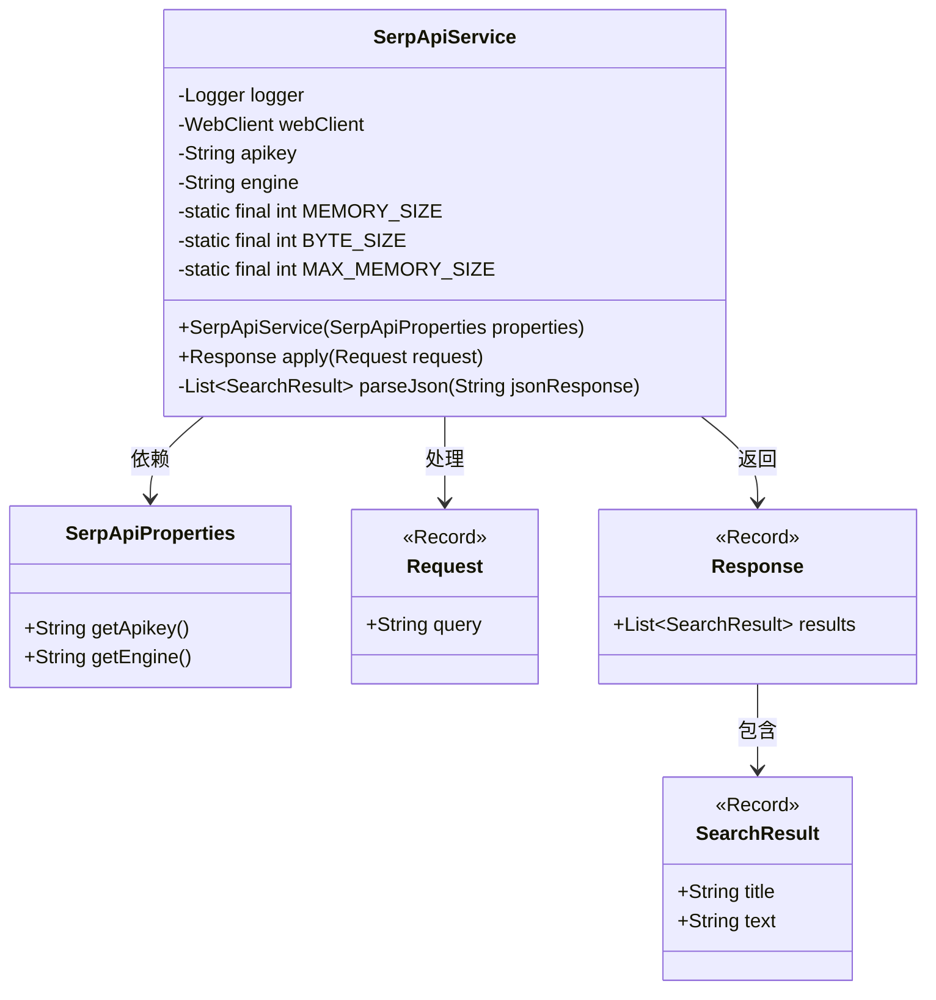
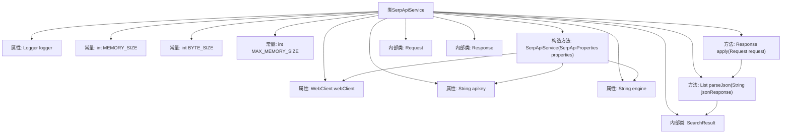
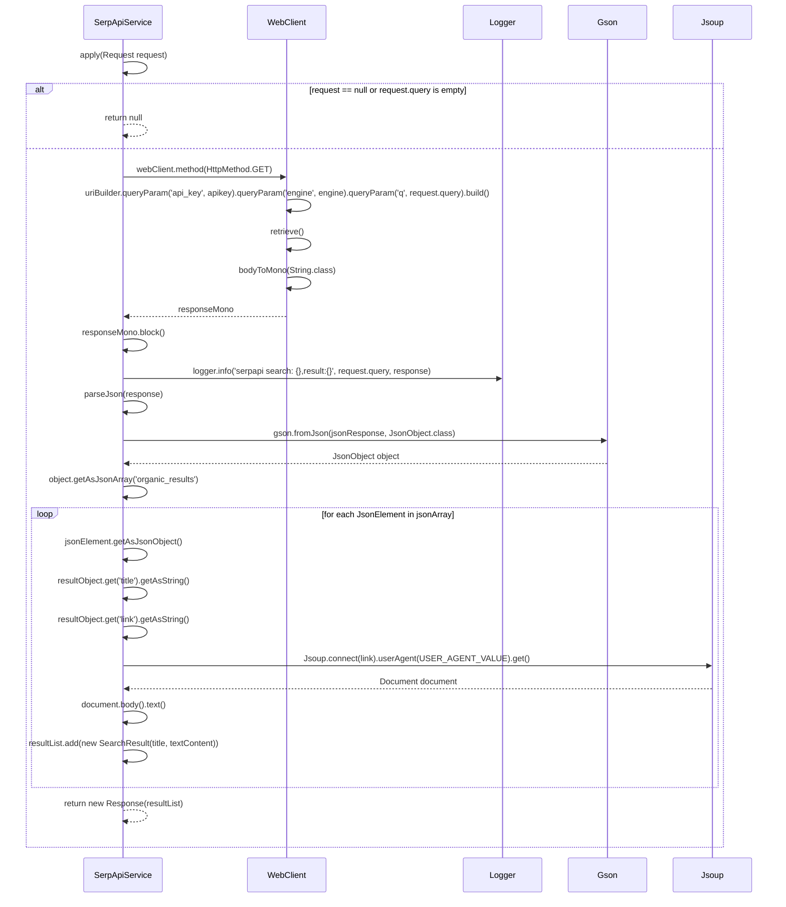

# 基础信息

|      |      |
|------|------|
| 名称 | SerpApiService |
| 编码语言 | .java |
| 代码路径 | spring-ai-alibaba/community/tool-calls/spring-ai-alibaba-starter-tool-calling-serpapi/src/main/java/com/alibaba/cloud/ai/toolcalling/serpapi/SerpApiService.java |
| 包名 | com.alibaba.cloud.ai.toolcalling.serpapi |
| 依赖项 | ['com.fasterxml.jackson.annotation.JsonClassDescription', 'com.fasterxml.jackson.annotation.JsonInclude', 'com.fasterxml.jackson.annotation.JsonProperty', 'com.fasterxml.jackson.annotation.JsonPropertyDescription', 'com.google.gson.Gson', 'com.google.gson.JsonArray', 'com.google.gson.JsonElement', 'com.google.gson.JsonObject', 'org.jsoup.Jsoup', 'org.jsoup.nodes.Document', 'org.slf4j.Logger', 'org.slf4j.LoggerFactory', 'org.springframework.http.HttpHeaders', 'org.springframework.http.HttpMethod', 'org.springframework.util.StringUtils', 'org.springframework.web.reactive.function.client.WebClient', 'reactor.core.publisher.Mono', 'java.util.ArrayList', 'java.util.List', 'java.util.function.Function', 'com.alibaba.cloud.ai.toolcalling.serpapi.SerpApiProperties.SERP_API_URL', 'com.alibaba.cloud.ai.toolcalling.serpapi.SerpApiProperties.USER_AGENT_VALUE'] |
| 概述说明 | SerpApiService通过API实现搜索功能，解析并返回结果数据。 |

# 说明

SerpApiService实现了一个搜索功能，该功能通过调用API获取搜索结果，并对这些结果进行解析处理，最终返回响应数据。这一过程确保了搜索功能的完整性和数据的准确性，为用户提供了可靠的搜索结果。

# 类列表 Class Summary

| 名称   | 类型  | 说明 |
|-------|------|-------------|
| SerpApiService | class | SerpApiService实现搜索功能，通过API获取并解析搜索结果，返回响应数据。 |

## 类 SerpApiService

|      |      |
|------|------|
| 访问范围 | public |
| 类型 | class |
| 名称 | SerpApiService |
| 说明 | SerpApiService实现搜索功能，通过API获取并解析搜索结果，返回响应数据。 |

### UML类图

**描述：**  
`SerpApiService` 是一个实现 `Function` 接口的类，用于通过 SerpAPI 进行搜索。它依赖于 `SerpApiProperties` 来获取 API 密钥和搜索引擎类型。`SerpApiService` 接收 `Request` 对象作为输入，处理后返回 `Response` 对象，其中包含多个 `SearchResult`。`Request` 和 `Response` 是记录类，分别表示搜索请求和响应。`SearchResult` 记录类包含搜索结果的标题和文本内容。

### 内部方法调用关系图

**流程图描述：**  
该流程图展示了`SerpApiService`类的结构和主要方法调用关系。类中包含多个属性和常量，构造方法用于初始化`webClient`、`apikey`和`engine`。`apply`方法处理搜索请求，调用`parseJson`方法解析JSON响应，并通过`Jsoup`获取网页内容。内部类`Request`、`Response`和`SearchResult`分别用于封装请求、响应和搜索结果。

### 字段列表 Field List

| 名称  | 类型  | 说明 |
|-------|-------|------|
| engine | String | 定义了一个私有且不可变的字符串类型变量engine。 |
| webClient | WebClient | 定义了一个私有且不可变的WebClient实例。 |
| MEMORY_SIZE = 5 | int | 定义常量MEMORY_SIZE，值为5。 |
| logger = LoggerFactory.getLogger(SerpApiService.class) | Logger | SerpApiService类中定义了一个私有的静态日志记录器。 |
| apikey | String | 私有且不可变的字符串变量apikey。 |
| MAX_MEMORY_SIZE = MEMORY_SIZE * BYTE_SIZE * BYTE_SIZE | int | 定义了最大内存大小，基于内存大小和字节大小的乘积。 |
| BYTE_SIZE = 1024 | int | 定义常量BYTE_SIZE，值为1024。 |

### 方法列表 Method List

| 名称  | 类型  | 说明 |
|-------|-------|------|
| parseJson | List<SearchResult> | 解析JSON响应，提取搜索结果并获取网页内容。 |
| apply | Response | 处理请求，调用API获取搜索结果，解析并返回响应，异常时记录错误。 |

