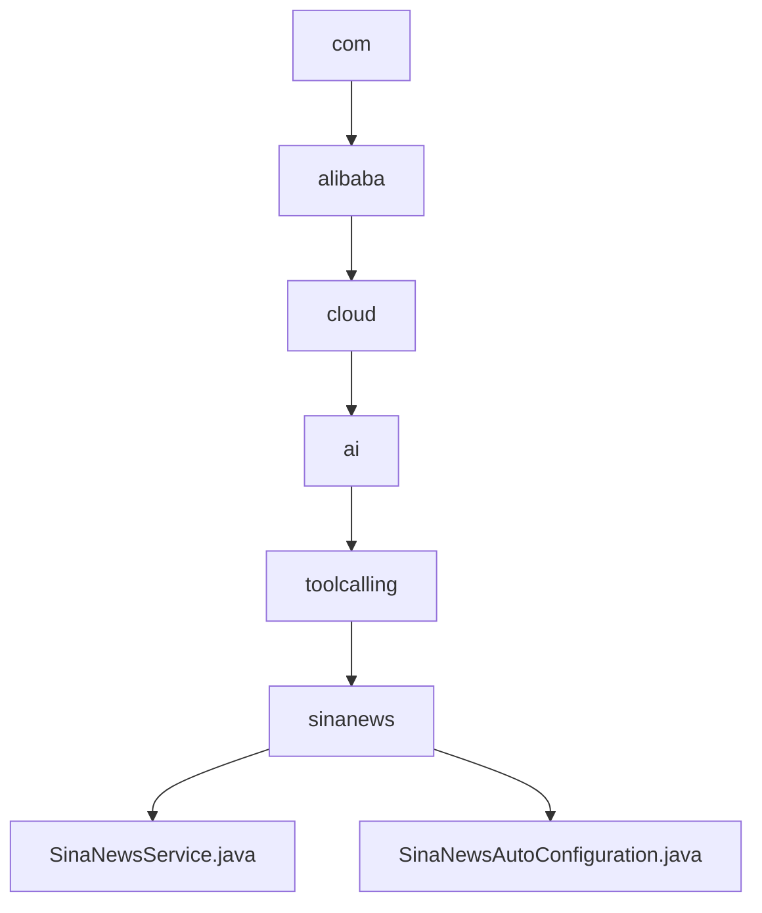

# 基础信息

|      |      |
|------|------|
| 名称 | com |
| 编码语言 | .java |
| 代码路径 | spring-ai-alibaba/community/tool-calls/spring-ai-alibaba-starter-tool-calling-sinanews/src/main/java/com |
| 包名 | spring-ai-alibaba.community.tool-calls.spring-ai-alibaba-starter-tool-calling-sinanews.src.main.java.com |
| 概述说明 | SinaNewsService通过API获取新浪新闻并解析为结构化事件列表，提供实时新闻汇总。SinaNewsAutoConfiguration动态加载服务Bean，确保服务稳定运行。 |

# 说明

## 概述
该代码模块是一个名为`SinaNewsService`的服务，旨在通过API接口从新浪新闻平台获取热点新闻数据，并将其解析为结构化的事件列表。该服务的主要功能包括数据获取、内容解析和事件列表生成，旨在为用户提供高效、实时的新闻信息汇总。此外，模块中包含一个自动配置类`SinaNewsAutoConfiguration`，用于根据特定条件动态加载新浪新闻服务所需的Bean，确保服务在运行时能够正确初始化并投入使用。

## 主要业务场景
1. **新闻数据获取**：通过API接口从新浪新闻平台获取最新的热点新闻数据。
2. **内容解析**：自动解析获取到的新闻内容，并将其转换为结构化的事件列表。
3. **事件列表生成**：将解析后的新闻内容生成结构化的事件列表，便于用户查看和访问。
4. **服务初始化**：通过`SinaNewsAutoConfiguration`类，根据特定条件动态加载新浪新闻服务所需的Bean，确保服务在运行时能够正确初始化并投入使用。

该模块的设计旨在提升系统的灵活性和可维护性，避免不必要的资源消耗，同时保证新浪新闻服务的稳定运行。

### 包内部结构视图

该流程图展示了`spring-ai-alibaba-starter-tool-calling-sinanews`项目的层级结构，从`com`目录开始，逐级深入到`alibaba`、`cloud`、`ai`、`toolcalling`，最终到达`sinanews`目录，并在其中包含了`SinaNewsService.java`和`SinaNewsAutoConfiguration.java`两个文件。

# 文件列表 File List

| 名称   | 类型  | 说明 |
|-------|------|-------------|
| [alibaba](alibaba/_module.md) | package | SinaNewsService通过API获取新浪新闻并解析为结构化事件列表，提供实时新闻汇总。SinaNewsAutoConfiguration动态加载服务Bean，确保服务稳定运行。 |

