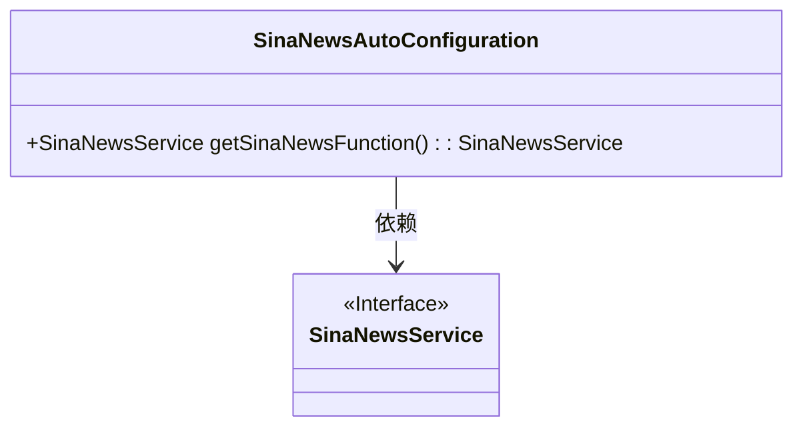
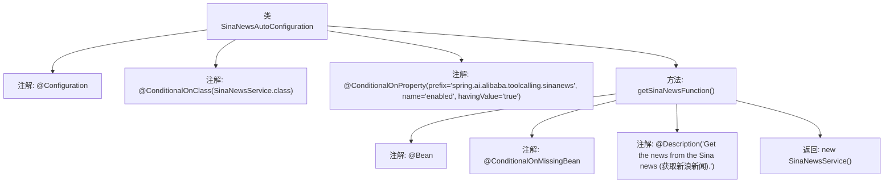

# 基础信息

|      |      |
|------|------|
| 名称 | SinaNewsAutoConfiguration |
| 编码语言 | .java |
| 代码路径 | spring-ai-alibaba/community/tool-calls/spring-ai-alibaba-starter-tool-calling-sinanews/src/main/java/com/alibaba/cloud/ai/toolcalling/sinanews/SinaNewsAutoConfiguration.java |
| 包名 | com.alibaba.cloud.ai.toolcalling.sinanews |
| 依赖项 | ['org.springframework.boot.autoconfigure.condition.ConditionalOnClass', 'org.springframework.boot.autoconfigure.condition.ConditionalOnMissingBean', 'org.springframework.boot.autoconfigure.condition.ConditionalOnProperty', 'org.springframework.context.annotation.Bean', 'org.springframework.context.annotation.Configuration', 'org.springframework.context.annotation.Description'] |
| 概述说明 | 新浪新闻自动配置类用于条件加载新浪新闻服务Bean。 |

# 说明

新浪新闻自动配置类的主要功能是条件加载新浪新闻服务Bean。该配置类通过自动化的方式，根据特定条件动态加载新浪新闻服务所需的Bean，确保服务在运行时能够正确初始化并投入使用。这一机制有助于提升系统的灵活性和可维护性，避免不必要的资源消耗，同时保证新浪新闻服务的稳定运行。

# 类列表 Class Summary

| 名称   | 类型  | 说明 |
|-------|------|-------------|
| SinaNewsAutoConfiguration | class | 新浪新闻自动配置类，条件加载新浪新闻服务Bean。 |

## 类 SinaNewsAutoConfiguration

|      |      |
|------|------|
| 访问范围 | @Configuration;@ConditionalOnClass(SinaNewsService.class);@ConditionalOnProperty(prefix = "spring.ai.alibaba.toolcalling.sinanews", name = "enabled", havingValue = "true");public |
| 类型 | class |
| 名称 | SinaNewsAutoConfiguration |
| 说明 | 新浪新闻自动配置类，条件加载新浪新闻服务Bean。 |

### UML类图

这段代码定义了一个名为 `SinaNewsAutoConfiguration` 的配置类，用于在满足特定条件时自动配置 `SinaNewsService` 实例。`SinaNewsAutoConfiguration` 类通过 `@ConditionalOnClass` 和 `@ConditionalOnProperty` 注解确保仅在 `SinaNewsService` 类存在且相关属性启用时生效。`getSinaNewsFunction` 方法返回一个新的 `SinaNewsService` 实例，并通过 `@ConditionalOnMissingBean` 注解确保仅在缺少该 Bean 时创建。`SinaNewsService` 被标记为接口，表示它是一个抽象的服务接口。

### 内部方法调用关系图

这段代码定义了一个名为 `SinaNewsAutoConfiguration` 的配置类，用于在满足特定条件时自动配置 `SinaNewsService` 实例。类上使用了 `@Configuration` 注解，表示这是一个配置类。`@ConditionalOnClass` 和 `@ConditionalOnProperty` 注解用于指定配置条件，只有当 `SinaNewsService` 类存在且配置属性 `spring.ai.alibaba.toolcalling.sinanews.enabled` 为 `true` 时，才会创建 `SinaNewsService` 实例。`getSinaNewsFunction` 方法上使用了 `@Bean` 注解，表示该方法返回的对象将被注册为 Spring 容器中的 Bean。`@ConditionalOnMissingBean` 注解确保只有在没有其他 `SinaNewsService` Bean 存在时才会创建新的实例。`@Description` 注解提供了对该方法的描述信息。

### 字段列表 Field List

| 名称  | 类型  | 说明 |
|-------|-------|------|

### 方法列表 Method List

| 名称  | 类型  | 说明 |
|-------|-------|------|
| getSinaNewsFunction | SinaNewsService | 条件缺失时创建获取新浪新闻的服务实例。 |

