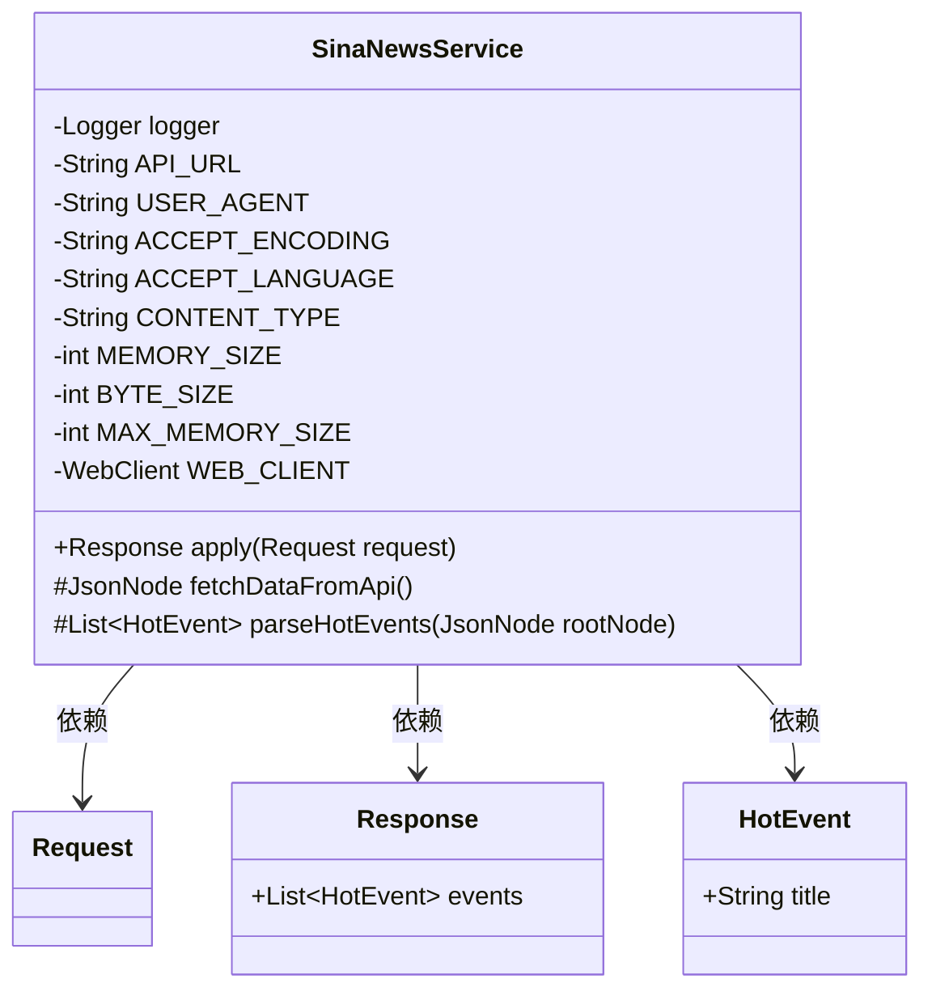
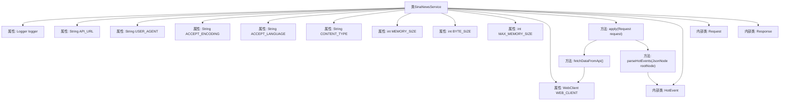

# 基础信息

|      |      |
|------|------|
| 名称 | SinaNewsService |
| 编码语言 | .java |
| 代码路径 | spring-ai-alibaba/community/tool-calls/spring-ai-alibaba-starter-tool-calling-sinanews/src/main/java/com/alibaba/cloud/ai/toolcalling/sinanews/SinaNewsService.java |
| 包名 | com.alibaba.cloud.ai.toolcalling.sinanews |
| 依赖项 | ['com.fasterxml.jackson.databind.JsonNode', 'org.slf4j.Logger', 'org.slf4j.LoggerFactory', 'org.springframework.http.HttpHeaders', 'org.springframework.http.MediaType', 'org.springframework.web.reactive.function.client.WebClient', 'reactor.core.publisher.Mono', 'java.util.ArrayList', 'java.util.List', 'java.util.function.Function'] |
| 概述说明 | 新浪新闻API解析热点生成事件列表。 |

# 说明

SinaNewsService是一个通过API接口从新浪新闻平台获取热点新闻数据的服务。该服务能够自动解析获取到的新闻内容，并将其转换为结构化的事件列表。通过这种方式，用户可以便捷地访问和查看最新的新闻热点，而无需手动浏览和整理新闻信息。该服务的主要功能包括数据获取、内容解析和事件列表生成，旨在为用户提供高效、实时的新闻信息汇总。

# 类列表 Class Summary

| 名称   | 类型  | 说明 |
|-------|------|-------------|
| SinaNewsService | class | SinaNewsService通过API获取新浪新闻热点并解析为事件列表。 |

## 类 SinaNewsService

|      |      |
|------|------|
| 访问范围 | public |
| 类型 | class |
| 名称 | SinaNewsService |
| 说明 | SinaNewsService通过API获取新浪新闻热点并解析为事件列表。 |

### UML类图

**描述：**  
`SinaNewsService` 类实现了 `Function` 接口，用于处理新浪新闻的热点事件数据。它通过 `fetchDataFromApi` 方法从指定的API URL获取数据，并使用 `parseHotEvents` 方法解析数据生成热点事件列表。`HotEvent`、`Request` 和 `Response` 是三个记录类，分别用于存储热点事件的标题、请求和响应数据。`SinaNewsService` 类依赖于这些记录类来完成其功能。

### 内部方法调用关系图

这段代码定义了一个名为 `SinaNewsService` 的类，该类实现了 `Function` 接口，用于处理新浪新闻的热点事件请求。类中包含多个常量属性，如API的URL、用户代理、编码类型等，并初始化了一个 `WebClient` 实例用于HTTP请求。`apply` 方法是主要入口，调用 `fetchDataFromApi` 获取数据，并通过 `parseHotEvents` 解析数据，最终返回包含热点事件的 `Response` 对象。代码还定义了三个内部记录类 `HotEvent`、`Request` 和 `Response`，分别用于表示热点事件、请求和响应。

### 字段列表 Field List

| 名称  | 类型  | 说明 |
|-------|-------|------|
| logger = LoggerFactory.getLogger(SinaNewsService.class) | Logger | SinaNewsService类中定义了一个静态日志记录器。 |
| MEMORY_SIZE = 5 | int | 定义私有静态常量MEMORY_SIZE，值为5。 |
| BYTE_SIZE = 1024 | int | 定义常量BYTE_SIZE，值为1024。 |
| API_URL = "https://newsapp.sina.cn/api/hotlist?newsId=HB-1-snhs%2Ftop_news_list-all" | String | 新浪新闻热点API地址定义为常量API_URL。 |
| CONTENT_TYPE = "application/json" | String | 定义静态常量CONTENT_TYPE，值为"application/json"。 |
| MAX_MEMORY_SIZE = MEMORY_SIZE * BYTE_SIZE * BYTE_SIZE | int | 定义常量MAX_MEMORY_SIZE为MEMORY_SIZE乘以BYTE_SIZE的平方。 |
| WEB_CLIENT = WebClient.builder()		.defaultHeader(HttpHeaders.USER_AGENT, USER_AGENT)		.defaultHeader(HttpHeaders.ACCEPT, MediaType.APPLICATION_JSON_VALUE)		.defaultHeader(HttpHeaders.ACCEPT_ENCODING, ACCEPT_ENCODING)		.defaultHeader(HttpHeaders.CONTENT_TYPE, CONTENT_TYPE)		.defaultHeader(HttpHeaders.ACCEPT_LANGUAGE, ACCEPT_LANGUAGE)		.codecs(configurer -> configurer.defaultCodecs().maxInMemorySize(MAX_MEMORY_SIZE))		.build() | WebClient | 创建WebClient实例，配置默认请求头及内存大小限制。 |
| ACCEPT_LANGUAGE = "zh-CN,zh;q=0.9,ja;q=0.8" | String | 定义常量ACCEPT_LANGUAGE，值为"zh-CN,zh;q=0.9,ja;q=0.8"。 |
| USER_AGENT = "Mozilla/5.0 (Macintosh; Intel Mac OS X 10_15_7) AppleWebKit/537.36 (KHTML, like Gecko) Chrome/131.0.0.0 Safari/537.36" | String | 定义用户代理字符串为Chrome浏览器在Mac OS X上的模拟。 |
| ACCEPT_ENCODING = "gzip, deflate" | String | 私有静态常量ACCEPT_ENCODING值为"gzip, deflate"。 |

### 方法列表 Method List

| 名称  | 类型  | 说明 |
|-------|-------|------|
| parseHotEvents | List<HotEvent> | 解析JSON数据，提取热门事件标题并返回列表。 |
| fetchDataFromApi | JsonNode | 从API获取数据，处理4xx/5xx错误，返回JsonNode对象。 |
| apply | Response | 重写方法从API获取数据，解析热点事件并记录日志，返回响应。 |

