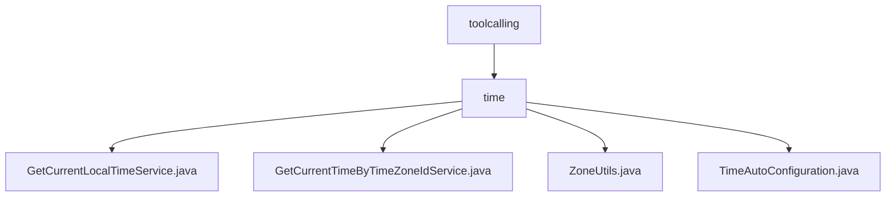

# 基础信息

|      |      |
|------|------|
| 名称 | toolcalling |
| 编码语言 | .java |
| 代码路径 | spring-ai-alibaba/community/tool-calls/spring-ai-alibaba-starter-tool-calling-time/src/main/java/com/alibaba/cloud/ai/toolcalling |
| 包名 | spring-ai-alibaba.community.tool-calls.spring-ai-alibaba-starter-tool-calling-time.src.main.java.com.alibaba.cloud.ai.toolcalling |
| 概述说明 | GetCurrentLocalTimeService返回本地时间，GetCurrentTimeByTimeZoneIdService根据时区ID获取时间，ZoneUtils处理时区时间，TimeAutoConfiguration条件启用时间服务。 |

# 说明

## 概述

该代码模块主要围绕时间服务功能展开，提供了获取当前本地时间、根据指定时区ID获取时间、时区时间格式化等核心功能。模块通过多个服务类和工具类协同工作，确保在不同时区下能够准确获取并展示当前时间。此外，模块还通过配置类实现了时间服务的条件启动机制，确保服务仅在特定条件下启用，避免不必要的资源消耗或功能冲突。

## 主要业务场景

1. **实时时间获取**：`GetCurrentLocalTimeService`类用于返回当前的本地时间，适用于需要实时时间信息的应用程序，如日志记录、时间戳生成等场景，确保时间显示的准确性和一致性。

2. **时区时间获取与追踪**：`GetCurrentTimeByTimeZoneIdService`类根据指定的时区ID获取当前时间，并记录每次请求的详细信息和响应结果。此功能适用于需要追踪和分析时间获取操作的场景，如跨时区的时间同步、时间数据审计等。

3. **时区时间格式化**：`ZoneUtils`类通过`ZoneId`获取指定时区的当前时间，并支持时间格式化输出。该功能在处理多时区时间数据的场景中非常实用，如国际化的时间展示、跨时区的时间计算等。

4. **条件启动时间服务**：`TimeAutoConfiguration`类通过检查特定类的存在性及其属性值，决定是否启用时间服务。这种机制适用于需要根据系统配置或环境条件动态启用或禁用时间服务的场景，确保服务的灵活性和资源优化。

该模块通过上述功能，为应用程序提供了全面且灵活的时间服务支持，适用于多种需要精确时间管理的业务场景。

### 包内部结构视图

该流程图展示了`toolcalling`目录下的层级结构，`time`作为子目录，包含了四个文件：`GetCurrentLocalTimeService.java`、`GetCurrentTimeByTimeZoneIdService.java`、`ZoneUtils.java`和`TimeAutoConfiguration.java`。这些文件都与时间相关的功能模块相关，体现了模块化设计的清晰结构。

# 文件列表 File List

| 名称   | 类型  | 说明 |
|-------|------|-------------|
| [time](time/_module.md) | package | GetCurrentLocalTimeService返回本地时间，GetCurrentTimeByTimeZoneIdService根据时区ID获取时间，ZoneUtils处理时区时间，TimeAutoConfiguration条件启用时间服务。 |

