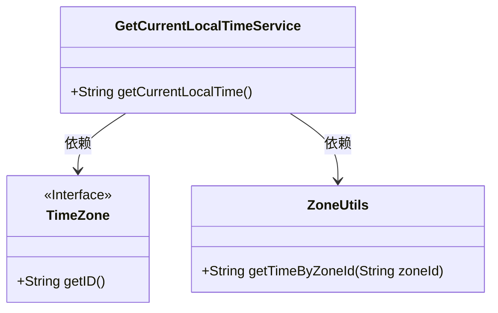
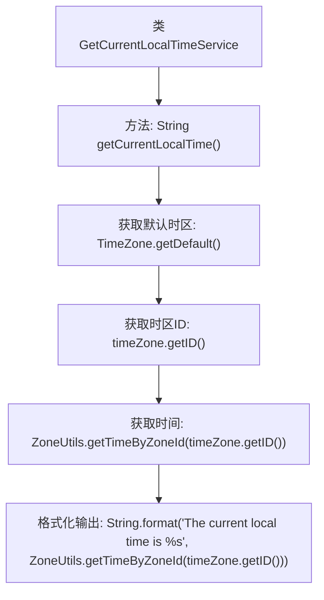

# 基础信息

|      |      |
|------|------|
| 名称 | GetCurrentLocalTimeService |
| 编码语言 | .java |
| 代码路径 | spring-ai-alibaba/community/tool-calls/spring-ai-alibaba-starter-tool-calling-time/src/main/java/com/alibaba/cloud/ai/toolcalling/time/GetCurrentLocalTimeService.java |
| 包名 | com.alibaba.cloud.ai.toolcalling.time |
| 依赖项 | ['java.util.TimeZone'] |
| 概述说明 | GetCurrentLocalTimeService类用于获取当前本地时间。 |

# 说明

GetCurrentLocalTimeService类的主要功能是返回当前的本地时间。该类通过其内部逻辑获取系统时间，并将其转换为本地时区的时间格式。该服务通常用于需要实时时间信息的应用程序中，以确保时间显示的准确性和一致性。

# 类列表 Class Summary

| 名称   | 类型  | 说明 |
|-------|------|-------------|
| GetCurrentLocalTimeService | class | GetCurrentLocalTimeService类返回当前本地时间。 |

## 类 GetCurrentLocalTimeService

|      |      |
|------|------|
| 访问范围 | public |
| 类型 | class |
| 名称 | GetCurrentLocalTimeService |
| 说明 | GetCurrentLocalTimeService类返回当前本地时间。 |

### UML类图

**描述：**
`GetCurrentLocalTimeService` 类提供了一个公有方法 `getCurrentLocalTime()`，用于获取当前本地时间。该方法依赖于 `TimeZone` 接口来获取默认时区的ID，并通过 `ZoneUtils` 类的 `getTimeByZoneId` 方法根据时区ID获取具体时间。类图中展示了 `GetCurrentLocalTimeService` 与 `TimeZone` 和 `ZoneUtils` 之间的依赖关系。

### 内部方法调用关系图

这段代码定义了一个名为 `GetCurrentLocalTimeService` 的类，其中包含一个 `getCurrentLocalTime` 方法。该方法首先获取默认的时区，然后通过时区ID获取当前时间，最后将时间格式化为字符串并返回。流程图展示了从类定义到方法调用，再到时区获取、时间获取和格式化输出的完整流程。

### 字段列表 Field List

| 名称  | 类型  | 说明 |
|-------|-------|------|

### 方法列表 Method List

| 名称  | 类型  | 说明 |
|-------|-------|------|
| getCurrentLocalTime | String | 获取并返回当前本地时间的字符串表示。 |

