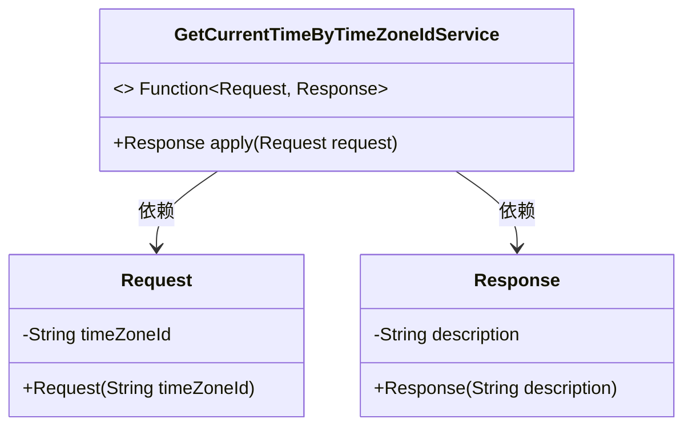
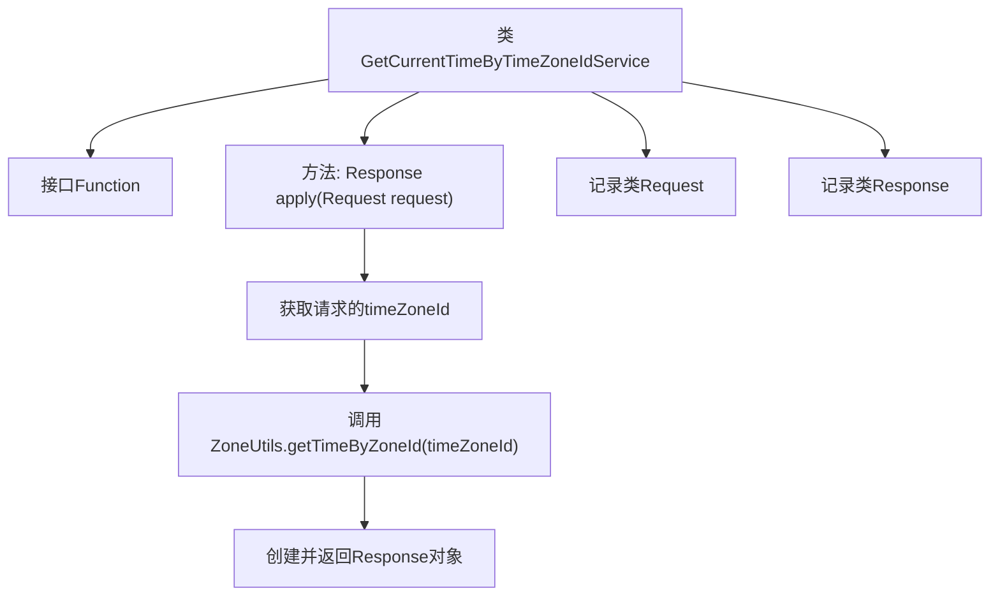

# 基础信息

|      |      |
|------|------|
| 名称 | GetCurrentTimeByTimeZoneIdService |
| 编码语言 | .java |
| 代码路径 | spring-ai-alibaba/community/tool-calls/spring-ai-alibaba-starter-tool-calling-time/src/main/java/com/alibaba/cloud/ai/toolcalling/time/GetCurrentTimeByTimeZoneIdService.java |
| 包名 | com.alibaba.cloud.ai.toolcalling.time |
| 依赖项 | ['com.fasterxml.jackson.annotation.JsonClassDescription', 'com.fasterxml.jackson.annotation.JsonInclude', 'com.fasterxml.jackson.annotation.JsonProperty', 'com.fasterxml.jackson.annotation.JsonPropertyDescription', 'java.util.function.Function'] |
| 概述说明 | 根据时区ID获取当前时间，记录请求和响应。 |

# 说明

该服务类用于根据指定的时区ID获取当前时间，具备记录请求和响应的功能。通过输入时区ID，服务类能够准确返回该时区的当前时间，并记录每次请求的详细信息和相应的响应结果。此功能有助于追踪和分析时间获取操作的执行情况，确保服务的可靠性和可追溯性。

# 类列表 Class Summary

| 名称   | 类型  | 说明 |
|-------|------|-------------|
| GetCurrentTimeByTimeZoneIdService | class | 根据时区ID获取当前时间的服务类，包含请求和响应记录。 |

## 类 GetCurrentTimeByTimeZoneIdService

|      |      |
|------|------|
| 访问范围 | public |
| 类型 | class |
| 名称 | GetCurrentTimeByTimeZoneIdService |
| 说明 | 根据时区ID获取当前时间的服务类，包含请求和响应记录。 |

### UML类图

类图描述：
`GetCurrentTimeByTimeZoneIdService` 类实现了 `Function` 接口，接收 `Request` 对象并返回 `Response` 对象。`Request` 类包含一个 `timeZoneId` 属性，用于表示时区ID。`Response` 类包含一个 `description` 属性，用于描述当前时区和时间。`GetCurrentTimeByTimeZoneIdService` 类通过 `apply` 方法处理请求并生成响应。

### 内部方法调用关系图

这段代码定义了一个服务类 `GetCurrentTimeByTimeZoneIdService`，它实现了 `Function` 接口，用于根据时区ID获取当前时间。`apply` 方法接收一个 `Request` 对象，从中提取时区ID，调用 `ZoneUtils.getTimeByZoneId` 方法获取当前时间，并返回一个包含描述信息的 `Response` 对象。`Request` 和 `Response` 是两个记录类，分别用于封装请求和响应数据。

### 字段列表 Field List

| 名称  | 类型  | 说明 |
|-------|-------|------|

### 方法列表 Method List

| 名称  | 类型  | 说明 |
|-------|-------|------|
| apply | GetCurrentTimeByTimeZoneIdService.Response | 根据时区ID获取当前时间并返回响应。 |

