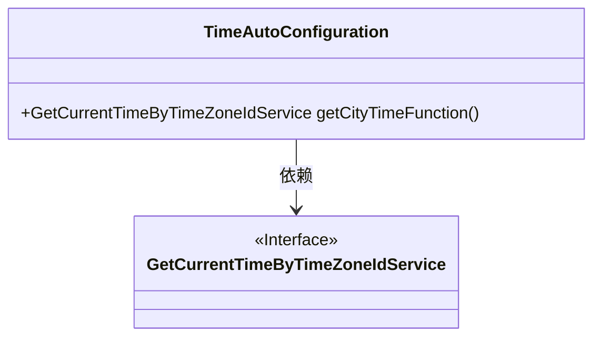
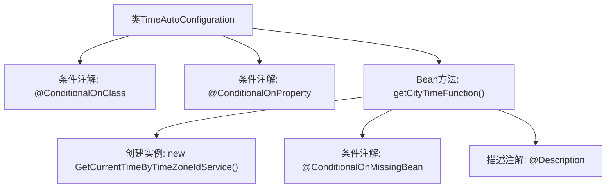

# 基础信息

|      |      |
|------|------|
| 名称 | TimeAutoConfiguration |
| 编码语言 | .java |
| 代码路径 | spring-ai-alibaba/community/tool-calls/spring-ai-alibaba-starter-tool-calling-time/src/main/java/com/alibaba/cloud/ai/toolcalling/time/TimeAutoConfiguration.java |
| 包名 | com.alibaba.cloud.ai.toolcalling.time |
| 依赖项 | ['org.springframework.boot.autoconfigure.condition.ConditionalOnClass', 'org.springframework.boot.autoconfigure.condition.ConditionalOnMissingBean', 'org.springframework.boot.autoconfigure.condition.ConditionalOnProperty', 'org.springframework.context.annotation.Bean', 'org.springframework.context.annotation.Configuration', 'org.springframework.context.annotation.Description'] |
| 概述说明 | 启用时间服务需相关类存在且属性为真。 |

# 说明

配置类启用时间服务的条件是在相关类存在且其属性为true时才会生效。这意味着系统会检查特定类的存在性以及该类的某个属性值，只有当这两个条件都满足时，时间服务才会被启用。这种机制确保了时间服务仅在适当的条件下启动，避免不必要的资源消耗或功能冲突。

# 类列表 Class Summary

| 名称   | 类型  | 说明 |
|-------|------|-------------|
| TimeAutoConfiguration | class | 配置类启用时间服务，条件为相关类存在且属性为true。 |

## 类 TimeAutoConfiguration

|      |      |
|------|------|
| 访问范围 | @Configuration;@ConditionalOnClass({ GetCurrentLocalTimeService.class, GetCurrentTimeByTimeZoneIdService.class });@ConditionalOnProperty(prefix = "spring.ai.alibaba.toolcalling.time", name = "enabled", havingValue = "true");public |
| 类型 | class |
| 名称 | TimeAutoConfiguration |
| 说明 | 配置类启用时间服务，条件为相关类存在且属性为true。 |

### UML类图

这段代码定义了一个自动配置类 `TimeAutoConfiguration`，它根据条件创建并返回 `GetCurrentTimeByTimeZoneIdService` 的实例。该类依赖于 `GetCurrentTimeByTimeZoneIdService` 接口，并在满足特定条件时自动配置该服务。`TimeAutoConfiguration` 类通过 `@ConditionalOnClass` 和 `@ConditionalOnProperty` 注解确保只有在特定类和属性存在时才会被激活。

### 内部方法调用关系图

这段代码定义了一个名为 `TimeAutoConfiguration` 的自动配置类，用于在特定条件下创建 `GetCurrentTimeByTimeZoneIdService` 的实例。该类使用了多个条件注解，如 `@ConditionalOnClass` 和 `@ConditionalOnProperty`，确保只有在满足条件时才会创建该 Bean。`getCityTimeFunction` 方法负责创建并返回 `GetCurrentTimeByTimeZoneIdService` 的实例，并且仅在 `GetCurrentTimeByTimeZoneIdService` 类型的 Bean 不存在时才会执行。

### 字段列表 Field List

| 名称  | 类型  | 说明 |
|-------|-------|------|

### 方法列表 Method List

| 名称  | 类型  | 说明 |
|-------|-------|------|
| getCityTimeFunction | GetCurrentTimeByTimeZoneIdService | 定义获取指定城市时间的服务Bean，缺失时自动创建。 |

