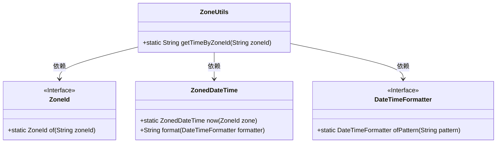
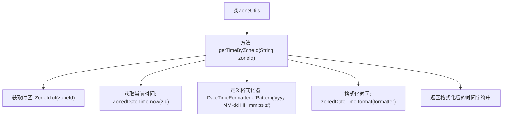

# 基础信息

|      |      |
|------|------|
| 名称 | ZoneUtils |
| 编码语言 | .java |
| 代码路径 | spring-ai-alibaba/community/tool-calls/spring-ai-alibaba-starter-tool-calling-time/src/main/java/com/alibaba/cloud/ai/toolcalling/time/ZoneUtils.java |
| 包名 | com.alibaba.cloud.ai.toolcalling.time |
| 依赖项 | ['java.time.ZoneId', 'java.time.ZonedDateTime', 'java.time.format.DateTimeFormatter'] |
| 概述说明 | ZoneUtils类用ZoneId获取并格式化指定时区当前时间。 |

# 说明

ZoneUtils类提供了通过ZoneId获取指定时区当前时间的功能，并能够将获取到的时间进行格式化输出。该类主要用于处理时区相关的时间操作，确保在不同时区下能够准确获取并展示当前时间。通过ZoneId参数，用户可以指定目标时区，从而获取该时区的当前时间，并通过格式化方法将其转换为所需的输出格式。这一功能在需要处理多时区时间数据的场景中非常实用。

# 类列表 Class Summary

| 名称   | 类型  | 说明 |
|-------|------|-------------|
| ZoneUtils | class | ZoneUtils类通过ZoneId获取指定时区的当前时间并格式化输出。 |

## 类 ZoneUtils

|      |      |
|------|------|
| 访问范围 | public |
| 类型 | class |
| 名称 | ZoneUtils |
| 说明 | ZoneUtils类通过ZoneId获取指定时区的当前时间并格式化输出。 |

### UML类图

**描述：**  
`ZoneUtils` 类提供了一个静态方法 `getTimeByZoneId`，用于根据指定的时区ID获取当前时间并格式化为字符串。该方法依赖于 `ZoneId`、`ZonedDateTime` 和 `DateTimeFormatter` 类。`ZoneId` 用于表示时区，`ZonedDateTime` 用于获取当前时间，`DateTimeFormatter` 用于格式化时间。这些类共同协作，实现了根据时区获取并格式化时间的功能。

### 内部方法调用关系图

这段代码定义了一个名为`ZoneUtils`的类，其中包含一个静态方法`getTimeByZoneId`，该方法根据传入的时区ID获取当前时间，并将其格式化为指定的字符串格式。代码首先通过`ZoneId.of`方法获取时区对象，然后使用`ZonedDateTime.now`获取当前时间，接着定义一个`DateTimeFormatter`来格式化时间，最后返回格式化后的时间字符串。整个流程清晰地展示了从时区获取到时间格式化的步骤。

### 字段列表 Field List

| 名称  | 类型  | 说明 |
|-------|-------|------|

### 方法列表 Method List

| 名称  | 类型  | 说明 |
|-------|-------|------|
| getTimeByZoneId | String | 根据时区ID获取当前时间并格式化返回。 |

