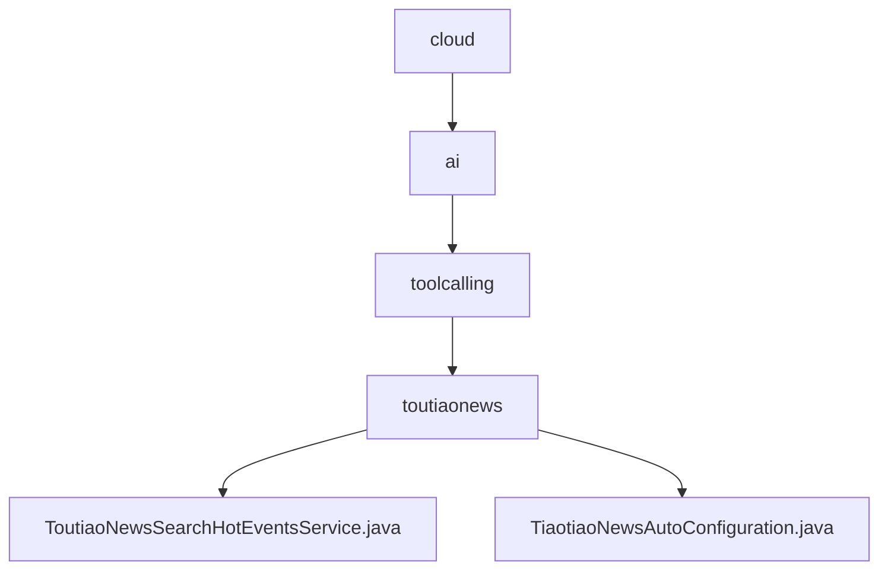

# 基础信息

|      |      |
|------|------|
| 名称 | cloud |
| 编码语言 | .java |
| 代码路径 | spring-ai-alibaba/community/tool-calls/spring-ai-alibaba-starter-tool-calling-toutiaonews/src/main/java/com/alibaba/cloud |
| 包名 | spring-ai-alibaba.community.tool-calls.spring-ai-alibaba-starter-tool-calling-toutiaonews.src.main.java.com.alibaba.cloud |
| 概述说明 | 头条新闻热搜服务通过API实时抓取并解析热搜数据，支持自定义过滤和排序。 |

# 说明

## 概述

该代码模块是一个基于Spring框架的头条新闻热搜服务模块，主要功能是通过API接口获取并解析当前的热搜事件。模块包含两个核心类：`ToutiaoNewsSearchHotEventsService` 和 `TiaotiaoNewsAutoConfiguration`。前者负责实时抓取各大新闻平台的热搜数据，并进行结构化处理，提供热搜标题、热度值、相关链接等关键信息；后者则是一个自动配置类，用于在满足特定条件时自动生成头条新闻服务，简化服务创建流程。

## 主要业务场景

1. **实时热搜数据获取**：该模块通过API接口实时抓取各大新闻平台的热搜数据，确保用户能够获取最新的热门话题。
2. **数据解析与结构化处理**：模块具备高效的数据解析能力，能够从复杂的API响应中提取关键信息，如热搜标题、热度值、相关链接等，以便用户快速了解热点事件。
3. **自定义过滤与排序**：用户可以根据需求筛选特定类型或时间段的热搜事件，满足个性化的新闻获取需求。
4. **自动化服务创建**：通过`TiaotiaoNewsAutoConfiguration`类，模块能够在检测到配置类存在且相关属性启用时，自动生成头条新闻服务，简化服务创建流程，提高开发效率。

整体设计旨在为用户提供简洁、实时的热搜信息，满足对新闻动态的快速获取需求，同时通过自动化配置减少开发工作量。

### 包内部结构视图

该流程图展示了从 `cloud` 到 `toutiaonews` 的层级关系，最终指向两个具体的服务类文件 `ToutiaoNewsSearchHotEventsService.java` 和 `TiaotiaoNewsAutoConfiguration.java`。每个节点代表路径中的最后一级元素，清晰地展示了文件在项目中的位置和结构。

# 文件列表 File List

| 名称   | 类型  | 说明 |
|-------|------|-------------|
| [ai](ai/_module.md) | package | 头条新闻热搜服务通过API实时抓取并解析热搜数据，支持自定义过滤和排序。 |

