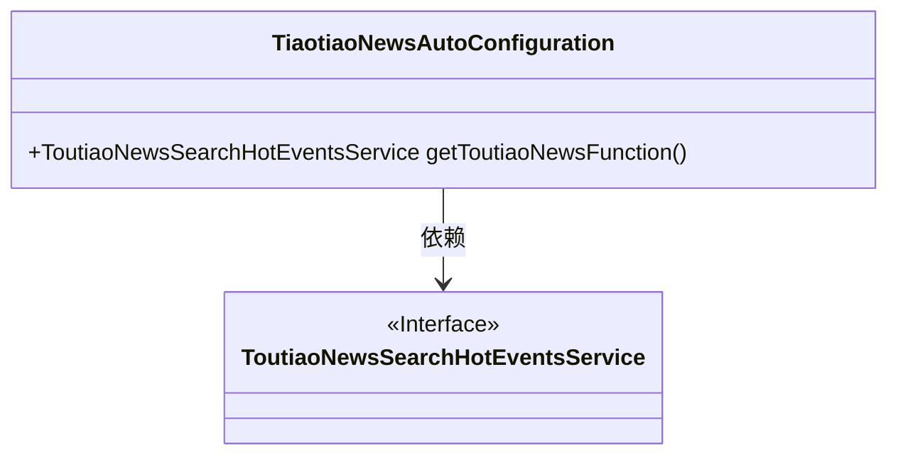
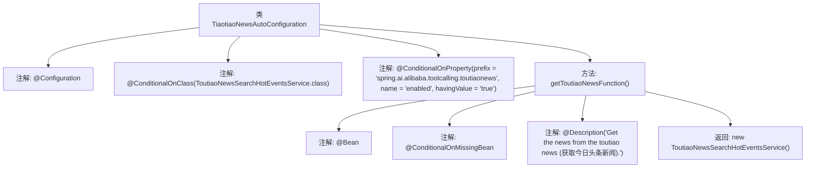

# 基础信息

|      |      |
|------|------|
| 名称 | TiaotiaoNewsAutoConfiguration |
| 编码语言 | .java |
| 代码路径 | spring-ai-alibaba/community/tool-calls/spring-ai-alibaba-starter-tool-calling-toutiaonews/src/main/java/com/alibaba/cloud/ai/toolcalling/toutiaonews/TiaotiaoNewsAutoConfiguration.java |
| 包名 | com.alibaba.cloud.ai.toolcalling.toutiaonews |
| 依赖项 | ['org.springframework.boot.autoconfigure.condition.ConditionalOnClass', 'org.springframework.boot.autoconfigure.condition.ConditionalOnMissingBean', 'org.springframework.boot.autoconfigure.condition.ConditionalOnProperty', 'org.springframework.context.annotation.Bean', 'org.springframework.context.annotation.Configuration', 'org.springframework.context.annotation.Description'] |
| 概述说明 | 配置类自动生成头条新闻，需类存在且属性启用。 |

# 说明

该内容描述了一个自动创建头条新闻服务的配置类功能。该功能的条件是配置类必须存在，并且相关属性必须启用。这意味着只有当系统检测到配置类存在且其属性被激活时，才会自动生成头条新闻服务。该功能旨在通过自动化流程简化新闻服务的创建，确保在满足特定条件时能够高效地生成新闻内容。

# 类列表 Class Summary

| 名称   | 类型  | 说明 |
|-------|------|-------------|
| TiaotiaoNewsAutoConfiguration | class | 配置类自动创建头条新闻服务，条件为类存在且属性启用。 |

## 类 TiaotiaoNewsAutoConfiguration

|      |      |
|------|------|
| 访问范围 | @Configuration;@ConditionalOnClass(ToutiaoNewsSearchHotEventsService.class);@ConditionalOnProperty(prefix = "spring.ai.alibaba.toolcalling.toutiaonews", name = "enabled", havingValue = "true");public |
| 类型 | class |
| 名称 | TiaotiaoNewsAutoConfiguration |
| 说明 | 配置类自动创建头条新闻服务，条件为类存在且属性启用。 |

### UML类图

**描述：**  
`TiaotiaoNewsAutoConfiguration` 是一个配置类，用于在满足特定条件时自动配置 `ToutiaoNewsSearchHotEventsService` 实例。该类通过 `@ConditionalOnClass` 和 `@ConditionalOnProperty` 注解确保仅在 `ToutiaoNewsSearchHotEventsService` 类存在且相关配置属性为 `true` 时生效。`getToutiaoNewsFunction` 方法返回 `ToutiaoNewsSearchHotEventsService` 的实例，且仅在未定义该 Bean 时才会创建。该配置类依赖于 `ToutiaoNewsSearchHotEventsService` 接口。

### 内部方法调用关系图

这段代码定义了一个名为 `TiaotiaoNewsAutoConfiguration` 的配置类，该类在满足特定条件时自动配置一个 `ToutiaoNewsSearchHotEventsService` 的 Bean。代码通过多个注解来控制 Bean 的创建条件，包括类路径中存在 `ToutiaoNewsSearchHotEventsService` 类，以及配置属性 `spring.ai.alibaba.toolcalling.toutiaonews.enabled` 为 `true`。如果这些条件都满足，且当前上下文中没有其他同类型的 Bean，则会创建一个 `ToutiaoNewsSearchHotEventsService` 实例。

### 字段列表 Field List

| 名称  | 类型  | 说明 |
|-------|-------|------|

### 方法列表 Method List

| 名称  | 类型  | 说明 |
|-------|-------|------|
| getToutiaoNewsFunction | ToutiaoNewsSearchHotEventsService | 获取今日头条新闻的服务方法。 |

