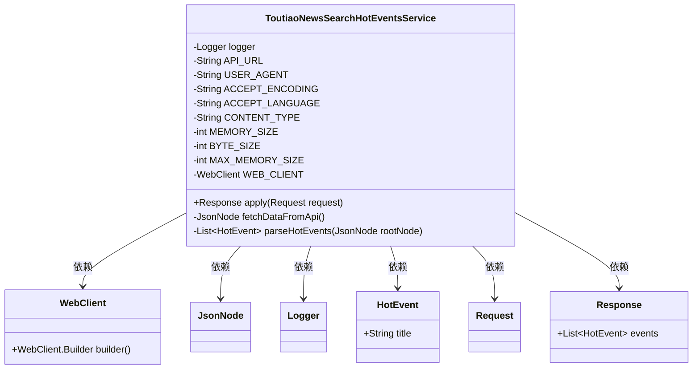
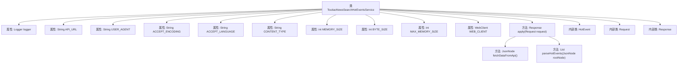

# 基础信息

|      |      |
|------|------|
| 名称 | ToutiaoNewsSearchHotEventsService |
| 编码语言 | .java |
| 代码路径 | spring-ai-alibaba/community/tool-calls/spring-ai-alibaba-starter-tool-calling-toutiaonews/src/main/java/com/alibaba/cloud/ai/toolcalling/toutiaonews/ToutiaoNewsSearchHotEventsService.java |
| 包名 | com.alibaba.cloud.ai.toolcalling.toutiaonews |
| 依赖项 | ['com.fasterxml.jackson.databind.JsonNode', 'org.slf4j.Logger', 'org.slf4j.LoggerFactory', 'org.springframework.http.HttpHeaders', 'org.springframework.http.MediaType', 'org.springframework.web.reactive.function.client.WebClient', 'reactor.core.publisher.Mono', 'java.util.ArrayList', 'java.util.List', 'java.util.function.Function'] |
| 概述说明 | 头条新闻热搜服务通过API获取并解析热搜事件。 |

# 说明

头条新闻热搜服务类通过API接口获取并解析当前的热搜事件。该服务能够实时抓取各大新闻平台的热搜数据，并进行结构化处理，以便用户快速了解最新的热门话题。服务类具备高效的数据解析能力，能够从复杂的API响应中提取关键信息，如热搜标题、热度值、相关链接等。此外，该服务还支持自定义过滤和排序功能，用户可以根据需求筛选特定类型或时间段的热搜事件。整体设计旨在为用户提供简洁、实时的热搜信息，满足对新闻动态的快速获取需求。

# 类列表 Class Summary

| 名称   | 类型  | 说明 |
|-------|------|-------------|
| ToutiaoNewsSearchHotEventsService | class | 头条新闻热搜服务类，通过API获取并解析热搜事件。 |

## 类 ToutiaoNewsSearchHotEventsService

|      |      |
|------|------|
| 访问范围 | public |
| 类型 | class |
| 名称 | ToutiaoNewsSearchHotEventsService |
| 说明 | 头条新闻热搜服务类，通过API获取并解析热搜事件。 |

### UML类图

这段代码定义了一个名为 `ToutiaoNewsSearchHotEventsService` 的类，该类实现了 `Function` 接口，用于处理今日头条热点新闻搜索请求。类中包含了一些常量配置，如API URL、用户代理等，并通过 `WebClient` 进行HTTP请求。`apply` 方法负责调用API、解析数据并返回响应。`fetchDataFromApi` 方法用于从API获取数据，`parseHotEvents` 方法用于解析返回的JSON数据并生成热点事件列表。类中还定义了 `HotEvent`、`Request` 和 `Response` 三个记录类，分别用于表示热点事件、请求和响应。

### 内部方法调用关系图

这段代码定义了一个名为`ToutiaoNewsSearchHotEventsService`的类，该类实现了`Function`接口，用于处理头条新闻热门事件的搜索请求。代码中包含了多个常量和属性，如API的URL、用户代理字符串、内存大小等。`apply`方法负责调用API、解析数据并返回响应。`fetchDataFromApi`方法通过`WebClient`发送HTTP请求并获取JSON数据，而`parseHotEvents`方法则从JSON数据中提取热门事件。代码还定义了三个内部类`HotEvent`、`Request`和`Response`，分别用于表示热门事件、请求和响应。

### 字段列表 Field List

| 名称  | 类型  | 说明 |
|-------|-------|------|
| logger = LoggerFactory.getLogger(ToutiaoNewsSearchHotEventsService.class) | Logger | ToutiaoNewsSearchHotEventsService类中定义了一个私有的静态日志记录器。 |
| WEB_CLIENT = WebClient.builder()		.defaultHeader(HttpHeaders.USER_AGENT, USER_AGENT)		.defaultHeader(HttpHeaders.ACCEPT, MediaType.APPLICATION_JSON_VALUE)		.defaultHeader(HttpHeaders.ACCEPT_ENCODING, ACCEPT_ENCODING)		.defaultHeader(HttpHeaders.CONTENT_TYPE, CONTENT_TYPE)		.defaultHeader(HttpHeaders.ACCEPT_LANGUAGE, ACCEPT_LANGUAGE)		.codecs(configurer -> configurer.defaultCodecs().maxInMemorySize(MAX_MEMORY_SIZE))		.build() | WebClient | WebClient配置默认请求头并设置内存大小限制。 |
| BYTE_SIZE = 1024 | int | 定义了一个私有的静态常量BYTE_SIZE，值为1024。 |
| ACCEPT_LANGUAGE = "zh-CN,zh;q=0.9,ja;q=0.8" | String | 定义常量ACCEPT_LANGUAGE，值为中文优先的浏览器语言设置。 |
| MEMORY_SIZE = 5 | int | 定义了一个私有的静态常量MEMORY_SIZE，值为5。 |
| CONTENT_TYPE = "application/json" | String | 定义静态常量CONTENT_TYPE，值为"application/json"。 |
| USER_AGENT = "Mozilla/5.0 (Macintosh; Intel Mac OS X 10_15_7) "			+ "AppleWebKit/537.36 (KHTML, like Gecko) Chrome/131.0.0.0 Safari/537.36" | String | 定义用户代理字符串为Chrome浏览器在Mac OS X上的模拟信息。 |
| API_URL = "https://www.toutiao.com/hot-event/hot-board/?origin" + "=toutiao_pc" | String | 私有静态常量API_URL指向头条热榜API地址。 |
| MAX_MEMORY_SIZE = MEMORY_SIZE * BYTE_SIZE * BYTE_SIZE | int | 定义常量MAX_MEMORY_SIZE，值为MEMORY_SIZE乘以BYTE_SIZE的平方。 |
| ACCEPT_ENCODING = "gzip, deflate" | String | 定义常量ACCEPT_ENCODING，值为"gzip, deflate"。 |

### 方法列表 Method List

| 名称  | 类型  | 说明 |
|-------|-------|------|
| parseHotEvents | List<HotEvent> | 解析JSON数据并生成热门事件列表。 |
| fetchDataFromApi | JsonNode | 通过WEB_CLIENT调用API，处理错误并返回JSON数据。 |
| apply | ToutiaoNewsSearchHotEventsService.Response | 该方法从API获取数据，解析热点事件并记录日志，返回包含热点事件的响应。 |

