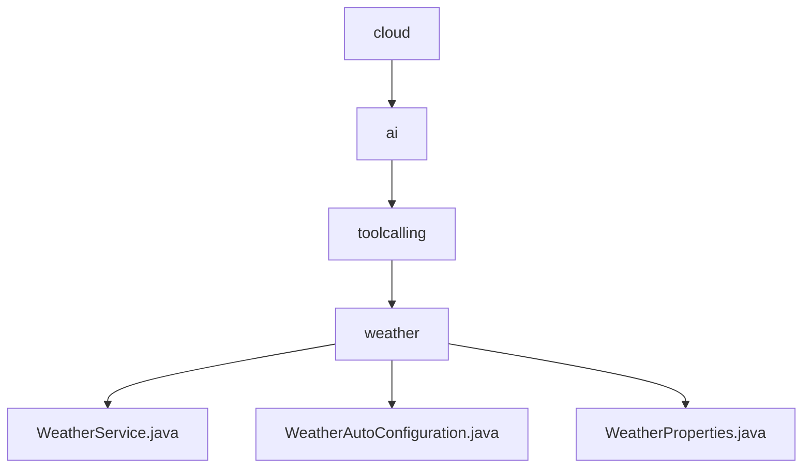

# 基础信息

|      |      |
|------|------|
| 名称 | cloud |
| 编码语言 | .java |
| 代码路径 | spring-ai-alibaba/community/tool-calls/spring-ai-alibaba-starter-tool-calling-weather/src/main/java/com/alibaba/cloud |
| 包名 | spring-ai-alibaba.community.tool-calls.spring-ai-alibaba-starter-tool-calling-weather.src.main.java.com.alibaba.cloud |
| 概述说明 | WeatherService类通过API获取天气数据，支持中文转拼音，处理请求并返回响应。系统根据条件加载WeatherService，配置WeatherProperties，自动注册Bean，确保服务灵活运行。WeatherProperties类配置API密钥，访问阿里天气服务。 |

# 说明

## 概述
该代码模块是一个基于Spring框架的天气服务工具调用模块，主要用于通过API获取天气数据。模块的核心功能包括中文城市名到拼音的转换、API请求的处理与响应返回，以及服务的自动配置与加载。模块通过`WeatherService`类实现具体的天气数据获取逻辑，并通过`WeatherAutoConfiguration`类实现服务的自动加载与配置。`WeatherProperties`类则用于管理API密钥等配置属性，确保系统能够正确访问阿里天气服务的API接口。

## 主要业务场景
1. **天气数据获取**：通过`WeatherService`类，系统能够根据用户提供的中文城市名，将其转换为拼音并调用阿里天气服务的API接口，获取相应的天气数据。
2. **服务自动配置**：`WeatherAutoConfiguration`类根据预设条件决定是否加载`WeatherService`，并自动配置`WeatherProperties`属性，确保服务能够正确运行。同时，该类还负责注册相关的Bean，使其在应用程序上下文中可用，简化了Bean的管理和注册。
3. **API密钥管理**：`WeatherProperties`类用于配置阿里天气工具调用的API密钥，确保系统能够通过该密钥访问阿里天气服务的API接口，从而获取所需的天气数据。

### 包内部结构视图

该流程图展示了`spring-ai-alibaba`项目中`tool-calls`模块的路径层级关系。从`cloud`目录开始，依次进入`ai`、`toolcalling`和`weather`子目录，最终在`weather`目录下有三个文件：`WeatherService.java`、`WeatherAutoConfiguration.java`和`WeatherProperties.java`。这种层级结构清晰地反映了项目文件的组织方式，便于理解和维护。

# 文件列表 File List

| 名称   | 类型  | 说明 |
|-------|------|-------------|
| [ai](ai/_module.md) | package | WeatherService类通过API获取天气数据，支持中文转拼音，处理请求并返回响应。系统根据条件加载WeatherService，配置WeatherProperties，自动注册Bean，确保服务灵活运行。WeatherProperties类配置API密钥，访问阿里天气服务。 |

