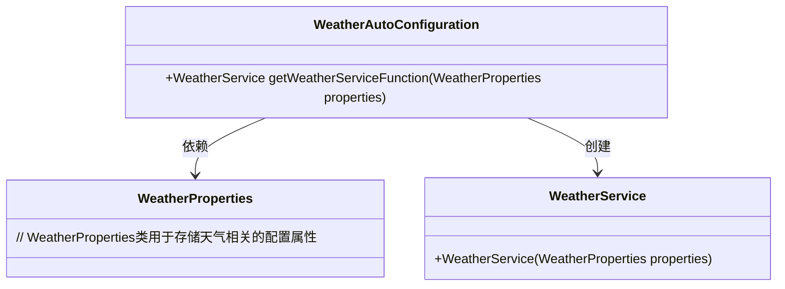
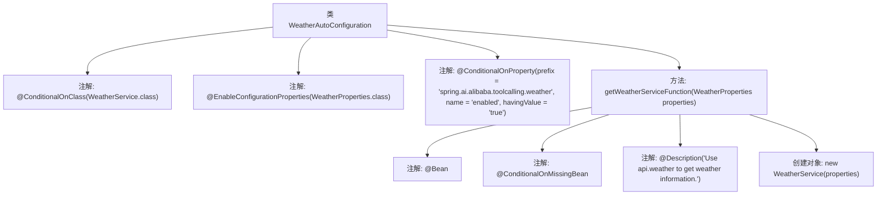

# 基础信息

|      |      |
|------|------|
| 名称 | WeatherAutoConfiguration |
| 编码语言 | .java |
| 代码路径 | spring-ai-alibaba/community/tool-calls/spring-ai-alibaba-starter-tool-calling-weather/src/main/java/com/alibaba/cloud/ai/toolcalling/weather/WeatherAutoConfiguration.java |
| 包名 | com.alibaba.cloud.ai.toolcalling.weather |
| 依赖项 | ['org.springframework.boot.autoconfigure.condition.ConditionalOnClass', 'org.springframework.boot.autoconfigure.condition.ConditionalOnMissingBean', 'org.springframework.boot.autoconfigure.condition.ConditionalOnProperty', 'org.springframework.boot.context.properties.EnableConfigurationProperties', 'org.springframework.context.annotation.Bean', 'org.springframework.context.annotation.Description'] |
| 概述说明 | 基于条件加载WeatherService，配置WeatherProperties并自动注册Bean。 |

# 说明

该内容描述了在软件系统中基于特定条件加载WeatherService的过程。首先，系统会根据预设条件决定是否加载WeatherService。接着，配置属性WeatherProperties会被设置，以确保服务能够正确运行。最后，系统会自动注册相关的Bean，使其在应用程序上下文中可用，以便其他组件能够使用这些服务。这一过程确保了WeatherService的灵活加载和配置，同时简化了Bean的管理和注册。

# 类列表 Class Summary

| 名称   | 类型  | 说明 |
|-------|------|-------------|
| WeatherAutoConfiguration | class | 基于条件加载WeatherService，配置属性WeatherProperties，自动注册Bean。 |

## 类 WeatherAutoConfiguration

|      |      |
|------|------|
| 访问范围 | @ConditionalOnClass(WeatherService.class);@EnableConfigurationProperties(WeatherProperties.class);@ConditionalOnProperty(prefix = "spring.ai.alibaba.toolcalling.weather", name = "enabled", havingValue = "true");public |
| 类型 | class |
| 名称 | WeatherAutoConfiguration |
| 说明 | 基于条件加载WeatherService，配置属性WeatherProperties，自动注册Bean。 |

### UML类图

**描述：**  
`WeatherAutoConfiguration` 是一个自动配置类，用于在满足特定条件时创建 `WeatherService` 实例。它依赖于 `WeatherProperties` 类来获取配置属性，并通过 `getWeatherServiceFunction` 方法返回 `WeatherService` 实例。该类使用了条件注解 `@ConditionalOnClass` 和 `@ConditionalOnProperty` 来确保只有在特定类存在且配置属性启用时才会生效。

### 内部方法调用关系图

这段代码定义了一个名为 `WeatherAutoConfiguration` 的类，用于自动配置天气服务。类上使用了多个条件注解，确保只有在满足特定条件时才会加载该类。类中包含一个 `getWeatherServiceFunction` 方法，该方法在 `WeatherService` 类型的 Bean 不存在时，创建一个新的 `WeatherService` 实例，并返回该实例。方法的描述信息表明，它使用 `api.weather` 来获取天气信息。

### 字段列表 Field List

| 名称  | 类型  | 说明 |
|-------|-------|------|

### 方法列表 Method List

| 名称  | 类型  | 说明 |
|-------|-------|------|
| getWeatherServiceFunction | WeatherService | 使用api.weather获取天气信息的WeatherService方法。 |

