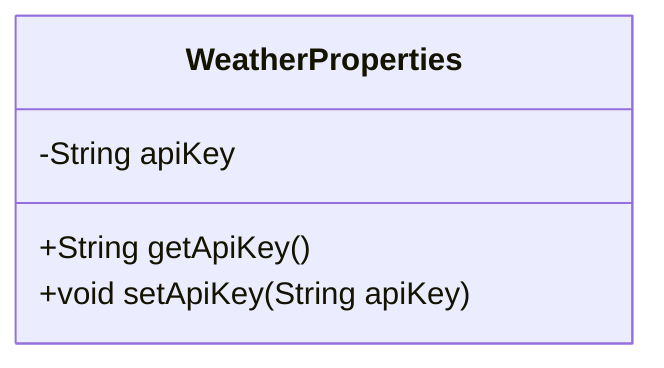
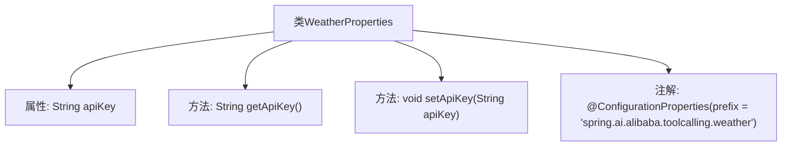

# 基础信息

|      |      |
|------|------|
| 名称 | WeatherProperties |
| 编码语言 | .java |
| 代码路径 | spring-ai-alibaba/community/tool-calls/spring-ai-alibaba-starter-tool-calling-weather/src/main/java/com/alibaba/cloud/ai/toolcalling/weather/WeatherProperties.java |
| 包名 | com.alibaba.cloud.ai.toolcalling.weather |
| 依赖项 | ['org.springframework.boot.context.properties.ConfigurationProperties'] |
| 概述说明 | WeatherProperties类配置阿里天气API密钥。 |

# 说明

WeatherProperties类用于配置阿里天气工具调用的API密钥，确保系统能够通过该密钥访问阿里天气服务的API接口，从而获取所需的天气数据。

# 类列表 Class Summary

| 名称   | 类型  | 说明 |
|-------|------|-------------|
| WeatherProperties | class | WeatherProperties类配置了阿里天气工具调用的API密钥。 |

## 类 WeatherProperties

|      |      |
|------|------|
| 访问范围 | @ConfigurationProperties(prefix = "spring.ai.alibaba.toolcalling.weather");public |
| 类型 | class |
| 名称 | WeatherProperties |
| 说明 | WeatherProperties类配置了阿里天气工具调用的API密钥。 |

### UML类图

这段代码定义了一个名为 `WeatherProperties` 的类，用于配置与天气相关的属性。该类包含一个私有成员变量 `apiKey`，并提供了对应的公有 getter 和 setter 方法，用于获取和设置 `apiKey` 的值。通过 `@ConfigurationProperties` 注解，该类可以从配置文件中加载以 `spring.ai.alibaba.toolcalling.weather` 为前缀的属性值，并自动绑定到 `apiKey` 字段上。

### 内部方法调用关系图

这段代码定义了一个名为 `WeatherProperties` 的类，该类使用了 `@ConfigurationProperties` 注解，并指定了前缀为 `spring.ai.alibaba.toolcalling.weather`。类中包含一个私有属性 `apiKey`，以及对应的 `getApiKey` 和 `setApiKey` 方法。该类主要用于从配置文件中读取与天气相关的属性，并通过 `apiKey` 属性进行访问和修改。

### 字段列表 Field List

| 名称  | 类型  | 说明 |
|-------|-------|------|
| apiKey | String | 定义了一个私有的字符串变量apiKey。 |

### 方法列表 Method List

| 名称  | 类型  | 说明 |
|-------|-------|------|
| setApiKey | void | 设置API密钥的方法。 |
| getApiKey | String | 获取API密钥的方法。 |

